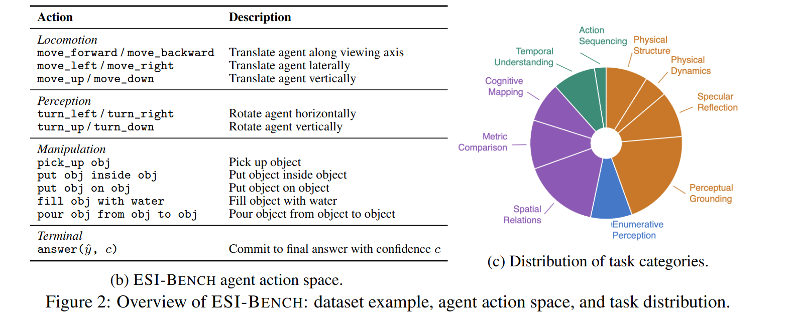
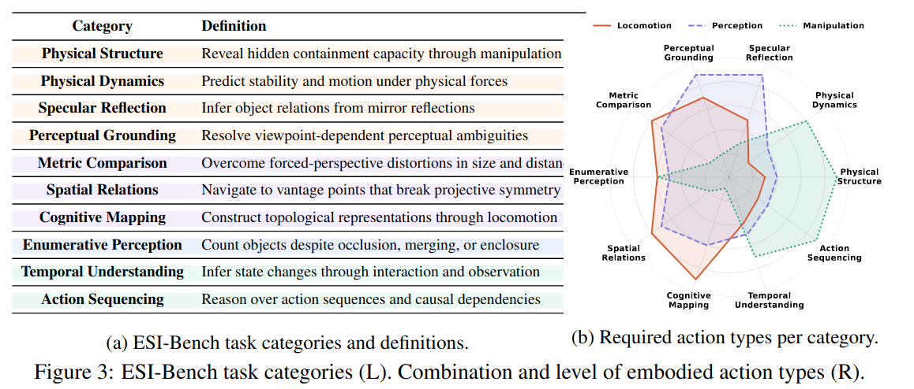

# ESI-BENCH: Towards Embodied Spatial Intelligence that Closes the Perception-Action Loop

- [webpage](https://esi-bench.github.io/)

Li FeiFei 组做的 Active Perception Benchmark。

是 ASI-Bench [Thinking in Space: How Multimodal Large Language Models See, Remember, and Recall Spaces](../LLM/[2025%20CVPR]%20Thinking%20in%20Space%20How%20Multimodal%20Large%20Language%20Models%20See,%20Remember,%20and%20Recall%20Spaces.md) 的后续工作。

## Task Definition

每个 Task 定义为 $(\mathcal{S}, p_0, q, y^*)$

- $\mathcal{S}$: 场景，来自 BEHAVIOR-1K
- $p_0$: 机器人的 initial pose
- $q$: Natural Language Question
- $y^*$: Ground Truth Answer

整个测评环境则定义为 $\mathcal{E}=\langle \mathcal{S, A, O,} T \rangle$

测评流程为，给定任务 $(\mathcal{S}, p_0, q)$，agent 在每个 step 都可以获取到 $o_t\in \mathcal{O}$，要求 agent 输出 $a_t\in \mathcal{A}$，得到 $\tau=(o_0, a_0, ..., o_t, a_t)$，在最长 30 步之内给出 answer $\hat{y}$。

Action Space 包括了 perception, locomotion, manipulation，机器人可以在场景中移动、转动视角、与物体交互，最终输出 $\text{answer}(\hat{y}, c)$，c 是 confidence。

Action Space：



任务分类：




## 详细说明

### Tasks

ESI-Bench 包含 **10 大类（Big Task）**共 **29 个子任务（Small Task）**，总计 **3502** 个测试样例。所有任务基于 OmniGibson 仿真器和 BEHAVIOR-1K 场景。

| Big Task | Small Task | 样例数 | Runner | Action Space | 答案类型 |
|----------|-----------|--------|--------|-------------|----------|
| **Action Sequencing** | Action Order Inference | 77 | action | 相机移动 + pick/place/put back | choice (JSON) |
| **Cognitive Mapping** | Connectivity | 60 | cognitivemap | 相机移动 | choice |
| | Long-Term Navigation | 60 | cognitivemap | 相机移动 | text (路径) |
| | Regional Boundary | 80 | cognitivemap | 相机移动 | choice |
| | Traversable Passage | 60 | cognitivemap | 相机移动 | choice |
| **Enumerative Perception** | Category Ambiguity | 60 | counting | 相机移动 | choice |
| | Counting w Occlusion | 30 | counting | 相机移动 | choice |
| | Illumination Variability | 50 | counting | 相机移动 | choice |
| | Merged Observation | 60 | counting | 相机移动 | choice |
| | Spatial Segmentation | 30 | counting | 相机移动 | choice |
| | Structural Enclosure | 40 | counting | 相机移动 | choice |
| **Metric Comparison** | Dimensional Size | 167 | size | 相机移动 | choice |
| | Spatial Distance | 152 | distance | 相机移动 | choice |
| **Perceptual Grounding** | Material Transparency | 218 | transparent | 相机移动 | choice |
| | Partial Occlusion | 95 | occlusion | 相机移动 | choice |
| | View Hallucination | 437 | angle_confusion | 相机移动 | choice |
| **Physical Dynamics** | Inclined Plane | 61 | slope | 相机移动 + put_on_slope | choice |
| | Stacking & Stability | 89 | stacking | 相机移动 + pick_up/place_on_top/place_on_floor | choice |
| **Physical Structure** | Deformable | 98 | deformable | 相机移动 | choice |
| | Liquid Volume | 136 | pour | 相机移动 + pour X into Y | choice |
| | Rigid Containment | 80 | storage | 相机移动 + pick up/put inside | choice |
| **Spatial Relations** | Geometric Configuration | 568 | triangle | 相机移动 | choice |
| | Linear Alignment | 94 | line | 相机移动 | choice |
| | Physical Contact | 119 | touching | 相机移动 | choice |
| **Specular Reflection** | Correspondence | 88 | mirror | 相机移动 | choice |
| | Reflection Authoring | 99 | mirror | 相机移动 | choice |
| | Spatial Relations | 113 | mirror | 相机移动 | choice |
| **Temporal Understanding** | Agent Observation | 133 | multiagent | 相机移动 | count |
| | Unobserved Change | 148 | unobserved_changes | 相机移动 | choice |

### Action Space

所有任务共享一套基础相机移动动作：

```
move_forward | move_backward | move_left | move_right | move_up | move_down
turn_left | turn_right | turn_up | turn_down
stop
```

部分任务在此基础上增加了物理交互动作：

| 任务 | 额外动作 | 说明 |
|------|---------|------|
| Action Sequencing | `pick up <obj>`, `place <obj> on top of <obj>`, `put back <obj>` | 拾取、堆叠、放回物体 |
| Physical Dynamics - Inclined Plane | `put_on_slope` | 将物体放到斜面上，观察物理模拟结果 |
| Physical Dynamics - Stacking | `pick_up <obj>`, `place_on_top <obj> <target>`, `place_on_floor <obj>` | 堆叠稳定性测试 |
| Physical Structure - Liquid Volume | `pour <container> into <container>` | 倾倒液体比较容积 |
| Physical Structure - Rigid Containment | `pick up <obj>`, `put <obj> inside <container>` | 测试物体是否能放入容器 |

所有动作都不考虑机器人本体情况，移动指令只考虑相机移动，操作指令则是直接改仿真环境中的物体姿态。

## Experiments

给出了四种不同的 setup 来对算法进行测评

- **Passive Single-View**: 单帧QA，类似现有的 Spatial QA Benchmark
- **Passive Multi-View**: 给定 30 帧，不允许交互获取新的帧，类似 I-Perceive 文章使用的自建 Benchmark。
- **Active Exploration**: interaction till answer。
- **Ground-Truth Passive**: 和 Passive Multi-View 的区别在于不追求对场景的 coverage，而是实际执行任务所获取的 trajectory。

Baseline: GPT, Gemini 作为 Baseline，以及加上 VGGT 提供 3D Geometry 作为额外 baseline。