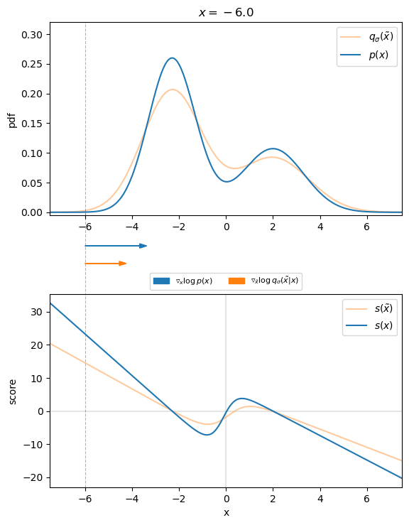
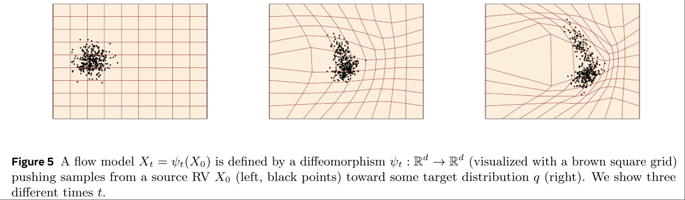
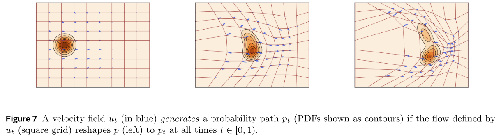
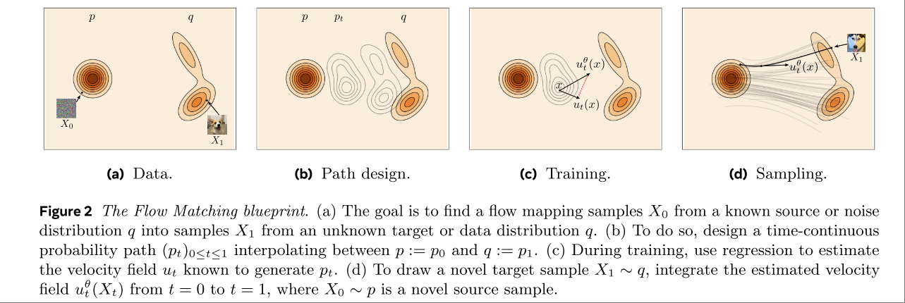
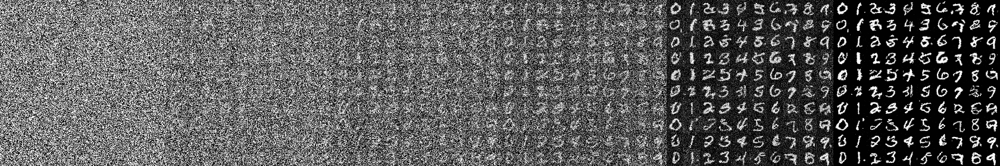
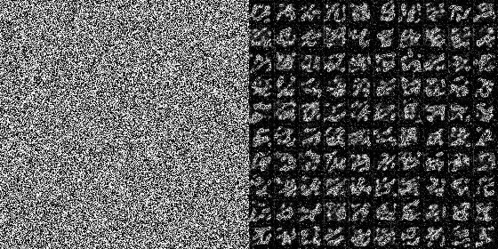
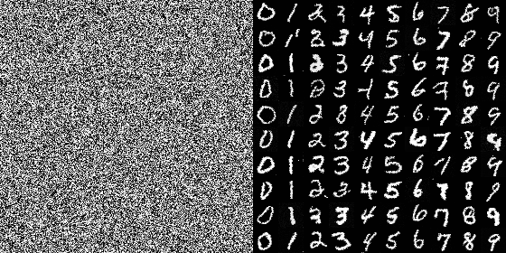

# Diffusion Model
[Reference: Step by Step visual introduction to Diffusion Models.](https://erdem.pl/2023/11/step-by-step-visual-introduction-to-diffusion-models)

Diffusion Model 是一个 数据生成模型，只不过其生成方式不是通过直接回归一个数据分布，或者直接从某个隐空间中映射，而是 “learn a reverse diffusion process that restores structure in data”.

与 GAN 类比的话，类似于将 GAN 的任务拆分成了多步更简单的 denoise 任务。

## Forward Diffusion
本意为扩散，在这里指的是往原始数据中逐渐添加噪声（使得数据的分布“扩散”）的过程。为了与数据复原过程区分，添加噪声的过程称为 Forward Diffusion Process

$$q(x_t| x_{t-1})=\mathcal{N}(x_t | \sqrt{1-\beta_t}x_{t-1},\beta_t I)$$


$\beta\in (0.0001,0.02)$

$\beta$被称作 schedule，是一个取值在 $(0,1]$ 的变化值。但通常取值很小。

上述定义可以很方便的计算任意timestep的 forward diffusion 结果

$$
\begin{align*}
\alpha_t &= 1-\beta_t\\
\bar{\alpha}_t &= \prod_{s=1}^t a_s\\
q(x_t|x_0) &= \mathcal{N}(x_t, \sqrt{\bar{\alpha}_t}x_0, (1-\bar{\alpha}_t)I)\\
&=\sqrt{\bar{\alpha}_t}x_0 + \sqrt{1-\bar{\alpha}_t}\epsilon, \epsilon\sim \mathcal{N}(0,1)
\end{align*}
$$

## Reverse Diffusion
这也是 neural network 要做的事，即训一个模型完成 $p_\theta(x_{t-1}| x_t)$ 的过程。

而 Diffusion Model 的关键就在于，不去 predict $x_{t-1}$，而是 predict 添加在 $x_t$ 上的 noise

pseudo-code
```python
def train_loss(denoise_model, x_0, t):
    # noise is the total noise on x_0
    noise = torch.randn_like(x_0)
    # x_noisy is x_t from forward diffusion process
    x_noisy = q_sample(x_0=x_0, t=t, noise=noise)
    # predict total noise from x_0 to x_t
    predicted_noise = denoise_model(x_noisy, t)
    loss = F.l2_loss(noise, predicted_noise)
    return loss
```

并且更进一步，predict 的是 $t-1$ 次 forward diffusion 过程给 $x_0$ 加上的总 noise，而不是一步的 noise。

> 为什么是总 noise? 因为只有总 noise 才有确定的 target 来用于训练。在 forward diffusion 的过程中，$\beta_t$ 是一个已知的超参数，是可以设定的，在整个 forward diffusion 过程中也不是固定值。另外，最终希望 diffusion model 学到的还是关于 $x_0$ 分布的信息，所谓 "predict noise" 绝不是 "predict random normal noise"，而是 "predict noise on x_0"，只有设定成总 noise，模型才有确定的学习目标，才有容易实现的 target function。

model output 可以表示为 $\epsilon_\theta(x_t, t)$。

如果 diffusion model 可以一次准确的 predict noise，那只需要按照 $q(x_t|x_0) =\sqrt{\bar{\alpha}_t}x_0 + \sqrt{1-\bar{\alpha}_t}\epsilon$ 将 noise 去掉就完成了 denoise 过程，但是这样的话就几乎和 GAN 等价了，还是让 model 做了同样困难程度的问题。

为此 diffusion model 采用的 reverse diffusion 过程也是多步的。这时候就需要解决以下问题 **已知q(x_t|x_0)中noise根据当前x_t的估计值$\epsilon_\theta(x_t,t)$，和当前超参数$\beta_t$，求进行一步denoise之后$x_{t-1}$的估计值是多少**。

经过看不懂的数学推导，其答案为
$$x_{t-1}=\frac{1}{\sqrt{\alpha_t}}(x_t-\frac{\beta_t}{\sqrt{1-\bar{\alpha}}}\epsilon_\theta(x_t, t)) + \sqrt{\beta_t}\epsilon$$

上式结果可以这样粗略理解
- $\alpha_t$ 控制了当前的更新 “步长”，也可以认为是根据 $x_t$，在当前$t$步，diffusion model 只能提供这些可信的更新。这也是为什么 $\beta$ 要设定一个非常小的值，以防止这个更新过程不稳定。
- 除了 mean 部分，还要额外加上一个 random variance $\sqrt{\beta_t}\epsilon$。这是公式推导的结果，同时也代表着去掉一部分 noise 之后的结果并不是最终结果。当然，最后一步输出的时候就不加这一项了。

> 这里也能看出，学习 total noise 还带来了极大的灵活性，inference 的时候完全可以尝试更少的 step 数量以及不同的 $\beta$ schedule，只需要正确的计算 $\alpha$ 即可。

这篇[blog](https://erdem.pl/2023/11/step-by-step-visual-introduction-to-diffusion-models)作者做了一个很有意思的可视化，即如果直接将 predict 的 noise 整个去掉，而不是去掉一部分之后再加一个 random noise，其结果会如下所示：


需要注意上面的可视化中，左列并不是 $x_{t-1}$，而是直接根据 $q(x_t|x_0)$ 公式去掉 noise 之后的 $x_0$。不难想象如果只让 model 去 overfit 单个场景，就像 NeRF 那样，应该也可以做到在 $t=1$ 的时候就得到一个完美的图像。只是这样的话，diffusion model 的建模方式就没有意义了。

## 网络结构
参考 这篇[blog#architecture](https://erdem.pl/2023/11/step-by-step-visual-introduction-to-diffusion-models#architecture)中的可视化。

- 网络总体是一个 U-Net 的结构，其中的 block 可以是 几层CNN，也可以是 ResNet 或者 transformer block。
- 需要将 timestep embedding 和 prompt embedding 输入网络中间层。
  - 对于 timestep embedding，使用的是类似 transformer 里的 positional encoding。
  - 对于 prompt，则可以是简单的 classification，也可以是复杂的 CLIP 等 VLM Model 提供的 vision feature vector。

## Classifier Guidance
Paper: Diffusion models beat GANs on image synthesis.

需要注意的是，guidance 和 embedding 是完全不同的。使用 embedding 的意思是，直接改变图像的 feature。以 CLIP embedding 为例，一种可行的加入 embedding 的方式是，在 UNet 的 ResNet Block 中，将图像 feature 和 CLIP Text Feature 经过一个 attention layer，输出一个包含 Text Feature 的 Feature 来继续预测 noise。在训练的时候这些 embedding 就必须被加进来，这样 inference 的时候 diffusion model 就会根据 text embedding 输出符合当前文本描述的 noise。

而 classifier guidance 只在 inference 的时候发挥作用，是在 denoise 的每一步都在去掉噪声之后的 $\mu^{t-1}$ 的基础上加上一个 $\nabla g$，来直接引导 denoise 往 label $g$ 的方向进行。 

## Denoising Score Matching
[Blog Denoising Score Matching](https://johfischer.com/2022/09/18/denoising-score-matching/)

Diffusion Model 所采用的算法最早在2010年的 technical report "A connection between score matching and denoising autoencoders" 中提出的。Denoising Score Matching （DSM）从 score matching 的角度看待 denoising autoencoder，提出 denoising generative model 本质上的目标是 denoising-score matching。

### Generative Model

对生成式模型 Generative Model 来说，为了从一个未知的分布 $p(x)$ 中生成数据，有两个技术路线
- explicit: 直接对分布的概率密度函数 pdf 进行建模，然后根据这个密度函数进行随机采样。
- implicit: 直接对采样过程建模，例如 GAN，模型的输出也就是采样的结果。

对于 learning based algorithm 来说，不管是哪种建模方式，都需要有合适的 learning objective。而在 data driven learning based algorithm 中，最常见的 learning objective 是 maximum likelihood estimation (MLE) objective，即找到合适的 parameter 值，使得 observed data 有最高的概率（似然）。为此，对一堆 observed data $\mathbf{y}=\{y_1,...,y_n\}$，需要找到一个可以衡量这些数据的似然值的似然函数，并求使其最大化的 $\theta$，以此为 learning objective。

$$
\begin{align*}
\mathcal{L}_n(\theta)=\mathcal{L}_n(\theta;\mathbf{y})=f_n(\mathbf{y},\theta)\\
\hat{\theta} = \argmax_{\theta\in\Theta}\mathcal{L}_n(\theta;\mathbf{y})
\end{align*}
$$

对于 GAN 这样的 implicit method 来说，最大似然可以通过最小化采样结果和数据之间的差别做到。而对 explicit method 来说，需要合适的建模方式，以及在该建模方式下 Likelihood Function 的定义。

一种常见的建模方式是 energy-based model

$$p(x)=\frac{e^{-f_\theta(x)}}{Z_\theta}$$

$f_\theta$ 即为 energy function，通常作为模型的直接输出，$Z_\theta$ 则为 Normalization Constant. 这种建模方式参考了物理学中的 **[波尔兹曼分布 Boltzmann Distribution](https://zh.wikipedia.org/wiki/%E7%8E%BB%E5%B0%94%E5%85%B9%E6%9B%BC%E5%88%86%E5%B8%83)**。该模型的似然函数为

$$\mathbb{E}_{p(x)}[-\log p_\theta(x)] = \mathbb{E}_{p(x)}[\log f_\theta(x) - \log Z_\theta]$$

剩下的就是用随机梯度下降等方法求解。

但是对于生成式模型来说，即使通过最大似然得到了很好的 energy function estimation (例如通过随机梯度下降)，得到的 energy-based model 也无法用于高维的、维度之间强相关的分布的采样，也就没办法生成符合分布的样本。

### Score Based Model
不同于直接 estimate energy，定义 score function

$$s(x) = \nabla_x\log p_\theta(x)$$

对于样本点 $x$，$s(x)$ 很直观的表示了 direction to higher density region.

从 energy-based model 的角度看

$$s(x) = -\nabla_x f(x)$$

energy-based model 意味着 model 本身的建模对象(输出)就是 $s(x)$，想要采样的时候就不是按照 $p(x)$ 采样了，一种可能的采样方式是根据随机的输入 $x_t$，求出该位置的 score estimation $s(x_t)$，然后 move along this direction。当然，直接这样做必然会得到一个 local optimal。

如何采样先放一边，仅仅是 score-based model 本身是无法直接训练的，因为没有合适的 objective，或者说面临 score-matching 的问题。

$s_\theta(x)$ 的定义是 “似然函数的梯度”，所以最直接的 learning objective 就是和真实似然函数梯度之间的差距，或者叫 score-matching objective

$$J(\theta) = E_{p(x)}[\lVert s_\theta(x)-\nabla_x\log p(x) \rVert]$$

而 $-\nabla_x\log p(x)$ 无法从数据中计算出来，即使有真值，由于要 weignted with $p(x)$ (因为是 estimation over $p(x)$)，所以在 low density (probability) region 就难以获得准确的 estimation。

### Denoising Score-Matching
"A connection between score matching and denoising autoencoders" 文章的核心观点就是，最小化 score-matching objective，等价于 denoising 过程，即：
- 最小化 DSM Objective 等价于 最小化 score-matching objective。
- denoising 过程就是按照 score function 的 direction 不断 shift distribution 的过程，denoising 的结果就是最大似然。

稍微具体来说，考虑一个添加了 noise 的新随机变量 

$$\tilde{x} = x+\epsilon, \epsilon \sim \mathcal{N}(0,\sigma^2\cdot I)$$

对于这个新的分布 $q_\sigma(\tilde{x})$，如果要估计其 score function $s_\theta(\tilde{x})$，对应的 score-matching objective 为

$$\mathcal{J}_{explicit}(\theta) = \mathbb{E}_{q_\sigma(\tilde{x})}\left[ \frac{1}{2}\lVert s_\theta(\tilde{x}) - \nabla_{\tilde{x}}\log q_\sigma(\tilde{x})\rVert^2_2 \right]$$

而前面提到的文章证明了上述结果等同于以下 DSM Objective

$$\mathcal{J}_{DSM_\sigma}(\theta) = \mathbb{E}_{q_\sigma(\tilde{x}, x)}\left[ \frac{1}{2}\lVert s_\theta(\tilde{x}) - \nabla_{\tilde{x}}\log q_\sigma(\tilde{x}|x)\rVert^2_2 \right]$$

通过最小化这个 objective 所训练出来的 $\theta$ 就是 $s_\theta(\tilde{x})$。

又因为有 

$$\nabla_{\tilde{x}}\log q_\sigma(\tilde{x}|x) = \frac{x-\tilde{x}}{\sigma^2}$$

denoise 的过程原本是向着 $x$ 的分布逐渐靠近，而根据上面的式子，这个过程同时也是在沿着 $\nabla_{\tilde{x}}\log q_\sigma(\tilde{x}|x)$ 移动，也就是沿着 score function $s_\theta(\tilde{x})$ 移动，也就是在最大化 $q(\tilde{x})$ 的似然函数。

博客中给出了一个很直观的可视化，对于两个 Gaussian 组成的 1D GMM $p(x)$，为其加上另一个 gaussian noise 之后得到 $q_\sigma(\tilde{x})$，$p(x)$ 的 score function (似然函数的梯度) 和 denoise score $\nabla_{\tilde{x}}\log q_\sigma(\tilde{x}|x)$ （按照 $q_\sigma(\tilde{x}|x)\sim \mathcal{N}(x, \sigma^2\cdot I)$ 计算，大概）如下图所示。



## Local and Global Conditioning

## Deep Diffusion Implicit Model(DDIM)
- [DDIM Blog](https://medium.com/@akp83540/deep-diffusion-implicit-model-ddim-b2e4e947b606) (写得并不好)
- [Hugging Face DDIM Schedule](https://huggingface.co/docs/diffusers/v0.31.0/en/api/schedulers/ddim)

> The Deep Diffusion Implicit Model (DDIM) is a type of generative model that accelerates the sampling process of diffusion models by using non-Markovian diffusion processes. This approach allows for faster generation of high-quality images and sounds while maintaining the same training objective as traditional diffusion models.

## Flow Matching

来自论文 Flow Matching for Generative Modeling。

如果要上手 Flow Matching，可以通过 [flow_matching repo](https://github.com/facebookresearch/flow_matching) 和 [TorchCFM](https://github.com/atong01/conditional-flow-matching)，提供了代码实现、example code、tutorial doc。

其他可选 code base


- [Optimal-Flow-Matching](https://github.com/Jhomanik/Optimal-Flow-Matching)


Flow Matching 中用 $x_0$ 是初始噪声，$x_1$ 是最终图像。

其最重要的两个公式，一个是定义 vector field 的常微分方程 ODE，flow $\phi_t(x)$ 即为该方程的解。

$$
dx = u_t(x)dt
$$

另一个是 连续性方程 continuity equation，规定了 vector field 的约束条件，即将 $p_0$ 在满足连续性方程的情况下变换到 $p_1$

$$
\frac{\partial p}{\partial t} = - \nabla \cdot (p_t u_t)
$$

### 物理基础

对于某个向量场 $F$ ，其单位时间内通过某个曲面的量，即为通量 Flux。

$$ \Phi = \iint_S \mathbf{F} \cdot \mathbf{n} ~ dS $$

$n$ 为法向，$dS$ 是曲面的微分。

散度则描述向量场在某点处的发散程度，也可以说是通量的局部密度的变化率，他可以看作是通量在体积趋近于0时的通量的极限

$$ 
\begin{align*}
\text{div} ~\mathbf{F}|_{x_0} & = \nabla \cdot \mathbf{F} \\
&= \lim_{V \to 0} \frac{1}{|V|} \oiint_{\partial S(V)} \mathbf{F} \cdot \mathbf{n} ~ dS \\
& = \lim_{V \to 0} \frac{1}{|V|} \Phi(S)
\end{align*}
$$

上式中 $S(V)$ 是 $V$ 的 boundary，散度 Divergence 描述的是某个点是在产生某个物理量 source，还是消耗某个物理量 sink

在计算上，等于对向量场的分量求偏导的和，或者说等于梯度矩阵的迹（对角元素和）

$$ \text{div}  ~\mathbf{F} = \nabla \cdot \mathbf{F} = \frac{\partial F_x}{\partial x} + \frac{\partial F_y}{\partial y} + \frac{\partial F_z}{\partial z} $$

补充一下梯度矩阵：

$$ \nabla \mathbf{F} = \begin{bmatrix} \frac{\partial F_x}{\partial x} & \frac{\partial F_x}{\partial y} & \frac{\partial F_x}{\partial z} \\ \frac{\partial F_y}{\partial x} & \frac{\partial F_y}{\partial y} & \frac{\partial F_y}{\partial z} \\ \frac{\partial F_z}{\partial x} & \frac{\partial F_z}{\partial y} & \frac{\partial F_z}{\partial z} \end{bmatrix} $$

### 概率基础

对于随机变量 $z$ ，其符合分布 $z\sim \pi(z)$ ，则对于随机变量 $x=f(z)$ ，则 $x$ 的分布为

$$ p(x) = \pi(z) \cdot \left| \det \left( \frac{\partial z}{\partial x} \right) \right| $$

或者更简单的 1 维情况下为

$$ p(x) = \pi(z) \cdot \left| \frac{dz}{dx} \right| $$

换句话说，导数，（或者 Jacobian 矩阵的行列式），代表了概率密度的缩放。

如果 $f$ 是一个可逆函数，用 $z=f^{-1}(x)$ 做变量替换，则得到了

$$ p(x) = \pi(f^{-1}(x)) \cdot \left| \frac{d}{dx} f^{-1}(x) \right| $$

比如 DDPM 的 Forward Process 过程中，有

$$
x_t= f(\epsilon) = \sqrt{\bar{\alpha}_t}x_0 + \sqrt{1-\bar{\alpha}_t}\epsilon, \epsilon\sim \mathcal{N}(0,1)
$$

如果应用上面的变量替换公式，算出来的也应当是


$$q(x_t) = \mathcal{N}(x_t, \sqrt{\bar{\alpha}_t}x_0, (1-\bar{\alpha}_t)I)$$


### Flow

Flow 为将一个随机变量 $x_0$ ，通过一系列可逆变换 $x_{i+1} = f_{i+1}(x_i)$，得到 $x_t$ 的过程称为一个 flow

$$x_t = (f_t \circ f_{t-1} \circ ... f(1))(x_0) = \phi_t(x_0) $$

如果将 t 变为 0~1 的连续值 Continuous normalizing flows (CNFs) ，那么 flow 变换可以写成一个常微分方程 ODE

$$
\frac{d}{dt}\phi_t(x) = v_t(\phi_t(x)) \\
\phi_0(x) = x
$$

（即 flow $\phi(x)$ 是 vector field 的 ODE $dx = v_t(x)dt$ 的解）

这里的 $v_t$ 称为 time-dependent vector field，相当于变换过程在某个特定的 t 时刻的方向场。

如果 $\phi_t$ 是 Diffeomorphism （微分同胚，可逆函数且逆函数和本身都是连续可微），那么 vector field 也可以写成反函数形式

$$
v_t(x) = \frac{d}{dt}\phi_t(\phi^{-1}_t(x))
$$

整个 flow 的变换过程也是一个不断改变随机变量的分布的过程，可以看作是随着 flow 的变换，x 的分布沿着一条 probability density path $p_0 \rightarrow p_1 \rightarrow ... p_t$ 变换到目标分布。





### 从物理视角看 flow

现在从前面提到的通量和散度的视角看待这个过程，随机变量的分布 $p(x)$ 本身就是一个概率密度场，Flow 变换过程可以看作是一个连续的概率密度变化路径 ( $p_0 \rightarrow p_1 \rightarrow \dots \rightarrow p_t$ )，其变化由时间相关的向量场  $v_t$  决定。

再一对一类比一下

- 随机变量 $x$ 的取值对应了场的空间位置。
- 概率密度函数 $p(x)$ 描述了不同位置上的密度，即动态的场函数
- 在时间 $t$ ，概率密度场 $p_t(\phi_t(x))$ 的流动由时间相关的向量场 $v_t(\phi_t(x)) = \frac{d}{dt}\phi_t(x)$ 决定，如果把 $v_t$ 在 x 空间内的某个 manifold 上取积分，就对应了概率密度场在该曲面上的通量。
- 类比到图像空间（单个像素），$x$ 是该像素的颜色，$p(x)$ 是取不同颜色的概率密度。

而对于某个位置 $x_t$ 处，散度 $\nabla \cdot (p(x_t) v_t(x_t))$ 表示概率密度场的局部变化率。


在每个时间步 $t$ ，概率密度的变化可以通过散度公式描述： 

$$ \frac{\partial p(x_t)}{\partial t} = -\nabla \cdot (p(x_t) v_t(x_t)) $$

上述散度公式实际上体现了概率的守恒，即整个系统中，概率密度场可以动态变化，带概率密度的总量是守恒的，概率密度的变化是由概率密度流动引起的，或者说通量引起的。

如果再回到 flow matching 中，该方程是 flow matching 各种推导的核心之一，也称为连续性方程，**continuity equation**。一个满足 continuity equation 的 $v_t$ 和初始分布 $\phi_0(x) = x \sim p_0$ 定义了一个完整的 flow。上述公式定义了一个 “合法的” 的变化路径应当满足的条件。


### Vector Field GT $u_t$ 形式

Flow matching 的基本想法是，用网络预测时间相关向量场 $v_t$ ，用 $v_t$ 表示预测值，$u_t$ 表示 ground truth，learning target 为

$$\mathcal{L}_{FM} = \mathbb{E}_{t,p_t(x)} \lVert v_t(x) - u_t(x)\rVert^2$$

现在的问题是 $u_t$ 未知。但 Flow Matching 首先给出了 $u_t$ 需要满足的形式，即 $u_t$ 满足概率密度守恒，即满足散度公式。

根据前面的散度公式，$u_t(t)$ 是需要满足特定形式的，具体来说，$u_t$ 需要保证对于每一个最终目标场 $x_1$ ，其概率变化路径始终满足散度公式中的守恒关系。

用条件概率公式变化一下概率密度场的散度

$$
\frac{d}{dx} p_t(x) = -\text{div} \left(\int u_t(x|x_1) p_t(x|x_1)q(x_1)dx_1 \right) = -\text{div}\left( u_t(x) p_t(x) \right)
$$

即 $u_t$ 需要满足形式

$$
u_t(x) = \int u_t(x|x_1) \frac{p_t(x|x_1)q(x_1)}{p_t(x)}dx_1
$$

上面式子相当于说，满足散度守恒的向量场 $u_t$ 受到条件向量场 $u_t(x|x_1)$ 的限制。

### CFM Objective

Flow matching 证明了一件事，优化上述 Flow Matching objective 得到的概率密度变化路径等价于优化以下 Conditional Flow Matching objective

$$
\mathcal{L}_{CFM} (\theta) = \mathbb{E}_{t,q(x_1),p_t(x|x_1)} \lVert v_t(x) - u_t(x|x_1)\rVert^2
$$

这是因为他们的梯度相同 $\nabla_{\theta}\mathcal{L}_{FM} = \nabla_{\theta}\mathcal{L}_{CFM}$


### Construction of $p_t(x|x_1)$

即构造一类概率密度变化路径，和他对应的条件向量场。

- $p_t(x|x_1)$ 对应了噪声的添加方式
- $u_t(x|x_1)$ 对应了学习目标

对于概率密度变化路径，本文希望他仍然是 Gaussian conditional paths，即

$$
p_t(x|x_1) = \mathcal{N} (x| \mu_t(x_1),\sigma(x_1)^2I)
$$

该路径对应的 flow 为

$$
\psi_t(x) = \sigma_t(x_1)x + \mu_t(x_1)
$$

此时的 vector field 可以直接由 $u_t(\psi_t(x)|x_1) = \frac{d}{dt}\psi_t(x)$ 算出来

$$
u_t(x|x_1) = \frac{\sigma'_t(x_1)}{\sigma_t(x_1)}(x-\mu_t(x_1)) + \mu_t'(x_1)
$$

### Construction of $u_t(x|x_1)$

不同的 $\mu_t$ $\sigma_t$ 对应了不同类型的 flow。

Variance Exploding Path:

$$p_t(x) = \mathcal{N}(x| x_1, \sigma^2_{1-t}I)$$

即 $\mu_t (x_1) = x_1$。当 $\sigma_0 = 0$ $\sigma_1\gg 1$ 是，$x_0$ 依然是 random noise，这就对应了 score matching 算法的 flow。

Variance Preserving Path:

DDPM

### Optimal Transport conditional Vector Field

$$
\mu_t(x) = tx_1 \\
\sigma_t(x) = 1-(1-\sigma_{min}) t
$$

即线性变化，此时对应的 vector field 为

$$
u_t(x|x_1) = \frac{x_1 - (1-\sigma_{min})x}{1-(1-\sigma_{min})t}
$$

### Implementation: Conditional Flow Matching

注意这里的 Conditional 指的是 Conditioned on Dataset。

Reference: [Flow Matching Guide and Code](https://github.com/facebookresearch/flow_matching), [TorchCFM](https://github.com/atong01/conditional-flow-matching)

Flow Matching 模型建模的是 Vector Field，算法总体上需要考虑以下过程



即首先选定概率密度变化路径，然后训练 vector field 来生成该路径。概率密度变化路径的选择取决于两部分

- 初始分布 $q_0$
- ground truth vector field $u_t$

最简单的情况下，$q_0$ 为 random noise

```python
x0 = torch.randn_like(x1)
```

$u_t(x|x_1)$ 只要满足连续性方程 **continuity equation**，且保证根据该方程 push forward 到 t=1 的时候得到 x_1，于是最简单的形式如下所示

```python
ut = x1 - x0
```

此时的 learning target （公式来自 Rectified Flow）就变成了简单的

$$
\mathcal{L}_v = \mathbb{E}_{x0, x1, t} \left[  \lVert v_\theta(x_t, t) - (x_1 - x_0)  \rVert^2 \right]
$$

那么直接用上述最简单的情况，整个 flow matching 训练和推理流程的 psudo code 大概像下面这样

```python
def sample_location_and_conditional_flow(x0, x1):
    # 根据初始分布和目标分布的样本点，
    # 采样时间步 t
    t = torch.rand(x0.shape[0]).type_as(x0)

    # 采样输入样本点在时间 t 处对应分布的取值
    xt = t * x1 + (1-t)x0

    # 计算 ground truth 的 flow field
    ut = x1 - x0

    return t, xt, ut


# Train
for batch in dataset:
    # 获取目标分布的样本点
    x1 = batch[0]
    y = batch[1] # label

    # 生成训练数据
    x0 = torch.randn_like(x1)
    t, xt, ut = sample_location_and_conditional_flow(x0, x1)
    
    # 调用模型
    vt = model(t, xt, y)


    loss = torch.mean((vt - ut) ** 2)
    loss.backward()

# Inference
with torch.no_grad():
    num_steps = 5
    x0 = torch.randn_like(x1)
    y = random_label()
    traj = [x0]
    for i in range(num_steps):
        t = (i + 1) / num_steps # 1/num_steps, 2/num_steps, ..., 1

        # 调用模型预测 vector field
        v = model(t, x0, y)

        # 求解 ODE dx = vt * dt
        # 这里是用的最简单的欧拉法
        x0 = x0 + v / num_steps
        traj.append(x0)
```

用 5 步进行 push forward，在 mnist 手写数字数据集上用上述最简单的 linear vector field 训练后的结果如下所示



上述 psudo code 中，ODE 的求解是用的最简单的欧拉法，如果用该方法，在 num_steps=1 的时候并不能得到靠谱的结果。



torchCFM package 直接调用了 torchdiffeq package 提供的 ODE 求解器得到以下效果。




### Implementation: Optimal Transport Conditional Flow Matching (OT-CFM)

torchCFM 的论文 Improving and Generalizing Flow-Based Generative Models with Minibatch Optimal Transport 所实现的核心算法。

### Implementation: RectifiedFlow

FLUX 所基于的模型架构。