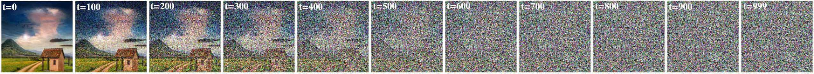
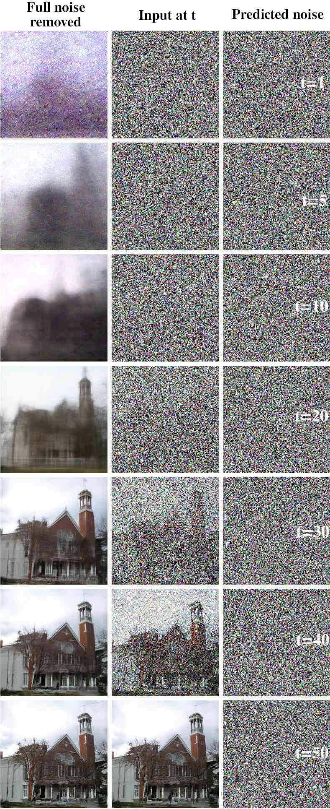

# Diffusion Model
[Reference: Step by Step visual introduction to Diffusion Models.](https://erdem.pl/2023/11/step-by-step-visual-introduction-to-diffusion-models)

Diffusion Model 是一个 数据生成模型，只不过其生成方式不是通过直接回归一个数据分布，或者直接从某个隐空间中映射，而是 “learn a reverse diffusion process that restores structure in data”.

与 GAN 类比的话，类似于将 GAN 的任务拆分成了多步更简单的 denoise 任务。

## Forward Diffusion
本意为扩散，在这里指的是往原始数据中逐渐添加噪声（使得数据的分布“扩散”）的过程。为了与数据复原过程区分，添加噪声的过程称为 Forward Diffusion Process

$$q(x_t| x_{t-1})=\mathcal{N}(x_t | \sqrt{1-\beta_t}x_{t-1},\beta_t I)$$


$\beta\in (0.0001,0.02)$

$\beta$被称作 schedule，是一个取值在 $(0,1]$ 的变化值。但通常取值很小。

上述定义可以很方便的计算任意timestep的 forward diffusion 结果

$$
\begin{align*}
\alpha_t &= 1-\beta_t\\
\bar{\alpha}_t &= \prod_{s=1}^t a_s\\
q(x_t|x_0) &= \mathcal{N}(x_t, \sqrt{\bar{\alpha}_t}x_0, (1-\bar{\alpha}_t)I)\\
&=\sqrt{\bar{\alpha}_t}x_0 + \sqrt{1-\bar{\alpha}_t}\epsilon, \epsilon\sim \mathcal{N}(0,1)
\end{align*}
$$

## Reverse Diffusion
这也是 neural network 要做的事，即训一个模型完成 $p_\theta(x_{t-1}| x_t)$ 的过程。

而 Diffusion Model 的关键就在于，不去 predict $x_{t-1}$，而是 predict 添加在 $x_t$ 上的 noise

pseudo-code
```python
def train_loss(denoise_model, x_0, t):
    # noise 为添加在 x_0 上的总 noise
    noise = torch.randn_like(x_0)
    # x_noisy 为 x_t
    x_noisy = q_sample(x_0=x_0, t=t, noise=noise)
    # 直接预测总 noise
    predicted_noise = denoise_model(x_noisy, t)
    loss = F.l2_loss(noise, predicted_noise)

    return loss
```

并且更进一步，predict 的是 $t-1$ 次 forward diffusion 过程给 $x_0$ 加上的总 noise，而不是一步的 noise。

> 为什么是总 noise? 因为只有总 noise 才有确定的 target 来用于训练。在 forward diffusion 的过程中，$\beta_t$ 是一个已知的超参数，是可以设定的，在整个 forward diffusion 过程中也不是固定值。另外，最终希望 diffusion model 学到的还是关于 $x_0$ 分布的信息，所谓 "predict noise" 绝不是 "predict random normal noise"，而是 "predict noise on x_0"，只有设定成总 noise，模型才有确定的学习目标，才有容易实现的 target function。

model output 可以表示为 $\epsilon_\theta(x_t, t)$。

如果 diffusion model 可以一次准确的 predict noise，那只需要按照 $q(x_t|x_0) =\sqrt{\bar{\alpha}_t}x_0 + \sqrt{1-\bar{\alpha}_t}\epsilon$ 将 noise 去掉就完成了 denoise 过程，但是这样的话就几乎和 GAN 等价了，还是让 model 做了同样困难程度的问题。

为此 diffusion model 采用的 reverse diffusion 过程也是多步的。这时候就需要解决以下问题 **已知q(x_t|x_0)中noise根据当前x_t的估计值$\epsilon_\theta(x_t,t)$，和当前超参数$\beta_t$，求进行一步denoise之后$x_{t-1}$的估计值是多少**。

经过看不懂的数学推导，其答案为
$$x_{t-1}=\frac{1}{\sqrt{\alpha_t}}(x_t-\frac{\beta_t}{\sqrt{1-\bar{\alpha}}}\epsilon_\theta(x_t, t)) + \sqrt{\beta_t}\epsilon$$

上式结果可以这样粗略理解
- $\alpha_t$ 控制了当前的更新 “步长”，也可以认为是根据 $x_t$，在当前$t$步，diffusion model 只能提供这些可信的更新。这也是为什么 $\beta$ 要设定一个非常小的值，以防止这个更新过程不稳定。
- 除了 mean 部分，还要额外加上一个 random variance $\sqrt{\beta_t}\epsilon$。这是公式推导的结果，同时也代表着去掉一部分 noise 之后的结果并不是最终结果。当然，最后一步输出的时候就不加这一项了。

> 这里也能看出，学习 total noise 还带来了极大的灵活性，inference 的时候完全可以尝试更少的 step 数量以及不同的 $\beta$ schedule，只需要正确的计算 $\alpha$ 即可。

这篇[blog](https://erdem.pl/2023/11/step-by-step-visual-introduction-to-diffusion-models)作者做了一个很有意思的可视化，即如果直接将 predict 的 noise 整个去掉，而不是去掉一部分之后再加一个 random noise，其结果会如下所示：



需要注意上面的可视化中，左列并不是 $x_{t-1}$，而是直接根据 $q(x_t|x_0)$ 公式去掉 noise 之后的 $x_0$。不难想象如果只让 model 去 overfit 单个场景，就像 NeRF 那样，应该也可以做到在 $t=1$ 的时候就得到一个完美的图像。只是这样的话，diffusion model 的建模方式就没有意义了。

## 网络结构
参考 这篇[blog#architecture](https://erdem.pl/2023/11/step-by-step-visual-introduction-to-diffusion-models#architecture)中的可视化。

- 网络总体是一个 U-Net 的结构，其中的 block 可以是 几层CNN，也可以是 ResNet 或者 transformer block。
- 需要将 timestep embedding 和 prompt embedding 输入网络中间层。
  - 对于 timestep embedding，使用的是类似 transformer 里的 positional encoding。
  - 对于 prompt，则可以是简单的 classification，也可以是复杂的 CLIP 等 VLM Model 提供的 vision feature vector。

## Classifier Guidance
Paper: Diffusion models beat GANs on image synthesis.

需要注意的是，guidance 和 embedding 是完全不同的。使用 embedding 的意思是，直接改变图像的 feature。以 CLIP embedding 为例，一种可行的加入 embedding 的方式是，在 UNet 的 ResNet Block 中，将图像 feature 和 CLIP Text Feature 经过一个 attention layer，输出一个包含 Text Feature 的 Feature 来继续预测 noise。在训练的时候这些 embedding 就必须被加进来，这样 inference 的时候 diffusion model 就会根据 text embedding 输出符合当前文本描述的 noise。

而 classifier guidance 只在 inference 的时候发挥作用，是在 denoise 的每一步都在去掉噪声之后的 $\mu^{t-1}$ 的基础上加上一个 $\nabla g$，来直接引导 denoise 往 label $g$ 的方向进行。 