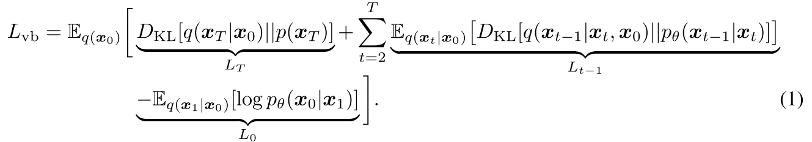
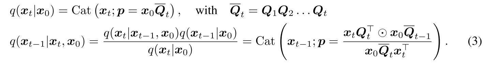

# Structured Denoising Diffusion Models in Discrete State-Spaces
Google Research, Brain Team. Cite 710

Discrete Denoising Diffusion Probabilistic Models (D3PMs)

本文首先将 Diffusion Model 进行了一定的抽象，不考虑具体的 forward 和 reverse 的方式，一个 Diffusion Model 总是关心
- forward process $q(x_{1:T}, x_0) = \prod_{t=1}^Tq(x_t|x_{t-1})$。
- learned reverse Markov process $p_\theta(x_{0:T}) = p(x_T)\prod_{t=1}^Tp_\theta(x_{t-1}|x_t)$

Diffusion Model 的最终目标是得到 $p_\theta(x_0)$ 使其符合 $q(x_0)$，训练的目标是最小化

Diffusion Model 的设计里，$t\rightarrow\infty$ 的时候，$q(x_t | x_0)$ 收敛到一个和 $x_0$ 无关的 $\pi(x)$。这样就保证 $L_T = 0$。（$\pi(x_t|x_0)$ 也可以是一个与 $x_0$ 有关的分布，这时候 $p_\theta(x_T)$ 也需要通过 $L_T$ 来优化得到。）

$q(x_t|x_{t-1})$ 理论上可以任意，但是实际能够使用的 $q$ 需要满足
- $q(x_t | x_0)$ 可以快速采样，从而可以快速获取优化 $L_{t-1}$ 的数据
- forward process 的后验 $q(x_{t-1}|x_t, x_0)$ 也可以计算的，从而能够实际计算 $L_{t-1}$

当前应用最广的 Diffusion Model 采用以下形式：

$$q(x_t|x_{t-1}) = \mathcal{N}(x_t|\sqrt{1-\beta_t} x_{t-1}, \beta_t I)$$

其添加的 gaussian noise 可以单独计算，用于 $L_{t-1}$ 的计算。

$$p_\theta(x_{t-1}| x_t) = \mathcal{N}(x_{t-1}| \mu_\theta(x_t, t), \Sigma_\theta(x_t, t))$$

## Diffusion models for discrete state spaces

本文为离散形式的 $x$ 提供了一个 forward transition model 的方案

$$q(x_t| x_{t-1}) = \text{Cat}(x_t; p=x_{t-1}Q_t)$$

这里的 $x_t$ 取值是离散的，不妨假设其代表 K categories $x_t\in 1,...,K$。$Q_t$ 是一个矩阵，将 $x_{t-1}$ transition 到 $x_t$。

考虑 $x_t$ 是一堆 one-hot 的 row vector （$x_t=i\in 1...K$ 即代表对应位置上是 1），$Q_t$ 可以定义为矩阵 $[Q_t]_{i,j} = q(x_t=j| x_{t-1}=i)$。$x_{t-1}Q_t$ 得到的每个 row vector 都是离散的 one hot vector $x_t$ 的概率（因为 q 是概率分布），$\text{Cat}(x;p)$ 则代表 $p$ 这个 probabilities row vector 所代表的 Categorical Distribution。

对应到实际数据形式，$x$ 的每一行都可以代表一个词向量或者像素值的离散值。

对应的 forward process 和 posterior 为

## Choice of $Q_t$

$Q_t$ 需要满足
- 每一行和为1
- $\bar{Q}_t$ 在 t 很大时收敛到一个和 $x_0$ 无关的噪声分布

本文采用的 $Q_t$ 来自先前别人的工作，没看但大概是下面的形式：

$$Q_t = (1-\beta_t)I + \beta_t/K\mathbb{11}^T$$