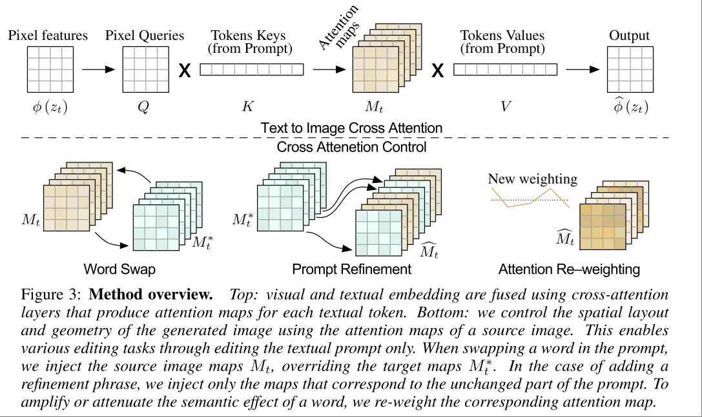

# Prompt-to-Prompt Image Editing with Cross-Attention Control

- [page](https://prompt-to-prompt.github.io/)

直接利用 text-to-image 模型做 image editing。

image editing 的一大难点在于按照指令编辑的同时保留原图片与 edit 指令无关的内容。在本文之前，常见的解决方案是各种 inpainting，或者用 mask 作为 conditioning。而本文的核心贡献就是不需要这些额外的输入做控制，只需要输入修改后的 prompt。

## Methodology

text-to-image 模型中， language prompt 和 image 之间的关联性主要由 cross attention layer 来控制。所以本文的思路就是，直接把 cross-attention map 注入到 diffusion 过程中。

首先把 text-to-image 模型中的 cross attention 部分拆开来看，其过程相当于 使用 pixel 作为 query，提取 language token 中该 pixel 需要的信息。具体来说

- 有 Pixel Query 和 Token Key 得到 Attention Map，其中的值即为每个 pixel query 对每个 token 的 attention map $M$。$M$ 数值上与 Q K 之间的相似度有关
- 正常流程下，该 map 用于提取 token value，得到的 $MV$ 用于更新 spatial feature $\phi(z_t)$

上述过程意味着

- Spatial feature $\phi(z_t)$ 是从 token value 中提取组合（weighted average）出来的
- 组合的方式 (weight) 由 attention map $M=QK$ 决定。

如果把 attention map 可视化一下，则如下图所示

