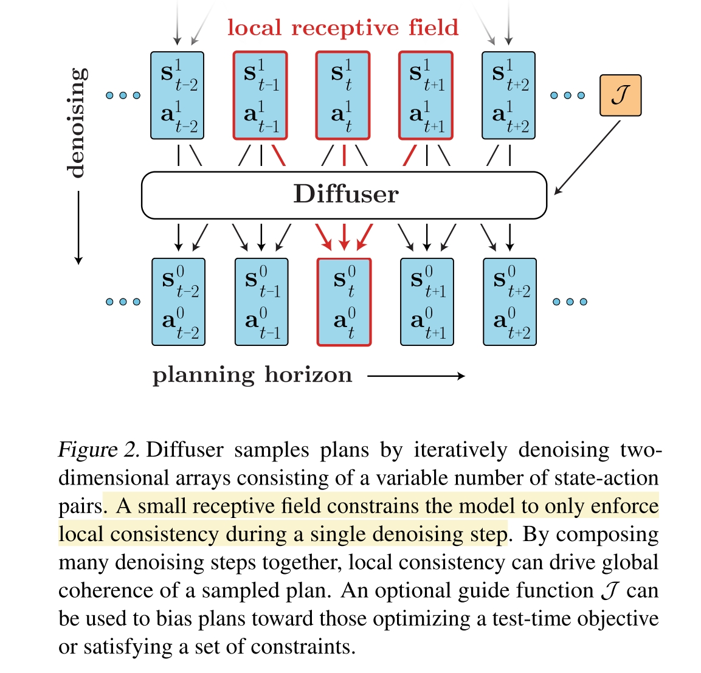
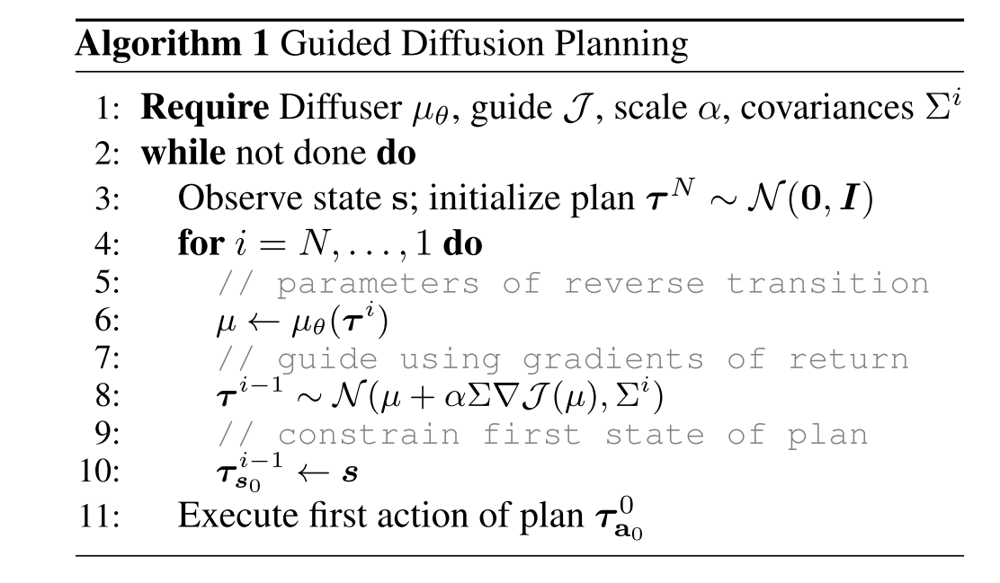

# Planning with diffusion for flexible behavior synthesis
Diffuser

- [page](https://diffusion-planning.github.io/)

总体上也是用 diffusion model 来求解 trajectory optimization 问题，然后用一个 reward function 来引导 reverse process 结果。

> 原理上可能得看一看 classifier guided diffusion 参考的一篇 2015 年文章 Deep unsupervised learning using nonequilibrium thermodynamics

## Method
首先将 planning 看作是一个 trajectory optimization 问题

$$a_{0:T}^* = \argmax_{a_{0:T}}\mathcal{J}(s_0, a_{0:T}) = \argmax_{a_{0:T}}\sum_{t=0}^Tr(s_t, a_t)$$

然后用一个 diffusion model 来求解这个问题

$$\tilde{p}_\theta(\tau)\propto p_\theta(\tau)h(\tau)$$

这里 $p_\theta(\tau)$ 为 diffusion model，$h(\tau)$则是包含 prior evidence (such as an observation history), desired outcomes (such as a goal to reach), or general functions to optimize (such as rewards or costs)。本文希望 denoise 的过程可以得到符合 $\tilde{p}_\theta(\tau)$ 的结果。

### Model
模型的输入为一个 trajectory。但是 trajectory 本身是一个 sequence，如果单纯的将 waypoint set 作为输入，diffusion model 的结果将无法包含顺序信息。

为此，本文限定了 diffusion model 的输入“感受野”，定义 diffusion model 的输入为相邻的三个 $(s,a)$ pair，输出 denoise 之后的中间 $(s,a)$

为了训练 diffusion model，首先生成在当前 state space 下的一大堆 trajectory，用这些 trajectory 作为训练集，以无监督的方式训练 diffusion model

$$\mathcal{L}(\theta) = \mathbb{E}_{i,\epsilon,\tau^0}[\lVert \epsilon-\epsilon_\theta(\tau_i, i) \rVert^2]$$

(就是 Diffusion Model 标准的 noise loss)

### RL as Guided Sampling
实际求解 optimization problem 的过程是 inference diffusion model 的过程。方法就是将 RL 的 reward 作为 guidance（classifer）来对 diffusion model 进行 inference。

本文中采用的方法很直接，在 diffusion model 之外，单独训练一个 value (reward) network $\mathcal{J_\phi}(\tau)$，来衡量整个 trajectory 的累积回报。

在 inference diffusion model （reverse process）的时候，正常的更新流程为

$$x_{t-1}=\frac{1}{\sqrt{\alpha_t}}(x_t-\frac{\beta_t}{\sqrt{1-\bar{\alpha}}}\epsilon_\theta(x_t, t)) + \sqrt{\beta_t}\epsilon$$

本文将 mean 的部分 （$\mu=\frac{1}{\sqrt{\alpha_t}}(x_t-\frac{\beta_t}{\sqrt{1-\bar{\alpha}}}\epsilon_\theta(x_t, t))$）额外加上一个 $\nabla\mathcal{J}(\mu)$，来直接引导 reverse process 给出最大化 $\mathcal{J}$ 的结果。

定义 $\mathcal{O}\in\{0,1\}$为trajectory最优与否，$p(\mathcal{O}_{1:T}=1)=\exp(r(s_t,a_t))$ 可以表示成一堆 reward function。那么求解最优化问题实际上是找到符合 $\tilde{p}_\theta(\tau)=p(\tau | \mathcal{O}_{1:T}=1)\propto p(\tau)p(\mathcal{O}_{1:T}=1|\tau)$

然后 reverse process 变成了 

$$p_\theta(\tau^{i-1}|\tau^i, \mathcal{O}_{1:T})\approx \mathcal{N}(\tau^{i-1}; \mu+\Sigma g, \Sigma)$$
$$\begin{align*}
g&=\nabla_\tau \log p(\mathcal{O_{1:T}|\tau})|_{\tau=\mu}\\
&=\sum_{t=0}^T\nabla_{s_t,a_t}r(s_t,a_t)|_{s_t,a_t=\mu_t}=\nabla\mathcal{J}(\mu)
\end{align*}$$

$\mu$为 reverse process 原本给出的 $\tau^{i-1}$ 估计，$t$是waypoint的index，也就是说只需要定义一堆 differential 并且 trainable 的 reward function $r(s_t, a_t)$ 就行了。

<!--
本文给出的数学推导很，牵强，大概意思是说
- diffusion model 学到了 trajectory 的总体分布 $p(\tau)$
- 定义 $\mathcal{O}\in\{0,1\}$为trajectory最优与否，$p(\mathcal{O}_{1:T}=1)=\exp(r(s_t,a_t))$ 可以表示成一堆 reward function。那么求解最优化问题实际上是找到符合 $\tilde{p}_\theta(\tau)=p(\tau | \mathcal{O}_{1:T}=1)\propto p(\tau)p(\mathcal{O}_{1:T}=1|\tau)$，类似的式子大概在 classifier guidance diffusion model 的 paper 出现过
- 文章认为用 diffusion 同样的推导方法，
-->

### Reward Design
文章对这一部分描述太语焉不详了。个人认为 reward function 是由 virtual env 直接给出的，即文章直接使用了 RL 所应用的一些 virtual env，然后直接从中训练 $\mathcal{J}_\phi$。在网络设计放面，文章有提到 reward model 使用了 diffusion model 的一部分，然后加一个 reward output head 输出。

很多任务都会限定 start goal state，本文的对这种 hard constraint 的建模方式是，在每一个 reverse process step 之后，将对应的 state 和 action （例如第一个和最后一个 state 及其 action）直接修改为 constraint 值。即下面 algorithm 的 inner loop 最后一行

## Question
- $\mathcal{J}$ 在这里必须是 differential 的，本文的方法是咋找到和 collision 相关的 differential function 的？效果如何？能否应对复杂场景？
- 本文的方法更像是对 RL 的一个扩展，而不是对 diffusion model 的一个扩展。实验环境也是 RL 环境。