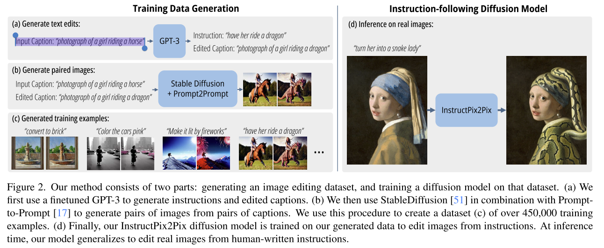

# Instructpix2pix: Learning to follow image editing instructions

Image editing。

方案乍一看非常奇怪

- 用 GPT-3 来对 caption 进行编辑
    - Input Caption: “photograph of a girl riding a horse”
    - Instruction: “have her ride a dragon”
    - Edited Caption: “photograph of a girl riding a dragon”
- 用 Stable Diffusion 对编辑前后的 caption 都生成对应的图片
- 用上述结果构建数据集训练 diffusion model。
    - input 为 Instruction，和 Input Caption 对应的生成图片
    - output 为 Edited Caption 对应的生成图片
    - Input Caption 和 Edited Caption 并不是数据集的一部分。

这个方案最大的问题在于，无法保证 Stable Diffusion 对两个指令的生成结果只有特定的差异，即只包含 instruction 所描述的差异。

本文使用了 [Prompt to Prompt](./[2022%20Arxiv]%20Prompt-to-Prompt%20Image%20Editing%20with%20Cross-Attention%20Control.md) Editing 的方式来得到 edit 之后的图像。

和 Prompt-to-Prompt 在任务上的不同之处在于
