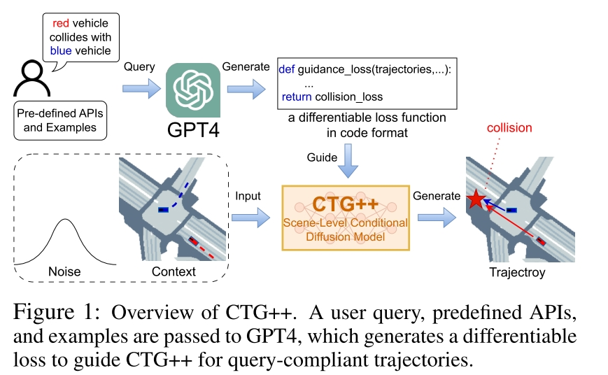
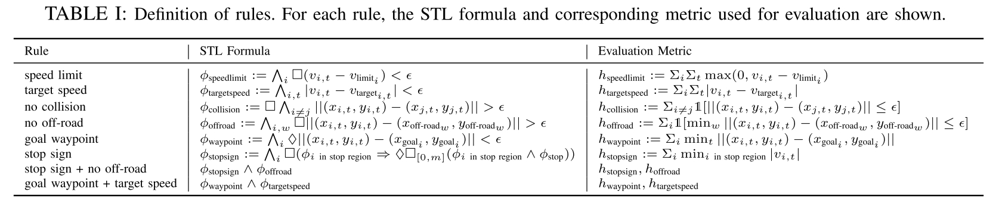
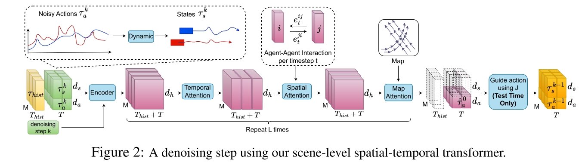
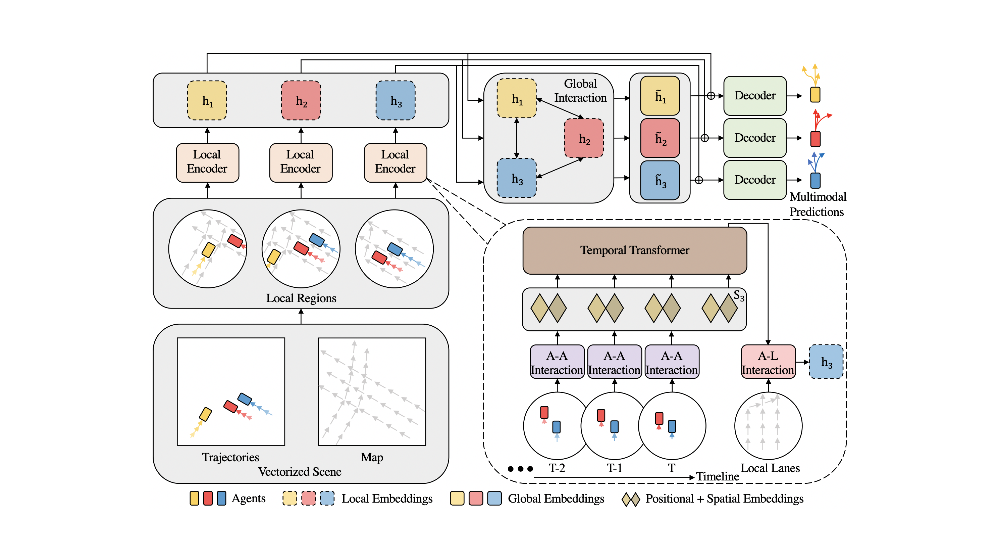
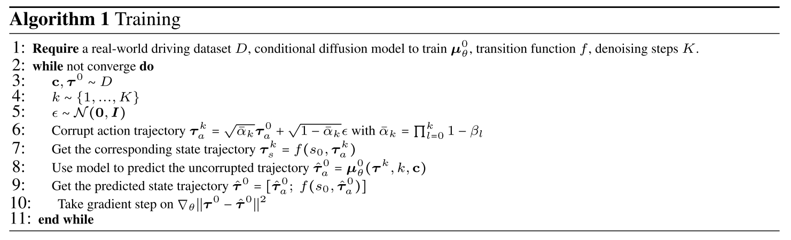
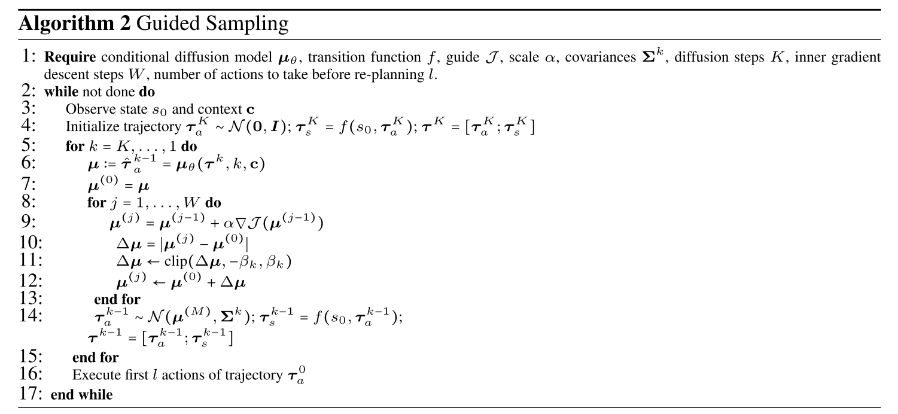
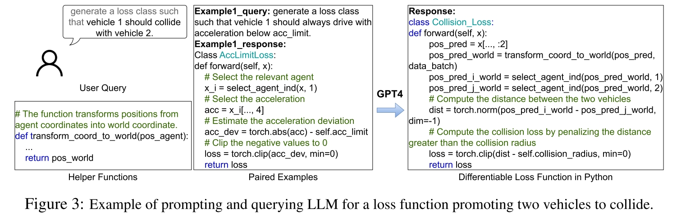

# Language-Guided Traffic Simulation via Scene-Level Diffusion

Task: 用 Diffusion Model 生成 Traffic Simulation，且可以通过 Language Instruction 来控制生成场景，强调真实 realistic 可控 controllable。

Core Idea: 用 LLM 把人的指令转化成 diffusion model 的 guidance loss function。

本文提出的方法叫 CTG++，是在该团队先前工作 CTG 基础上加了 LLM。CTG 的意思是 controllable traffic generation。

## Method



Problem Definition
- 场景中有 M 个 agent
- agent $i$ 在 $t$ 时刻的 state 为 $s_t^i=(x_t^i,y_t^i,v_t^i,\theta_t^i)$ 包括 2D location、speed、朝向（yaw）
- action space $a_t^i=(\dot{v}_t^i,\dot{\theta}_t^i)$，加速度和转向速度。
- $c=(I,s_{t-T_{hist}:t})$ 是每次生成 trajectory 时的 context
- 目标是给出 $c$ 和一个 satisfaction function $r(a_{t:t+T-1}, s_{t+1:t+T})$，来生成接下来 T 时间段的 trajectory $s_{t+1:t+T}$

在团队上一个工作 CTG 中，已经使用了类似的方法，只是那篇文章中的 guidance 用的是一堆预定义好的 guidance。CTG 中使用的 Guidance 如下表



本文的核心工作就是把这个表里的东西，变成LLM写的东西，并且是根据 language instruction 来写。另外 CTG 里面每个 agent 的 trajectory 是独立生成的，本文则是同时生成所有 agent 的 trajectory。

## Diffusion Model




### Input Encoding

输入所有 $M$ 个 agent 在过去 $T_{hist}$ 时间段中所有的 $s,a$，以及未来 $T$ 时间段的 noised $s,a$，首先将其经过一个 feed forward network，将纬度从 $d_s+d_a$ 变成统一的 $d_h$，后续 reverse diffusion process 都是直接作用在 $d_h$ 上的。denosing step 也会 embed 到这个纬度加上去，此时就得到了上图第一个粉色的 block $M\times(T_{hist}+T)\times d_h$

### Temporal Attention

Temporal Attention，在 $(T_{hist}+T)$ 这个纬度上计算各个 agent 各自的 temporal attention， $M$ dimension 在此时和 batch dimension 没区别。

### Spatial Attention

类似的，对不同 agent 之间算 attention，但是这个 attention 中 $T$ 纬度也是有用的。这里采用了 CVPR 2022 的文章 [Hivt: Hierarchical vector transformer for multi-agent motion prediction](https://github.com/ZikangZhou/HiVT) 的方案，HiVT 的总体架构如下图所示：



（虽然没读 HiVT 的情况下看不太懂在干嘛，但姑且可以做个参考）

本文的方法 Spatial Attention 的计算方法是，不直接使用 $h$ 来计算 attention，而是在模型输出的 $h$ 基础上加上 relative information $e$，再计算 attention

$$
\begin{align*}
\text{q}_t^i &= W^{Q_{\text{global}}}h_t^i\\ 
\text{k}_t^{ij} &= W^{K_{\text{global}}}[h_t^j, e_t^{ij}]\\
\text{v}_t^{ij} &= W^{V_{\text{global}}}[h_t^j, e_t^{ij}]
\end{align*}
$$

正常来说，计算 agent $i,j$ 之间在 $t$ 时刻的 attention 只需要 $q_t^i$ 和 $k_t^j$ $v_t^j$，而这里则额外加上了一个 $e_t^{ij}$

$$
e_t^{ij} = \phi_r: \left(\{x,y,\theta\}_t^j - \{x,y,\theta\}_0^i, d_t^{ij}\right) \rightarrow \mathbb{R}^h
$$

原文式子很长，牵扯到具体的数值计算 （而不仅仅是直接由网络负责），但最终是根据两个 agent 之间的位置关系算出了一个 relation。比较独特的是，算  j's attention feature by i，的时候，只关心 i 的起始状态，以及当前和 j 之间的距离。$e$ 的计算只有 $\phi$ 是一个 feedforward network，其余则是大量 transformation 计算。并且也没有 backbone network 的参与，是一个独立于整体模型之外的小模型。

### Map Attention Output

Map Attention 是用来算和 map 之间关系的 cross attention，$k,v$ 来自于一个 "encoded agent-centric vectorized map"，采用了 2022 ICLR 文章 [Latent variable sequential set transformers for joint multi-agent motion prediction](https://fgolemo.github.io/autobots/) 里的方案。

最后输出的 $d_h$ 重新 project 回 $d_a$ 得到 $\tau_a$，通过 differential tranformation 得到 $\tau_s$ 然后直接计算和 grounding truth 之间的差别（似乎不是求 noise）。

Training Algorithm:



inference 的时候有两个不同
- 只有 action prediction 有用，state 是应用 transition function 得到的
- 计算 $e_t^{i,j}$ 的时候，未来的 $\{x,y,\theta\}_t^j, t\in [T_{hist}+1, T_{hist}+T]$ 是未知的，此时采用的是按照恒定速度恒定角速度得到的结果来计算 $e$



Inference 的过程是一个典型的 Classifier-Guided Reverse Diffusion Process，区别在于 model output 不是 noise 而是直接 output mean，传统的 Classifier-Guided Reverse Diffusion Process 如下面的 pseudo-code 所示 [reference: Understand Classifier Guidance and Classifier-free Guidance in diffusion models via Python pseudo-code](https://medium.com/@baicenxiao/understand-classifier-guidance-and-classifier-free-guidance-in-diffusion-model-via-python-e92c0c46ec18)

```python
classifier_model = ...  # Load a pre-trained image classification model
y = 1  # We want to generate an image of class 1, let's assume class 1 corresponds to the "cat" category
guidance_scale = 7.5  # Controls the strength of the class guidance, the higher the stronger
input = get_noise(...)  # Randomly draw noise with the same shape as the output image from a Gaussian distribution

for t in tqdm(scheduler.timesteps):

    # Use neural networks for inference, to predict noise (score, the first term in equation (2))
    with torch.no_grad():
        noise_pred = model(input, t).sample

    # Classifier guidance step
    class_guidance = classifier_model.get_class_guidance(input, y) # Compute gradient using classifier (second term in equation (2))
    noise_pred+= class_guidance * guidance_scale  # Apply the gradient 

    # Calculate x_{t-1} using the updated noise
    input = scheduler.step(noise_pred, t, input).prev_sample
```

<details>
<summary>顺便 Classifier Free Reverse Diffusion Process 大概是这样。</summary>

```python
clip_model = ...  # Load an official CLIP model

text = "a dog"  # Input text
text_embeddings = clip_model.text_encode(text)  # Encode the conditional text
empty_embeddings = clip_model.text_encode("")  # Encode empty text
text_embeddings = torch.cat([empty_embeddings, text_embeddings])  # Concatenate them together as the condition

input = get_noise(...)  # Randomly draw noise with the same shape as the output image from a Gaussian distribution

for t in tqdm(scheduler.timesteps):

    # Use UNet for inference, to predict noise
    with torch.no_grad():
        # Here we predict noise for both images with text and images with empty text
        noise_pred = model(input, t, encoder_hidden_states=text_embeddings).sample

    # Classifier-Free Guidance guidance
    noise_pred_uncond, noise_pred_text = noise_pred.chunk(2)  # Split into unconditional and conditional noise
    # Consider the vector from "unconditional noise" towards "conditional noise", 
    # and scale this vector according to the value of guidance_scale 
    noise_pred = noise_pred_uncond + guidance_scale * (noise_pred_text - noise_pred_uncond)

    # Calculate x_t-1 using the predicted noise_pred and x_t
    input = scheduler.step(noise_pred, t, input).prev_sample
```

</details>

## Guidance
Guidance 不参与 diffusion model 的训练。

Guidance 是直接由 GPT4 输出的 python code。



## Questions

- 文章声称 LLM 的应用一大挑战是 grounding，本文做了什么来处理 grounding 问题？比如如何将文本中的某个 vehicle i 和代码中的 vehicle i 对应？还是完全不解决这个问题，由人来负责对应关系？
- 场景信息（车道、障碍物等）是如何 encode 的？看上去是文中提到的 Map Attention 完成的，具体是怎么做的？
<!-- - Spatial Attention 中似乎已经有 Temporal Information 了，为什么还要单独的 Spatial Attention？-->
- relative information 的定义逻辑是什么？
- 既然 $\tau_t$ 是由 $\tau_a$ 经由 transition function 得到的，为什么模型还要输入 $\tau_t$？以及为什么抛弃了 Diffusion Model 预测 Noise 的泛式而直接预测 Trajectory？

----

- The article claims that one major challenge in applying LLM is grounding. What does this paper do to address the grounding issue? For example, how is a specific vehicle i in the text corresponding to vehicle i in the code? Or is this issue not addressed at all, leaving the correspondence to be handled by humans?
- How is scene information (such as lanes and obstacles) encoded? It appears that this is achieved through the Map Attention mentioned in the paper. How exactly is this done?
- What is the logic behind the definition of relative information?
- Since $\tau_t$ is obtained from $\tau_a$ via the transition function, why does the model still need to input $\tau_t$? And why was the paradigm of predicting noise with the Diffusion Model abandoned in favor of directly predicting the trajectory?