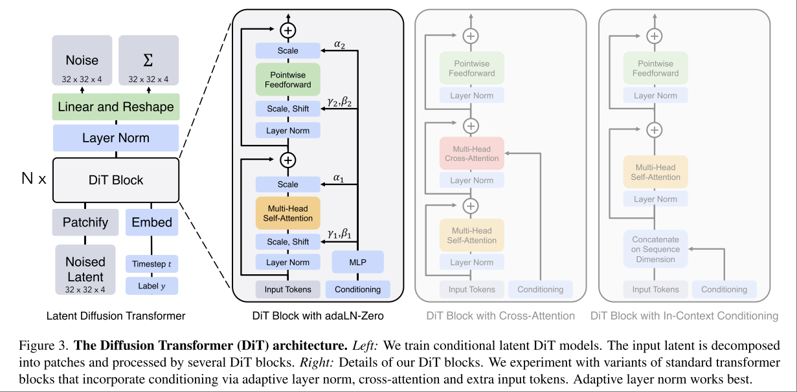

# Scalable diffusion models with transformers

DiT 论文




文章只牵扯到 text to image，需要两类 conditioning ，time step t，class labels c。

文中验证了三类 conditioning 方法

**in-context**: 简单说就是把 image token 和 t, c 拼在一起，在最后的输出层把 t, c 对应的 token 去掉。

**cross-attention**: 将 t, c 作为一个长度为 2 的 sequence，当做另一个模态的数据做 cross attention。这在三类 conditioning 方法中是计算量最大的。

**adaptive layer norm (adaLN)**

对于输入 $x \in \mathbb{R}^{B \times D}$，LN 的计算为： $$ \text{LN}(x) = \frac{x - \mu}{\sigma} \cdot \gamma + \beta $$

$\mu$ 和 $\sigma$ 是每个样本的均值和标准差（在特征维度上计算）。
$\gamma$ 和 $\beta$ 是可学习的缩放和平移参数（通常是 shape 为 $D$ 的向量）。

Psudo Code:

```python
def layer_norm(x, gamma, beta, eps=1e-5):
    """
    Args:
        x: input tensor of shape [B, D]
        gamma: scale parameter of shape [D]
        beta: shift parameter of shape [D]
        eps: small constant for numerical stability
    Returns:
        normalized tensor of same shape as x
    """
    # Calculate mean and variance along the feature dimension
    mean = mean(x, dim=-1, keepdim=True)  # shape [B, 1]
    var = variance(x, dim=-1, keepdim=True)  # shape [B, 1]
    
    # Normalize
    x_normalized = (x - mean) / sqrt(var + eps)
    
    # Scale and shift
    out = x_normalized * gamma + beta
    
    return out
```


Adaptive Layer Norm 就是学习这里的 $\gamma, \beta$。

$$ \text{AdaLN}(x, y) = \frac{x - \mu}{\sigma} \cdot \gamma(y) + \beta(y) $$

- $y$ 是条件信息（如时间步、类别、文本 embedding 等）。
- $\gamma(y)$ 和 $\beta(y)$ 是通过一个小网络（如 MLP）由 $y$ 生成的。

DiT 除了这两个参数，还引入了一个 learnable parameter $\alpha$，这是因为 DiT Block 本身是一个 residual block，只是用了 transformer 而不是 convolution 来计算残差，$\alpha$ 是残差的缩放系数，提升了模型本身对于 residual 的建模能力。

```python
def adaLN_zero(x, cond_emb, mlp_gamma, mlp_beta, mlp_alpha, eps=1e-5):
    """
    Adaptive Zero LayerNorm (adaLN-Zero) 伪代码

    Args:
        x: 输入特征, shape [B, D]
        cond_emb: 条件信息 embedding, shape [B, C]
        mlp_gamma: 生成 gamma 的 MLP, 输入 shape [B, C]，输出 shape [B, D]
        mlp_beta: 生成 beta 的 MLP, 输入 shape [B, C]，输出 shape [B, D]
        mlp_alpha: 生成 alpha 的 MLP, 输入 shape [B, C]，输出 shape [B, D]
        eps: 数值稳定项

    Returns:
        out: adaLN-Zero 归一化和残差缩放后的输出, shape [B, D]
    """
    # 1. 归一化
    mean = mean(x, dim=-1, keepdim=True)      # [B, 1]
    var = variance(x, dim=-1, keepdim=True)   # [B, 1]
    x_norm = (x - mean) / sqrt(var + eps)     # [B, D]

    # 2. 条件生成参数（初始化为0，训练可学习）
    gamma = mlp_gamma(cond_emb)   # [B, D]，初始权重为0
    beta = mlp_beta(cond_emb)     # [B, D]，初始权重为0
    alpha = mlp_alpha(cond_emb)   # [B, D]，初始权重为0

    # 3. adaLN-Zero
    h = x_norm * (1 + gamma) + beta          # [B, D]

    # 4. 残差缩放
    out = x + alpha * h                      # [B, D]

    return out
```

**注意**： $\gamma,\beta,\alpha$ 的维度都是 D

这种 conditioning 方式引入的额外计算量最小。

**adaptive zero layer norm (adaLN-Zero)**: 初始化 $\gamma, \beta, \alpha$ 为 0，此时在训练开始阶段，模型相当于只对输入做了 LayerNorm，而没有根据 conditioning 修改 Norm 结果，虽然这三个参数为 0 但输出不是 0，依然有梯度传回 $\gamma, \beta, \alpha$。
