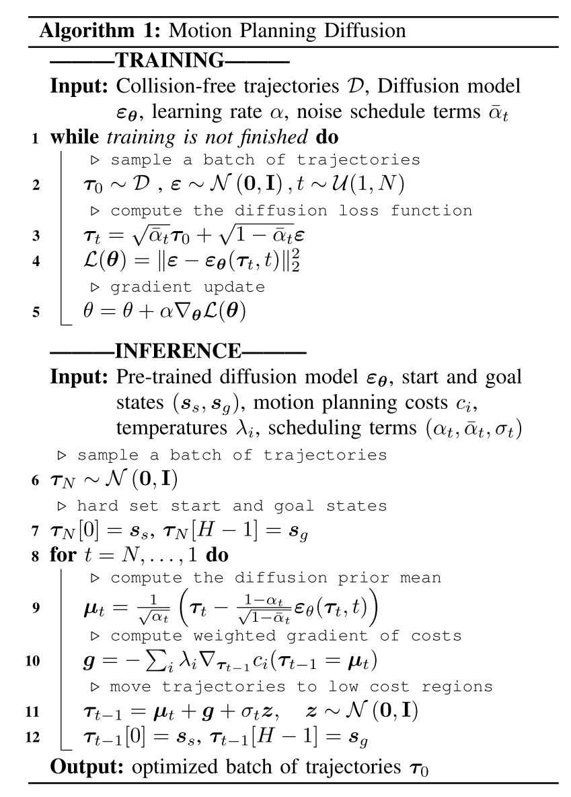

# Motion planning diffusion: Learning and planning of robot motions with diffusion models
[site](https://sites.google.com/view/mp-diffusion)
用 Diffusion Model 来做 motion planning，本质上还是让 diffusion model 生成 trajectory。

其实验部分主要是和其他生成模型和 trajectory optimization 方法做对比（？？），以及证明 diffusion model 的可用性（而非高效性）。

## Method
简单说就是将 cost 作为 guidance 来运行 diffusion model，生成一堆最小化 cost 的 trajectory。换句话说本文的方法
- 把 planning 问题作为一个 trajectory optimization 问题来解
- 用 diffusion model 来解 trajectory optimization 问题。



算法总体上和 [Diffuser](./[2022%20ICML]%20Planning%20with%20diffusion%20for%20flexible%20behavior%20synthesis.md) 是一样的，连 trajectory 的表示方式都是一样的。只不过本文为了解决多轴机器人的 motion planning，给出了 collision gradient 的计算方法。

- object collision gradient 的计算方法是在机械臂上取 sphere，然后算这些 sphere 的碰撞情况，算碰撞距离的 gradient。
- self-collision gradient 的计算方法和上面一样，只不过这里的碰撞距离是 sphere 之间的碰撞距离
- joint limit gradient 则直接取超出部分的平方。

对于 trajectory 的平滑性，则使用了一个 Gaussian Process Cost。暂时没看懂。

另外，训 diffusion model 的时候，使用的 expert data 是用 RRTConnect 外加 post process 生成的 500 x 20 个 trajectory
> To generate multimodal and collision-free expert data trajectories in each environment, we sample 500 random start and goal context configurations and 20 trajectories per context. We use RRTConnect to get a rough initial solution, then smoothen it using a B-spline, and run many optimization steps of Stochastic-GPMP [13] to create collision-free and smooth trajectories,similar as [54]. This process is costly but done offline once.

## 问题
- 本文的方法在计算 cost 的时候是需要对大量 trajectory 做 collision check 的，并且需要拿到这些 cost 的 gradient 来作为 guidance 更新 diffusion process。这对 planning 的环境有预处理要求（绑定 sphere，以及手写 differential forward kinematics）。
- 本文的方法理论上不会比 chomp 好，但是似乎没有跟 chomp 比较。
- 本文对 diffusion model 的使用方法，实际上并没有学习 plan experience。硬说 learnable 似乎是 learnable，但实际上没学什么东西。比如，在 difficule region 应当多采样，类似的信息。
- 本文得到的 path 并不是完全 collision free 的，并且不讨论后处理问题。部分实验环境中会有10%+的collision waypoints。原文中的实验效果部分很值得分析
- expert data 的生成是每个场景生成一次吗？如果是这样，那算法的价值就大打折扣了。目前看来应该是固定环境。
- diffusion model 的训练时间似乎极其长。
```python
exp_name = f'train_diffusion'

launcher = Launcher(
    exp_name=exp_name,
    exp_file='train',
    # project_name='project01234',
    n_seeds=N_SEEDS,
    n_exps_in_parallel=N_EXPS_IN_PARALLEL,
    n_cores=N_CORES,
    memory_per_core=MEMORY_PER_CORE,
    days=2,
    hours=23,
    minutes=59,
    seconds=0,
    partition=PARTITION,
    conda_env=CONDA_ENV,
    gres=GRES,
    use_timestamp=True
)
```