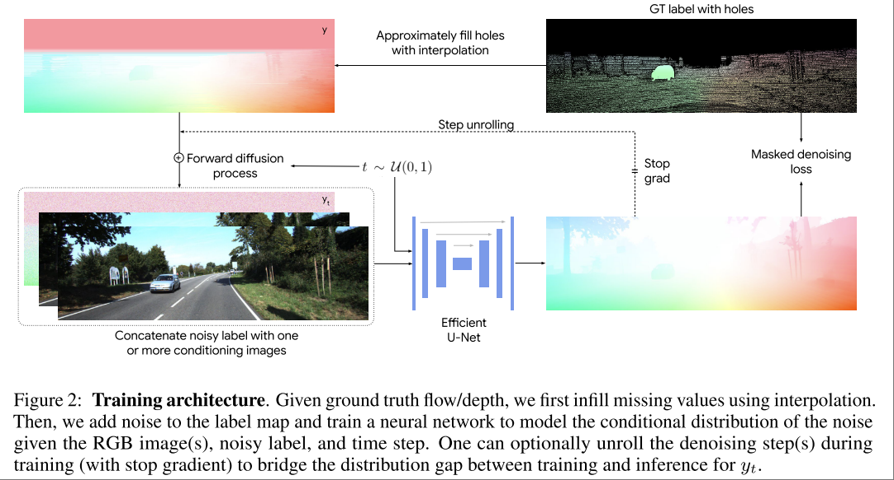
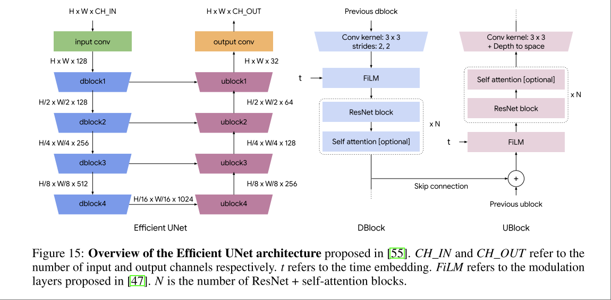

# The Surprising Effectiveness of Diffusion Models for Optical Flow and Monocular Depth Estimation

Deepmind

DDVM 论文，Diffusion Model 做 optical flow estimation 和 depth estimation 的基础工作，也是 diffusion model 做多模态生成的基础工作。

虽然该文章在最新的相关任务的论文中已经成了 baseline，但是其方法依然是基础，就像 RAFT **2020 ECCV Raft: Recurrent all-pairs field transforms for optical flow** 中 correlation volume 成为了各类 optical flow estimation 算法的基础。

本文还一个很有趣的做法是用不完整的 depth/flow map 做训练，这使得对数据集的质量要求大大下降，例如用 lidar 多线扫描出来的 depth 往往很稀疏，但一样可以训练 dense depth estimation。

亮点

- 模型简洁通用，没有针对任务的结构设计。
- 数据质量要求低
- 效率可接受，可以通过修改 denoise step 来控制速度和精度，能够在 3FPS 左右下得到比较靠谱的结果。

缺点：

- 没有开源，有非官方实现[open DDVM](https://github.com/DQiaole/FlowDiffusion_pytorch)和对应的权重。
- 模型很大，权重文件有 1GB，相比较而言 Optical Flow 的专用模型的权重文件往往只有几十 MB。

## Method

模型架构使用了 Efficient U-Net (ResNet + self-attention)，用单帧或两帧（flow检测时）RGB图片作为 conditioning，通过 denoise 过程得到目标图片（depth/flow）。

loss function 直接使用图片生成模型常用的 residual error，而不是 optical flow 模型所使用的专门用来衡量 flow 准确性的 image reconstruction loss。

不同的任务和训练阶段有不同的 `CH_IN`

- pre-train: 用 image-to-image translation 做预训练，方法直接来自 **Palette: Image-to-Image Diffusion Models**，用类似 Colorization 上色，Uncropping 补全，JPEG restoration 复原 等任务做预训练，这是 ViT Based Model 常用的预训练手段。此时输入为 RGB Image + target noise，`CH_IN=6, CH_OUT=3`
- supervised depth: `CH_IN=4,CH_OUT=1`
- supervised flow: `CH_IN=8, CH_OUT=2`

预训练和监督训练阶段之间，输出输出卷积核会被初始化，即图中的 `input conv` 部分。但其他模型权重会被复用。

本文也展现出了当前架构的 multi-modality 能力。

## OpenDDVM

是 [MemFlow](../Next_Best_View/[2024%20CVPR]%20Memflow%20Optical%20flow%20estimation%20and%20prediction%20with%20memory.md) 的作者基于 DDVM 论文所做的开源实现，在原本的基础上做了些许修改，增加了 MemFlow 中所使用的类似 memory 模块。

OpenDDVM 中的复现没有做 Palette Pretrain，效果稍差一点，但不多。

MemFlow 相当于用更专用的模型架构 (GRU for flow output, correlation volume for flow estimation) 超过了 DDVM 效果。
