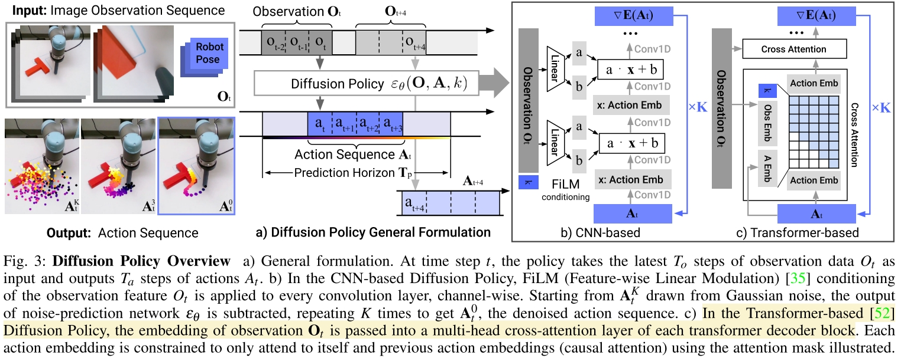

# Diffusion Policy: Visuomotor Policy Learning via Action Diffusion

基于视觉做 diffusion policy 的框架。

## Model Architecture
Diffusion Policy 提供了两类 Model Architecture
- CNN Based: 使用 FiLM Layer 来处理 conditional
- Transformer Based: 使用 attention 来处理 conditional

### CNN Based
FiLM Layer （Feature-wise Linear Modulation） 上次见到还是在 [RT-1](../LLM/[2022%20Arxiv]%20RT-1%20Robotics%20Transformer%20For%20Real-World%20Control%20at%20Scale.md)里面，本质上是一个 learnable actuation layer.

本文 FiLM Layer 实现在 `diffusion_policy/model/diffusion/conditional_unet1d.py:ConditionalResidualBlock1D`
- 输入 `x(batch, dim, horizon), cond(batch, dim)`，这里的 cond 没有 horizon dimension
- 维度变换：x 会经过卷积，从将 `dim` 维度从 `in_channels` 变为 `out_channels`, cond 也经过一个 linear layer 将 `dim` 维度变为 `cond_channels`
- 将两种 feature 合在一起，这里有两种选择
  - 一种是参考原论文做法，`cond_channels=2*out_channels`，`cond_channels` 代表了 `scale` 和 `bias` 两部分，然后 `out = scale * out + bias`，这也是 FiLM 可以看作一个 learnable actuation layer 的原因。
  - 另一种则更直接，`cond_channels=out_channels`，直接把 `x` 和 `cond` 的结果加在一起作为输出。这严格来说不是 FiLM Layer
- 合在一起的 feature 是作为 residual 直接加在 `x` 上的。

## Handle Observation
Diffusion Policy 提供了三类处理 Observation 的方案 `diffusion_policy/policy/diffusion_unet_lowdim_policy.py:line121-145`
- `obs_as_local_cond`：回合 predicted noise (输入) 经过类似的处理，也会和 global_cond 经过 FiLM 来得到 “global conditioned local condition feature”。处理的结果会加到 predicted noise 处理的结果上。这里有个问题是这两部分的 `horizon` 维是不一样大的，本文的做法是直接把 local condition padding 到一样的 horizon 长度，不够的补 0. **实际上本文的方法没有obs_as_local_cond的情况，都是其他两种**
- `obs_as_global_cond`: global condition 的处理方法和 diffusion step 一样，这才是用的最多的实验设置。大多数实验中 observation steps 为 2。处理方式是直接把 normalized observation 展开为 (batch, obs_steps * obs_dim)，然后和原本的 global feature，也就是 denoise step 拼到一起作为 global feature。
- **inpainting**

个人感觉 `obs_as_local_cond` 的做法是完全错的，`horizon` 在这里近似于 spatial 信息（卷积是作用在这个维度上的），把 padding 之后的 local condition (原文中是历史 observation trajectory 作为 local condition) 直接加到 predicted noise 上，相当于人为的在 history horizon step 和 predicted horizon step 之间加了一个关联性。