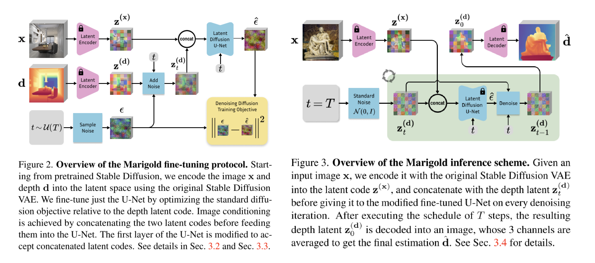

# Repurposing Diffusion-Based Image Generators for Monocular Depth Estimation

CVPR 2024 Oral

Marigold Paper.

后续 [DepthFM](./[2025%20AAAI]%20DepthFM%20Fast%20Generative%20Monocular%20Depth%20Estimation%20with%20Flow%20Matching.md) 在本文基础上还有进一步改进。

[page](https://marigoldmonodepth.github.io/)

利用 Stable-Diffusion 中现有的权重，使用 synthetic data 来微调，得到单目深度估计的 diffusion model。

> If the cornerstone of monocular depth estimation is indeed a comprehensive, encyclopedic representation of the visual world, then it should be possible to derive a broadly applicable depth estimator from a pretrained image diffusion model.

做法也很简单，Stable-Diffusion 原本就是一个 Latent Diffusion Model，其模型可以分成 Latent VAE 和 Diffusion U-Net 两部分，而本文的做法就是只训练 U-Net 部分。

## Methodology

为了复用 Stable Diffusion 的 VAE，需要输入是 3 dim image，因此本文将 depth map 映射到 3 通道来模拟一个图像。

然后 noise 只添加到 depth latent map 上，image 的 latent map 则作为 condition 和 depth noize 在 feature dim 拼接后输入后面的 denoise U-Net。

另一个比较有趣的点是 U-Net 也是用 Stable Diffusion 的 weight 初始化之后 fine-tuning 得来的，只是第一层做了一些修改，将 weight 都除以 2，将 input channel 数量乘以 2 。
