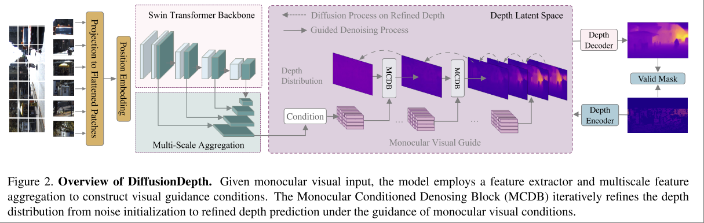

# Diffusiondepth: Diffusion denoising approach for monocular depth estimation

单帧RGB估计depth

影响一般效果一般，但方法通用且简洁，其方法在用 Diffusion Process 做视觉感知（例如 segmentation, depth estimation）中比较通用。

如果要看同技术路线下的好效果可以参考 **Repurposing Diffusion-Based Image Generators for Monocular Depth Estimation**

模型架构

## Multi-Scale Condition

要用 diffusion process 做 depth estimatimation 的问题在于 depth 依赖于原始图像中的几何细节，需要有 dense alignment with input。

本文的做法是用 multi-scale input feature 来做 condition，实现中使用的是 $\frac{H}{4}\times \frac{W}{4} \times c$ 的 aggregated feature map。

本文方法的一个可扩展性在于大多数可以输出 multi-scale feature 的 visual backbone 都适用，例如本文用的就是 Swin Transformer，一个 21 年提出的基础架构。

得到 aggregated feature map 之后的使用方式如下所示

其设计注重关注于轻量， heavy backbone + light weight diffusion。各类结构都是为了充分利用 multi-scale aggregated feature map 中的信息。

- upsampling，本文的 denoise 在 $\frac{H}{2}\times \frac{W}{2} \times d$ 的 latent space 中进行，因此先用一个小网络将 feature 的 resolution 上采样到和 depth latent 一样。
- fusion 过程是一个简单的 element-wise summation，只不过在这之前 aggregated feature 需要经过一个 CNN 和 self-attention 来达到相同的维度。
- latent space vae 是单独用重建 loss 训练的。

看上去结构很灵活，但是条件注入的方式有点太粗暴了，直接用加法。

理论上 DiT 使用的 adaLN_zero 在这里应该也能用才对。

## Training

本文所用的训练数据大量来自 LiDAR 数据，其中会有大量的 depth 信息缺失，例如 KITTI Depth 数据集可能只有 3.75% ~ 5% 的像素有深度信息。

为了提升模型对于数据确实的鲁棒性，本文在训练 Depth VAE 的时候用了 crop, jitter, flip 等数据增强。
