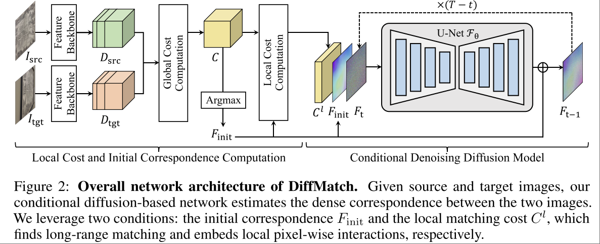
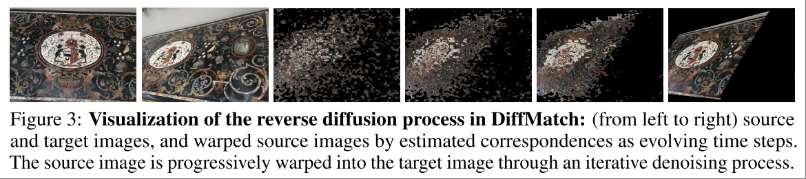

# Diffusion Model for Dense Matching

[page](https://cvlab-kaist.github.io/DiffMatch/), [code](https://github.com/cvlab-kaist/DiffMatch)

ICLR 2024, Oral

Task: Dense correspondence. 输入两张图片，输出两张图片之间像素级别的关联，是 SfM, SLAM 之类的应用所依赖的功能。

- 输入 $I_{src}$ $I_{tgt}$，以及其 Feature Descriptor $D_{src}, D_{tgt}$
- 输出 correspondence field $F$ 使得对每个 pixel $i$ ，有 $I_{tgt}(i) \sim I_{src}(i+F(i))$ , $D_{tgt}(i) \sim D_{src}(i+F(i))$

从贝叶斯的角度看，目标 $F^*$ 为 posterior probability distribution $p(F| D_{src}, D_{tgt})$ 的最大似然 

$$
\begin{align*}
F^* &= \argmax_F p(F| D_{src}, D_{tgt}) \\
&= \argmax_F p(D_{src}, D_{tgt} | F) \cdot p(F) \\
&= \argmax_F \{\log p(D_{src}, D_{tgt} | F) + \log p(F) \}
\end{align*}
$$

这里的 $\log p(D_{src}, D_{tgt} | F)$ 被称作 data term，即输入特征中包含的 matching evidence，第二项被称作 prior term，即 correspondence field 的先验信息。

## Core Idea

本文的基本思路就是，用 Diffusion Model 来解决上述问题，将 $D_{src}, D_{tgt}$ 作为 condition，构建 Conditional Diffusion Model 输出 correspondence field。

最直接的思路就是用 Diffusion Model 直接建模 data term

$$
F^* = \mathcal{F}_\theta (D_{src}, D_{tgt}) \approx \argmax_F \log p(D_{src}, D_{tgt} | F)
$$

这其中实际上包含了一个假设，即 prior term 可以借助大规模数据和模型参数来学到。本文的一个基本观点就是，对 prior term 的专门建模可以带来特定任务上更好的泛化性，对应到本文的任务，即对 correspondence field 的先验分布的建模可以带来更好的效果。

## Methodology

$$
C(i,j) = \frac{D_{src} \cdot D_{tgt}}{\lVert D_{src} \rVert\lVert D_{tgt} \rVert}
$$

$C\in \mathbb{R}^{h_{src} \times w_{src} \times h_{tgt} \times w_{tgt}}$ ，即所有像素之间的 global matching cost。直接计算的复杂度过高，所以实际实现中只计算了一个 local region 之内的 matching cost $C\in \mathbb{R}^{h_{src} \times w_{src} \times R \times R}$ 。

Diffusion Model 输出的是在输入 $F_{init}$ 基础上的 residual。

直接对 $C$ 通过 argmax 就可以得到一个 initial 的 corresponding field $F_{init}$ ，类似下图中第三张图

根据 $F_{init}$ 可以对 src img 上的每个 pixel 找到 tgt img 上对应的 pixel，计算这两个 pixel 之间的 $C(i,j)$ ，构成一个 $C^l$ local matching cost。

将 $F_{init}$ , $C^l$ , $F_t$ 输入 diffusion model (U-Net) ，输出 $F_{init}$ 基础上的 **residual field**。