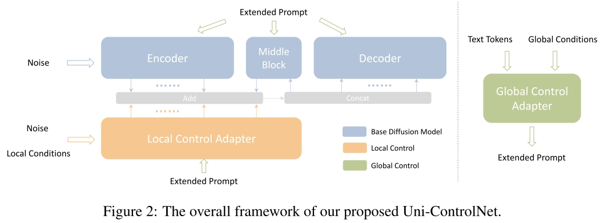

# Uni-controlnet: All-in-one control to text-to-image diffusion models
Cite 142

Task: Text-to-image, **controllable** diffusion models. 给近几年的 text-to-image 方案做了个集成，给出了多种控制生成的方式（conditioning method），例如 edge maps, depth map, segmentation masks 等 local control 和 CLIP image embeddings 等 global control。

## Method
方案核心是 local adapter 和 global adapter，这两部分分别处理 local condition 和 global condition。adapter 有以下特点
- 可以独立于 diffusion model 训练
- 可以做到即插即用。

文章总体上是在 Stable Diffusion 的基础上应用 adapter，Stable Diffusion 本身是 U-Net 架构，adapter 则是采用 attention 的方式把不同的 condition 引入进来。

定义
- UNet Encoder $F$，一共 12 个 block，每个 block 的输出定义为 $f_i$
- Middle Block $M$，其输出为 $m$
- UNet Decoder $G$，同样 12 个 block，输出为 $g_i$
- Noise Features 定义为 $Z$

基本的 Stable Diffusion 使用 Cross Attention 来引入 language condition，定义 $y$ 为 language embedding

$$Q=W_q(Z), K=W_k(y), V=W_v(y)$$

### Local Control Adapter