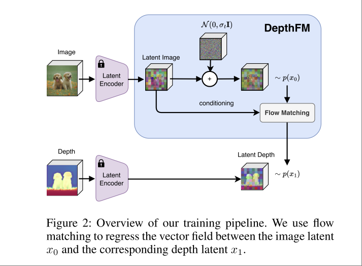

# DepthFM: Fast Generative Monocular Depth Estimation with Flow Matching

对 [Marigold](./[2024%20CVPR]%20Repurposing%20Diffusion-Based%20Image%20Generators%20for%20Monocular%20Depth%20Estimation.md) 的改进。

## Core Idea

核心想法很简单，把 Marigold 中用的 DDPM 也换成 Flow Matching。但是 SD 模型依然用的 SD 2.1 而不是 SD3，大概做这个工作的时候还没有 SD3。

另外，本文进一步简化了 flow matching 的对象，在 Marigold 中，模型输入添加了噪声的 depth，以及未添加噪声的 rgb latent 作为 condition，输出 noise in depth。

Marigold 的基本逻辑是，denoise process 依然是针对 depth 进行，而图像则作为 condation 拼接输入。

而本文则把问题简化成图像分布和 depth 分布之间的 matching。

通常的 flow matching 以 random noise 作为 $x_0$，要求模型学习 noise 到 data 的 flow（vector field）。

而本文将 image 作为 $x_0$，要求模型学习 image 到 depth 的 flow。即 image 为 $x_0$ depth 为 $x_1$ ，学习 $p(x_1|x_0)$ 。

本文还专门计算了 gaussian noise 和 rgb image 与 depth 之间的 Earth Mover’s Distance , rgb image 与 depth 之间的距离显著小于 gaussian noise 和 depth 之间的距离，即 rgb 和 depth 这两个分布更容易通过 flow 抵达。

## Methodology

- $(x_0, x_1)$ 为 rgb image 和 depth image pair
- 概率密度路径为

$$
x_t\sim p_t\left(x|(x_0, x_1)\right) = \mathcal{N}(x| tx_1 + (1-t)x_0, \sigma^2_{min}\mathbb{I})
$$

- vector field 为

$$
u_t(x| (x_0, x_1)) = x_1 - x_0
$$

- Loss 为

$$
\mathcal{L}(\theta) = \mathbb{E}_{t\in \mathcal{U}[0,1], (x_0, x_1) \sim D} \lVert v_\theta((t, x_t); \bar{x}) - (x_1 - x_0) \rVert
$$