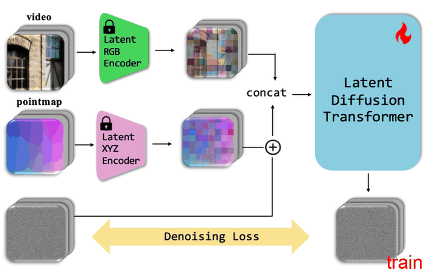

# Can Video Diffusion Model Reconstruct 4D Geometry?

[Page](https://wayne-mai.github.io/publication/sora3r_arxiv_2025/)

Task: Infer 4D pointmaps from casual videos using video diffusion models.

其基本逻辑和 [Marigold](./[2024%20CVPR]%20Repurposing%20Diffusion-Based%20Image%20Generators%20for%20Monocular%20Depth%20Estimation.md)，[DepthFM](./[2025%20AAAI]%20DepthFM%20Fast%20Generative%20Monocular%20Depth%20Estimation%20with%20Flow%20Matching.md) 是一样的，即将想要生成的模态通过一个 VAE 映射到 color latent space，然后复用 DiT 学习到的生成图像的先验，微调成一个生成目标模态的 DiT。

和 DepthFM 的核心区别在于目标模态的区别，以及使用的 DiT 模型本身是一个视频生成模型。

## Temporal pointmap latent and VAE

在 Marigold 中，Depth 被直接映射到 RGB 空间，然后复用 RGB VAE。本文则是专门微调了一个 Pointmap VAE，并且表示则是本文方案能够 work 的一个核心步骤。

