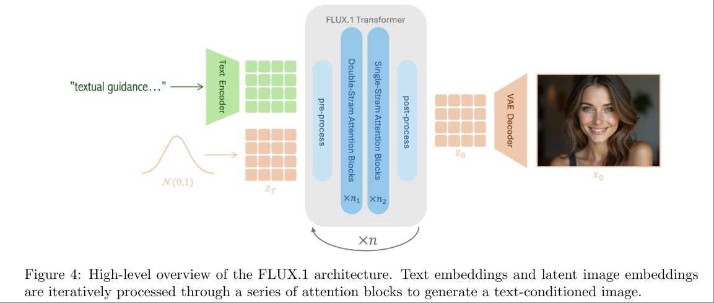
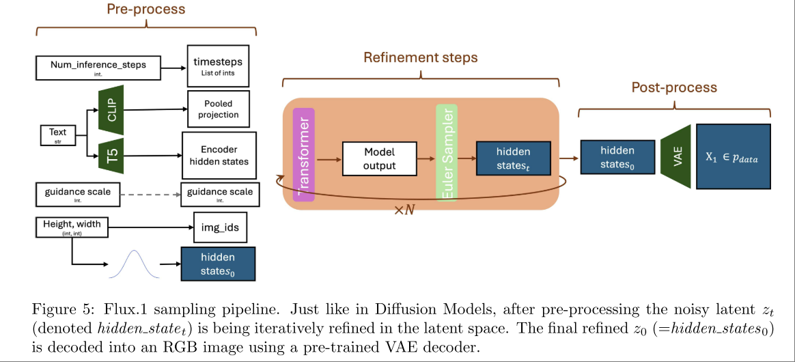
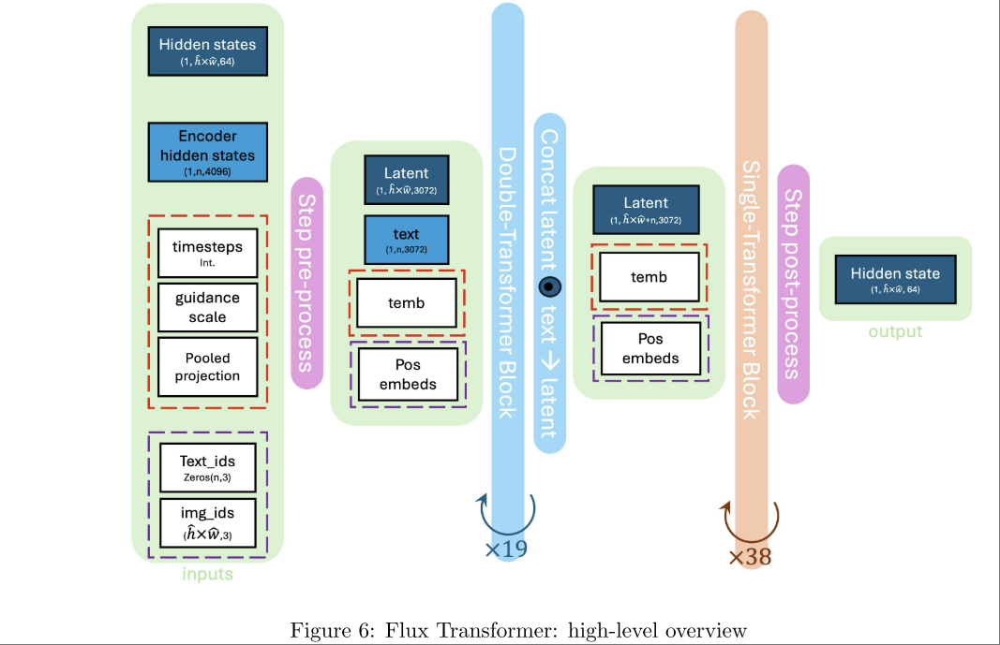
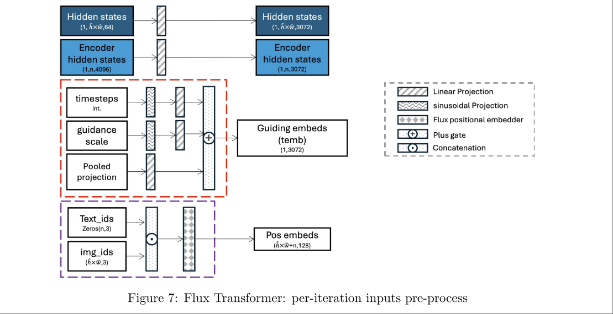

# FLUX.1 Kontext: Flow Matching for In-Context Image Generation and Editing in Latent Space

- [huggingface FLUX.1-dev](https://huggingface.co/black-forest-labs/FLUX.1-dev)
- [github repo flux](https://github.com/black-forest-labs/flux)

用 Flow Matching 进行图像生成的关键工作。

需要注意的是这篇文章并不是 FLUX 模型本身，而是用 FLUX 模型来做 image-to-image 生成，其突出点在于
- 没有对架构（指FLUX）进行大的修改
- 生成效果可以做非常精细的 editing，并且保持不希望 edit 的部分为原样。
- 支持多种 condition，例如用一个框框出来想要编辑的位置。

FLUX 的维护组织 Black Forest Labs 并没有提供实现细节，但是有人对 FLUX 做了逆向工程： **Demystifying Flux Architecture**。主要参考该文档了解 FLUX.1。

**很遗憾该逆向工程文档并没有给出 FLUX.1 的预训练方法，尽管很多地方都提到了 flow matching。姑且认为是直接以 Latent Space CFM Loss 训练的。**

FLUX 的模型设计和训练方式参考了 Rectified Flow （Flow Straight and Fast: Learning to Generate and Transfer Data with Rectified Flow）。Rectified Flow 本身的框架是非常标准的 Conditional Flow Matching

$$
\mathcal{L}_v = \mathbb{E}_{x0, x1, t} \left[  \lVert v_\theta(x_t, t) - (x_1 - x_0)  \rVert^2 \right]
$$

如果简单概括 FLUX.1 ，“FLUX.1 is arectified flow transformer trained in the latent space of an image encoder”。

## Sampling Process

要采样一张图片，以 text-to-image 为例

### 1. Initiation and Pre-processing

将输入处理成后面 refinement stage 需要的格式。各种输入以及其对应的处理方式如下

- text: 使用 CLIP pooled embedding 得到一个对整句话的 embedding `pooled_projection`，使用 T5 的 hidden states 得到一个 per token 的 embedding `encoder_hidden_states`
- resolution: 用来决定 $z_0$ 的尺寸，要生成 resolution 为 $(H,W)$ 的图片，在 preprocess 阶段生成尺寸为 $(h,w) = (H // \text{Scale}_\text{VAE} //2, W // \text{Scale}_\text{VAE}//2, 16)$ 的 grid。实际使用的 $\text{Scale}_\text{VAE}=8$ 。对于每一个 grid position，赋予其一个 img_id $(t, \hat{h}, \hat{w})$，其中 $t$ 是 number of timestep ，$\hat{h}\in [0,h-1], \hat{w}\in [0,w]$ 标记了 image token 位置。
- 对于 T5 text embedding 也有同样尺寸的 text_id，只不过对所有 text token 都有 $t=h=w=0$ ，text_id 是为了让模型区分 text token 和 image token 。
- num inference steps: 用来决定迭代的步数，模型输入的 timesteps 会从 $t\in [0:T]$ 采样。
- guidance scale: 用来控制 conditioning 的强度。

### 2. Iterative Refinement

经过 Pre-processing 处理之后，给到 refinement process 的输入为 `[encoder_hidden_states, pooled_projection, guidance, img_ids, text_ids]`

Iterative Refinement 由一个 DiT like Model 进行，所有的 Transformer Block 都是 Self-Attention Based Block。模型实现直接服用了 diffusers 中的大量已有模块。

总体的 Refinement 逻辑是 （并不是训练逻辑，其实就是 Flow Matching 的 inference 逻辑）：

- 每次输入 $(z_t, t)$ 输出 $z_{t+1}$
- $t$ 从 0 到 1 迭代多次，最终输出 $z_1$

除了 $z_t, t$ 之外，其他输入部分在每个 iteration 都是相同的，得到这些 constant 输入的过程如下。

- 对于 T5 tokens `encoder_hidden_states`，通过线性层投影到 3072 维，后续和 image latent token $z_t$ 投影到一个空间之后，一起过 self-attn
- 使用 sinusoidal projection 将 timestep 和 guidance scale 变为 embedding，将其和 CLIP pooled embedding 投影到一个维度（3072）之后加起来，以此作为 guidance （DiT 语义下的 Guidance）。
- pos embed 则是将 image_id 和 text_id 拼起来之后做 RoPE，只不过这里的 RoPE 是三维的。最后输出所有 $(h\times w + n), 128$ position embedding (图里的 $\hat{h} \hat{w}$ 看上去像笔误)

### 3. Double-Stream Transformer Block

