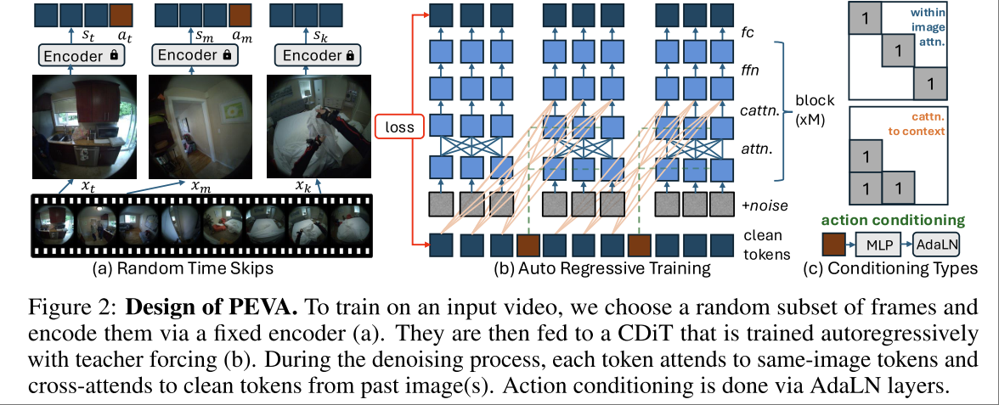

# Whole-Body Conditioned Egocentric Video Prediction

Meta

PEVA Paper. Predict Ego-centric Video from human Actions

本身是一个视频生成模型，但是是 conditioned on human body kinematic pose trajectory。

Task: 输入图像和人的身体动作，输出未来观察到的图像。换句话说，使用 future body motion 作为一个 control signal 来生成图像。

方案本身没有什么特殊，使用 DiT 作为基本架构，使用 AdaLN 来引入 pose condition。但是任务真的很独特，没有选择语言作为 condition，而是选择使用人的身体动作作为 condition。

> By conditioning on kinematic pose trajectories, structured by the joint hierarchy of the body, our model learns to simulate how physical human actions shape the environment from a first-person point of view

本文也直接用视觉预测模型实现了一个 planner，只不过 target 需要是 visual target，即采样大量动作，模型预测画面，然后取画面与 visual target 最接近的动作。

本文的 related work 只包含了 world model, human motion generation 和 Egocentric Forecasting，而没有 Perception Planning 相关的内容。

## Basic Idea

本文的基本想法是让机器有类似人类一样，预想未来场景的能力。例如要开门，人会想象到手伸到门把手的画面。为此，本文希望训练一个生成式的模型，基于人体的姿态，预测在该姿态下画面发生的变化，这包括视角的变化、身体部分本身的变化、场景的变化。这其中的挑战主要包括：

- 对人类肢体动作的编码。
- 人类动作和视觉观测之间的关系的复杂性。
- 从现实数据中学习的困难性。

## Method

肢体动作编码：使用相对动作编码，位置是3维相对位置，姿态则由15个球形轴的相对欧拉角表示，一共 $d_{act} = 3+15\times 3=48$

图像生成仍然是在 Latent Space 进行，$s_i = \text{enc}(x_i)$。

学习算法为 DDPM，模型基于 DiT，但是做了些许修改。

Random Timeskips: 数据采样方式，按照32秒为一个片段，片段内随机采样16帧图像，作为一个训练样本。训练过程中，添加了 noise 的图像会和上一个采样帧的完整图像之间进行 cross attention。

为了增大训练过程的并行度，训练时并不会将相邻两帧作为一个样本，而是将16帧作为一个样本。按照文章的说法，除了增大并行度，这样做最主要的考量是让模型同时学会不同程度的 dynamics。

> We enable efficient training by parallelizing across sequence prefixes through spatial-only attention in the current frame and past-frame-only attention for historical context