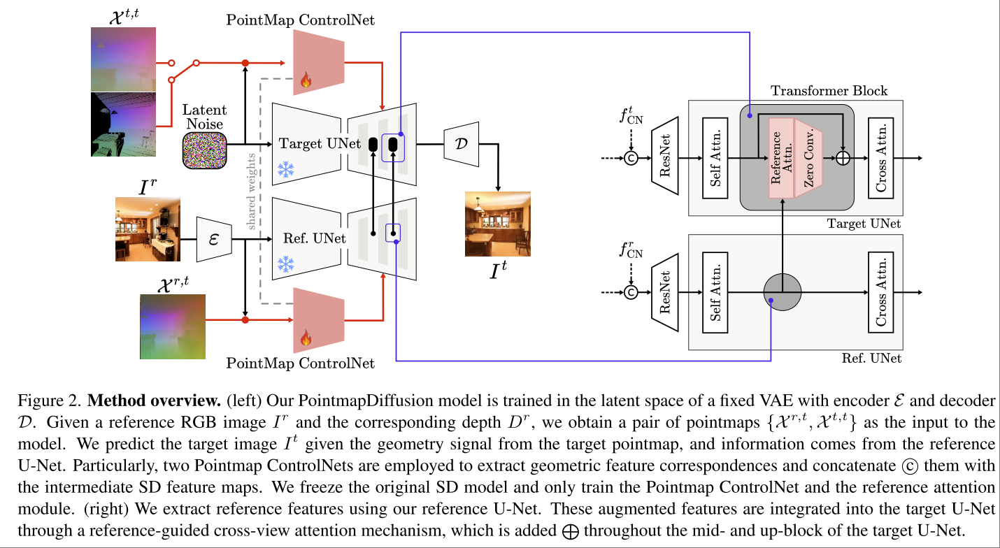

# Pointmap-Conditioned Diffusion for Consistent Novel View Synthesis

Task: Single-image Novel View Synthesis (NVS). 特点在于使用 Pointmap 来作为 condition，并且利用了现有的 pre-trained 2D diffusion models.

方案总体上来说是用一个外接的 Pointmap ControlNet 来控制原本的图像生成过程。

