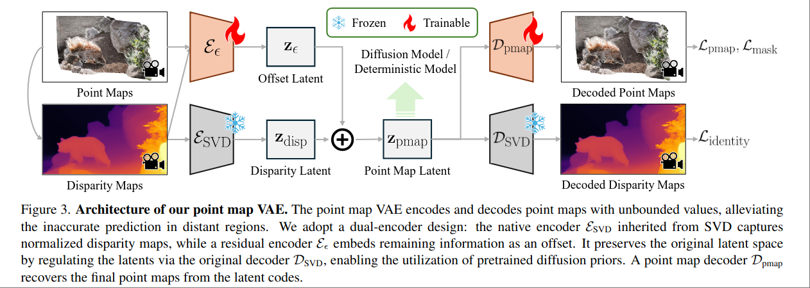

# GeometryCrafter: Consistent Geometry Estimation for Open-world Videos with Diffusion Priors

Tencent ARC Lab

[github](https://github.com/TencentARC/GeometryCrafter)

在 Marigold, DepthFM, Sora3R 等等工作类似的技术路线上，做到了比较成熟可用，code base 较为规范。

## PointMap VAE

