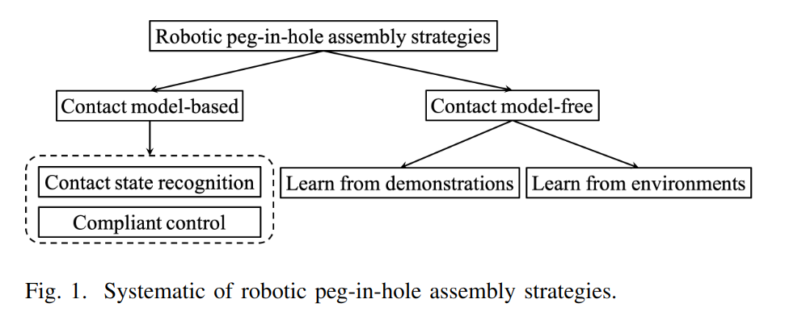

# Compare Contact Model-based Controland Contact Model-free Learning: A Survey of Robotic Peg-in-hole Assembly Strategies
58 引用，还可以的一篇综述。

本文把 peg-in-hole 的装配任务方案分为以下几种

- Contact Model 大多是传统方法，通过对 dynamic model 进行建模来解决
- Learn From Demonstration 则希望通过向 demonstration 学习的方式来替代复杂的 preprogramming.
- Learn From Environment 即常见的 Model Free Reinforcement Learning, 这里的 Environment 即环境给出的反馈（RL 中的 reward）。

## Perception
