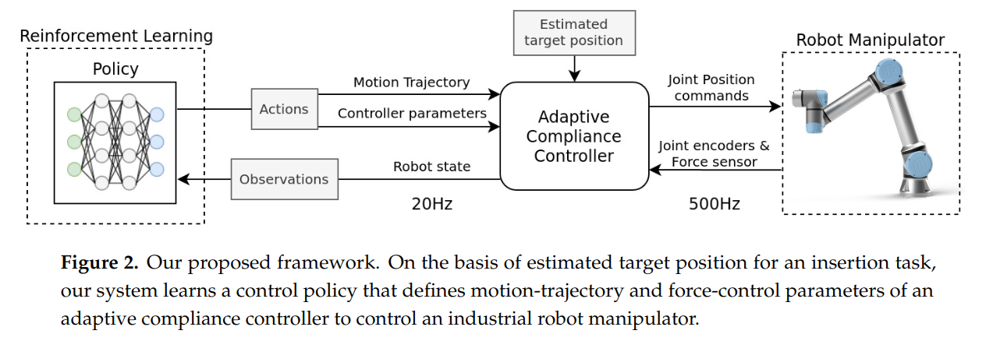

# Variable Compliance Control for Robotic Peg-in-HoleAssembly: A Deep-Reinforcement-Learning Approach
任务环境是工业装配环境，具体任务为轴孔装配 peg-in-hole assembly control.

机器人只说是 Position Control 的，没有 Impedance Control 假设。文章并不会关心控制器的 close control loop 的逻辑。

实验环境：
- 有对孔位置的估计，但是这个估计是有误差的。这种估计也可以是一个 reference trajectory.
- 机器人 wirst 上有力传感器
- 抓取已经完成并且抓得很紧。文章虽然说 slight changes were possible，但并没有任何策略处理这种 change，可以理解为是固定在夹爪上的。
- insert 方向相对于 griper 是确定的，即一定是垂直于 wrist 旋转平面插入（parallel to the griper's orientation）。

<!--
顺应控制方式
- 被动顺应控制 Passive compliant control: 提供额外的硬件，在不改变 trajectory 的情况下，提供执行时可以自由调整的自由度。例如在 wrist 和 griper 之间加一个可以切向一定范围移动和旋转的控制器来作轴孔装配。
- 主动顺应控制：根据 sensor feedback 来计算误差，根据任务的 dynamic model 来最小化 contact force。
-->

