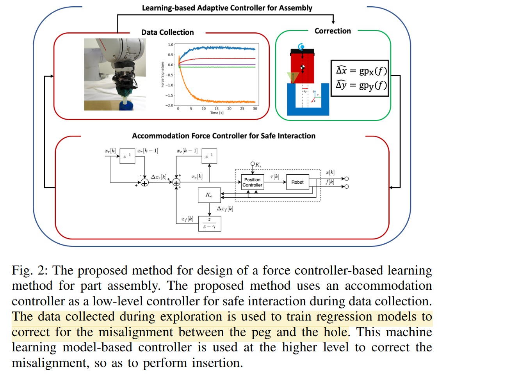

# Imitation and Supervised Learning of Compliance for Robotic Assembly
(没啥影响力的文章)

参考了 [Learning Assembly Tasks in a Few Minutes by Combining Impedance Control and Residual Recurrent Reinforcement Learning](./2021%20Learning%20Assembly%20Tasks%20in%20a%20Few%20Minutes%20by%20Combining%20Impedance%20Control%20and%20Residual%20Recurrent%20Reinforcement%20Learning.md) 里面的方法。

任务场景还是工业装配中的 peg in hole，这里不单单假设 perception 是不准确的，还假设 hole 的位置是可能变动的。

人会在操作过程中提供至少一次成功的 demonstration。

方法非常直接：
- 数据采集：在已知准确 peg position 的情况下，在水平方向上添加已知的 error，并采集力传感器数据。
- 模型训练：用上面的数据训练模型，输入力传感器数据，输出 error