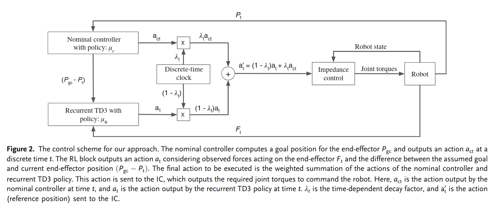

# Learning Assembly Tasks in a Few Minutes by Combining Impedance Control and Residual Recurrent Reinforcement Learning
比较系统的阐述了把 Learning 和 Compliance Control 两者结合的思路。

任务场景是把物体挂到另一个物体（hanger）上，但是进行了极大的简化。简单说文章假设在没有误差的情况下，物体和悬挂目标的XY坐标是一致的，只需要在 Z 轴下放。而有误差的时候可能存在位置检测误差、物体在夹爪中不牢固造成的误差 等。

文章采用 Impedance Control 和 RL 结合的方式来解决不确定性，结合的方法非常简单：把两个控制器输出的 action 做一个加权和。

RL 模型输入的 State 包含两部分信息
- eef 的力和力矩
- eef 当前位置和目标位置的差

RL 输出的 action 为三维位移。

## Recurrent TD3
文章的 RL Model 使用 LSTM 作为 backbone 搭的。因为 RL 的输入是十分 partial 的 observation，有两种策略使得 partial observation 可以取得和 state 一样的效果
- 给 action 也增加不确定性，例如概率化的 action 输出，从而让模型输出更加鲁棒，能够探索到足够宽泛的 observation 空间。
- 用 RNN 类模型，增加 observation 信息。

本文采用后者。

TODO： 研究一下文章咋用 RL 的训练流程训 LSTM 的，说不通啊感觉。