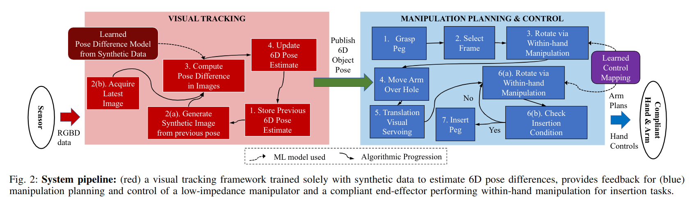

# Vision-driven Compliant Manipulation for Reliable, High-Precision Assembly Tasks
用 Vision Based 的 6D Pose Track 来做号称 close loop 的控制。

Learning Model 被使用在了两部分
- 识别 Pose
- 求解夹爪和物体之间的 dynamic model (dynamic relation)，最终目的是给出 object 的期望速度，模型输出夹爪的 action 