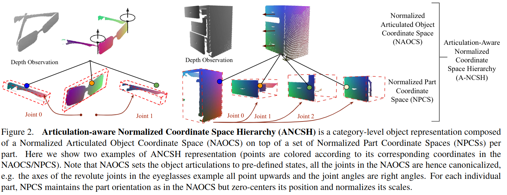
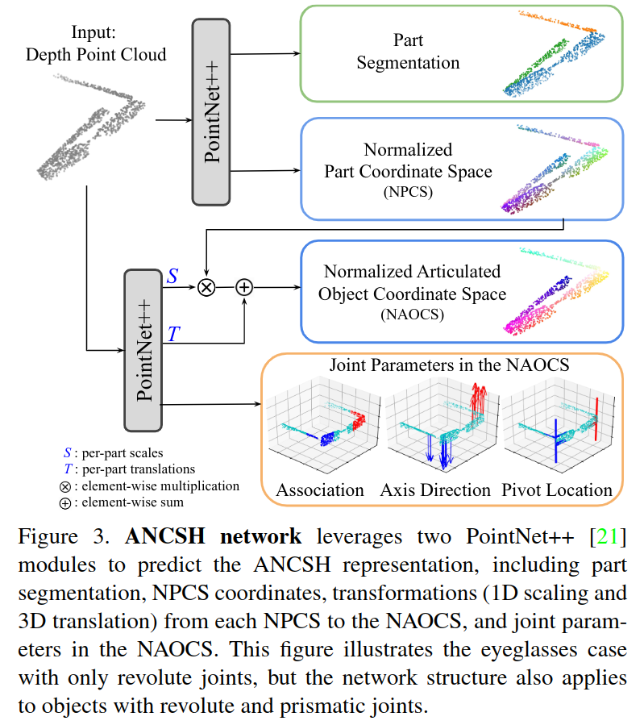

# Category-Level Articulated Object Pose Estimation
用视觉的方式，从单张深度图获取关节体的 part 6D pose, 3D scales, joint type & orientation, joint states。

核心是提出了一种类似 NOCS 空间的表征 articulated object pose 的空间 Articulation-aware Normalized Coordinate Space Hierarchy (ANCSH)。
- Artivulation-aware: 该标准空间包含了关节体的 kinematics 信息，主要指 link segmentation 和 joint parameters
- Hierarchy: 整个表征有 hierarchy 结构，先是基本的 scale, pose。然后是 joint parameter。

对于每个类型的物体，假设其 link 数量和 joint 数量类型已知 （category 本身就是按照 link, joint 的数量和类型区分的）。输入单张 depth image 对应的 point cloud，输出每个 link 的 segmentation, rotation, translation 和每个 joint 的 parameter, state。

joint parameter 的定义为
- 对旋转轴，参数为 rotation axis $u$ 和一个从轴上选取的支点 $q$。state 是相对于一个人为定义的 rest state 的旋转角度。
- 对平移轴，参数为平移方向 $u$，state 是相当于人为定义的 rest state 的移动距离。

## ANCSH，Articulation-aware Normalized Coordinate Space Hierarchy

### NOCS，Normalized Object Coordinate Space
将物体进行缩放之后放到一个单位大小的 cube 中，物体中心位于 cube 中心。这个坐标系称为 NOCS 坐标系。

NOCS space 和 camera space 中存在一个仿射变换，该仿射变换也就定义了物体此时的 Pose。

### NAOCS, Normalized Articulated Object Coordinate Space
定义每个类型关节体的 rest state，然后把关节体进行 NOCS 变换。

### NPCS, Normalized Part Coordinate Spaces 
对关节体的每个 part 做 NOCS 变换，并且保持其 orientation 不变。

NPCS 为每个 part 提供了一个到 camera space 的变换。

## Network

总体上两个 PointNet++ Network
- 一个直接处理 camera space 的点云数据，有两个输出 head
    - 输出 part segmentation，即对每个 point 输出一个 link 分类，例如对眼镜输出一个三分类。
    - 输出每个点的 NPCS 坐标，即在 part frame 里面的坐标
- 一个在 NAOCS 坐标下 predict joint parameter
    - 一个 head 预测每个 part 到 NAOCS 的 scaling 和 translation，这也是一个对每个 point 做输出的预测，然后再取平均。scale 和 rotation 则是直接从 NPCS 网络输出得到。
    - 另一个 head 直接输出 joint parameter。
