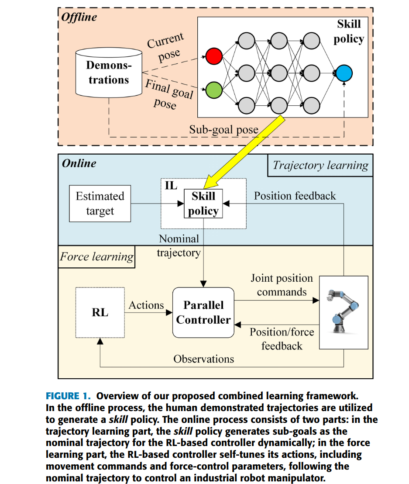

# Hybrid trajectory and force learning of complex assembly tasks: A combined learning framework
> we focus on exploring approaches that can execute proper force control along with the nominal trajectory with high adaptivity to the uncertainty involved in complexassembly tasks.

这里的 combined 指的是 Reinforcement Learning 和 Imitation Learning，文章认为 IL 的问题在于
- 如果需要 simulation 来获得 human 操作的 force profile，那么 sim-real gap 还解决不了
- human demonstration 也是 sub-optimal 的。

RL 的问题还是 low sample efficiency。

文章旨在用 RL 去适应性的执行 Imitation Learning 得到的 nominal trajectory。

## Method

方法由 Imitation Learning 和 Reinforcement Learning 俩模块构成

### Imitation Learning of Nominal Trajectory
没有使用简单的 Behavoir Cloning，而是 Goal-conditioned IL。看上去只是把输入增加了 goal 信息。