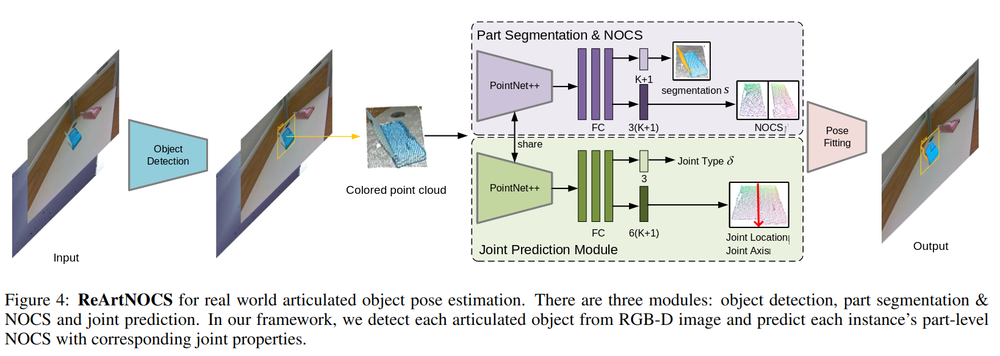

# Toward real-world category-level articulation pose estimation
解决的问题是 Category-level Articulation Pose Estimation (CAPE)，基于单帧 RGBD 输出 关节体的 Object detection，Part segmentation，Pose Estimation，Joint prediction。

纯视觉方案。

文章虽然关注关节体的 geometry info 的识别，但是实际做出来的是一个系统，包含了 detection 到 geometry info。Object detection 是一个相对独立的模块，加上一些数据增强，例如改变物体的颜色、纹理。

Detection 结束之后直接把 BBox 转成 PointCloud 用 PointNet++ 提取 feature。

有两个输出网络，一个负责 Part Segmentation 和 Part Pose，另一个负责 Joint Type 和 Joint Pose。