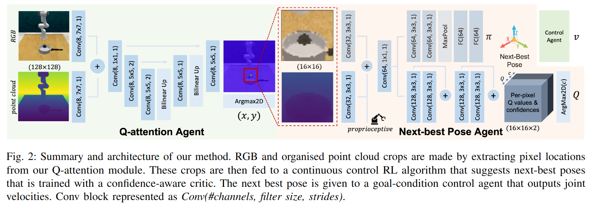

# Q-attention: Enabling Efficient Learning forVision-based Robotic Manipulation
[ARM github](https://github.com/stepjam/ARM)

ARM (Attention-driven Robotic Manipulation) 软件系统的第一篇文章。

最核心的思路在于 "Pixel location as actions"，即 action space 和 state space 为同一个，最终的 excution 则交给 motion planner 来做。

