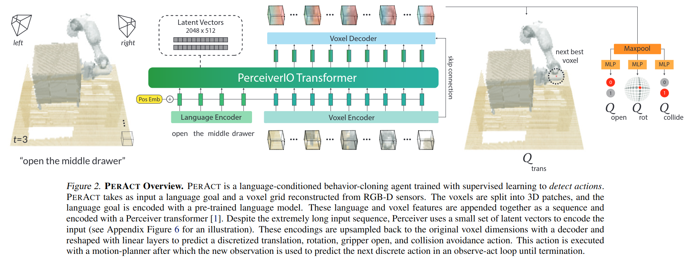

# PERCEIVER-ACTOR:A Multi-Task Transformer for Robotic Manipulation
[github](https://github.com/peract/peract)

用 Transformer 做 Robotic Manipulation，输入数据是 3D 数据，学习方式是 Behavior Cloning (BC)。

核心设计：
- Action 与 Observation 编码到同一个体素空间：
  - Observation 是从 RGBD 根据相机内外参计算得到的 $100*100*100$ voxel grid
  - 平移为夹爪中心所在 voxel
  - 旋转被离散化成三个坐标轴每个坐标轴上的5个 voxel 。
  - 夹爪状态和是否进行 Collision Avoidance 则是 binary 值。
  - 训练的时候模型输出的是每个 voxel 的 action value，然后实际的 voxel action 是这个 value 的 argmax
  - 实际执行 action 的时候，把 action 的 voxel 表示转化为 pose 之后由 motion planner 计算。
- 使用 Behavior Cloning 而不是 Reinforcement Learning
  - 训练的 target 是从 demonstration 中截取的关键帧，也就是直接用关键帧的 voxel action 作为 transformer 输出的 target。
- 融合 language 和 voxel feature
  - 模型输入数据是 langurage goal 和 voxel obvervation，经过 transformer 之后输出 voxel 表示的 action sequence