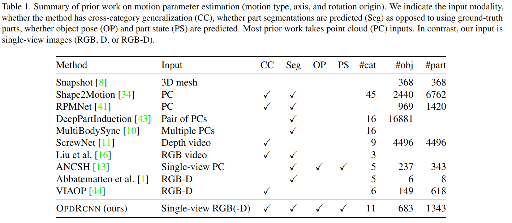
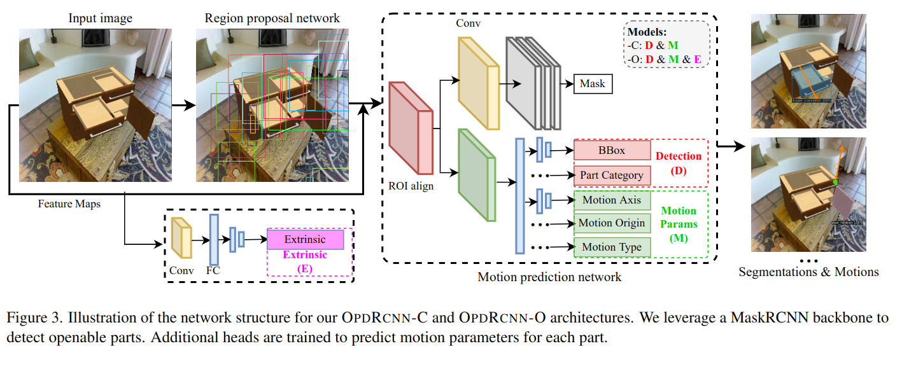

# OPD: Single-view 3D Openable Part Detection
- [github](https://github.com/3dlg-hcvc/OPD)

Openable Part Detection. 对任务的定义更加直接，直接 detect 物体的哪一部分可以打开以及如何打开。

输入单张RGB图片，输出可打开的部分的detection以及其关节数据。核心思路是用 MaskRCNN 基础上扩展的 Network 来直接从图片中预测各种参数。

文章对之前所有 motion parameter estimation 的工作列了个表，很有参考性

具体方案：
- 使用 MaskRCNN 作为网络骨架，将每个 openable part 看作是 instance
- 添加额外的 Head 来输出 Motion Parameter

