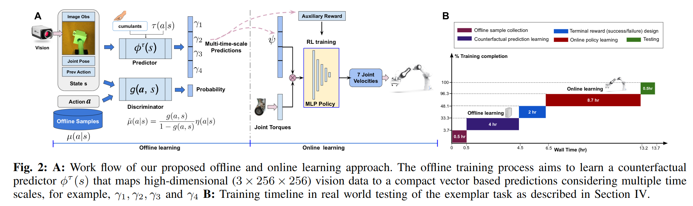

# Offline  Learning  of  Counterfactual  Predictions  for  Real-World  RoboticReinforcement  Learning
[Demo](https://sites.google.com/view/realrl)

感觉很故弄玄虚，但是采用的用 supervised learning 来学习一个 general value function 来加速 policy 学习的方法还是可以借鉴的。

任务场景是 peg-in-hole，同时使用 vision 和 force 信号训练 RL 模型，而且 reward 只有 terminal reward。

## General Value Functions GVF
在本文中 GVF 被作为了一种学习 state embedding 的方式。

> A  general  value function predicts the expected return of discounted cumulant $c_t$ by following a target policy $\tau$ according to a termination function $\gamma_t$ when  at  state $s_t$.

GVF 也是衡量一个 state 的 value function，只是它对应的 reward 不再是原本的 task。例如开门任务，定义一个 GVF 值为时刻的速度，速度越快 value 越大。最大化该 value 并不能得到 optimal policy。

> GVFs can be viewed as auxiliary tasks aiming to speed up learning the primary RL task.

文中使用的 $c_t$ 是 eef 和 target 之间的 6D Distance （对应6轴而不是平移旋转，即每个轴一个角度距离），实验中实际的做法是人把机械臂拖到 target，记录下这个过程中每个轴移动的距离。

采样用于训练 GVF 的数据的时候使用的 policy 是 $\tau(a_t|s_t, a_{t-1})=\mathcal{N}(a_{t-1}, \Sigma)$，代表保留一定的 randomness 重复上一次 action。

使用 $\tau$ 采样到的数据作为 target，训练 $\psi_t = \phi^\tau(I_t, J_t, a_{t-1})$
- 这里的 state 定义为 图片 $I$，joint configuration $J$，previous action $a$
- $\phi$ 网络是一个对图片进行 encoding 的 CNN，其输出拼上 $J,a$ 之后过 MLP 输出一个 24 维向量，向量中每 6 维代表未来某一个时刻的 GVF 值，6 维中的每一维都是一个 joint 用 joint distance 定义的 auxiliary reward （距离 target 之间的距离）.
- $\phi$ 的训练使用的是 Value Function Estimation 常用的 TD 

**得到的 $\phi$ 在后续 Policy Learning 过程中被作为对 state 的一种 embedding，而不是 value function。所以被叫做 General Value Function。**

### Distributional Shift
$\phi$ 的学习过程中由两个不同的 policy
- 人拖动机械臂计算 distance 的 policy $\mu$
- 采样时使用的 policy $\tau$

这两个 policy 的不同带来了 Distributional Shift 问题。例如 $\tau$ 采取的一个 action 实际上是靠近了 target，但是由于后续的 $\Sigma$ 导致 TD Target 是一个很小的 value，而且这个现象有一定的随机性。如果直接这样学习，将会导致 $\phi$ 的 Target 值和 6D Distance 不一致，从而不收敛。

文章一大半篇幅都在解决这个问题，翻译过来大概方法是：
- 使用一个加权的 TD Error 进行训练，权重是 $\mu$ 和 $\tau$ 相似度
- 用一个 uniform distribution 标定 $\mu$，从而能够计算 $\mu$ 的具体值。

原理推导没完全看懂。

## Policy Learning
前面得到的 $\phi$ 网络被当作一个 embedding 网络，其中包含了环境信息 $I$，robot state $J$，previous action $a$，并且隐含了当前状态和 target 之间的距离（更准确的说是“如果按照当前 action 继续，那么 joint distance 会如何变化”的信息）。

把 $\phi$ 的输出和 Force Feedback 拼接起来 $[\psi_t, F_t]$ 作为新的 state 定义 $x_t\in \mathbb{R}^{31}$，然后使用 final success/fail $z_t$作为 reward，使用 SAC 训练 policy network。

但是为了 guide exploration，文章直接使用 $\psi_t$ 来作为辅助 reward

$$\begin{equation}r_t=\left\{\begin{aligned}
&z_t, & &\text{if succeed}\\
&\alpha_t = \exp(-\lambda\lVert \psi_t \rVert), & &\text{otherwise}
\end{aligned}\right.\end{equation}$$
