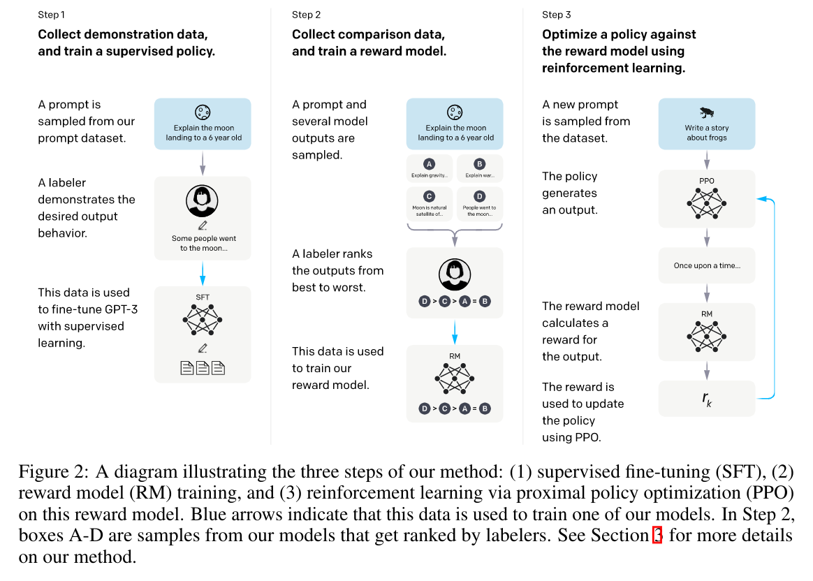

# Training language models to follow instructionswith human feedback
ChatGPT 之前的文章，ChatGPT 使用了该文章里的很多方法和思想。

核心任务是用 human instruction 调整 GPT3 language model 的表现。

采用的方法是 Reinforcement Learning from Human Feedback (RLHF)

## Method
- Pre-Trained GPT-3
- Supervised Fine-Tuning (SFT)
    - 即根据问题，人为给出输出，通过 supervised learning fine-tune GPT-3
- Train Reward Model (RM)
    - 由模型对同一个问题给出多个不同的输出，人为标注其优劣。
    - 用这些标注，直接使用 supervised learning 训练一个 Reward Model.
    - Reward Model 的结构是把前面 SFT 之后的模型的 final unembedding layer 去掉，变成输出一个 scalar reward。输入则同时包含了 prompt 和 response。
    - 训练 Reward Model 的 Label 是认为标注的针对同一个 prompt 不同 response 的相对优劣
    - 使用的 loss 是
    $$\text{loss}(\theta) = -\frac{1}{C_K^2}\text{E}_{(x,y_w, y_l)}[\log(\sigma(r_\theta(x, y_w), -r_\theta(x, y_l)))]$$
        - 这里的 $y_w, y_l$ 分别代表 win, lose，即认为标注的较好的 output 和相对较差的 output，$C_K^2$ 即对 K 个不同的输出两两都进行 loss 计算，loss 将使得模型对 $y_w$ 给出比 $y_l$ 更高的 reward。
- Reinforcement Learning based on Reward Model
    - 使用 Reward Model 的输出，用 RL 算法把 GPT-3 网络作为 Policy 网络训练。实际使用的 RL 算法是 PPO
    - 依然是在前面 SFT 作为起始 policy，相当于使用 PPO 来进一步 fine-tune SFT Model。
    - Loss 具体设计还没看懂

## Questions
