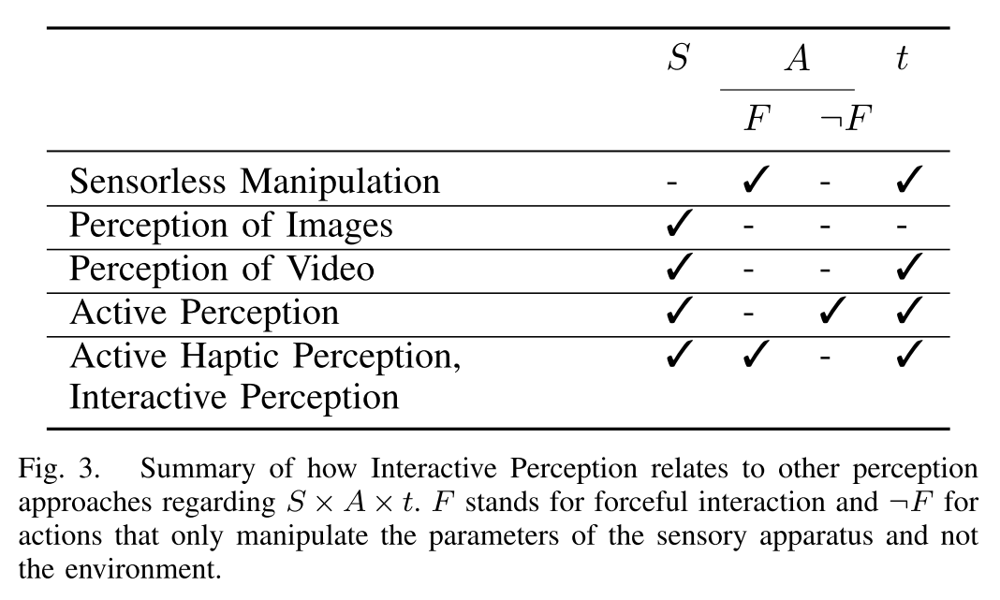

# Interactive Perception: Leveraging Action in Perception and Perception in Action
是一篇关于交互式感知Interactive Perception的Survey。

强调感知过程的交互性（探索性）和主动性。

## Abstract
在机器人研究领域，感知(Perception)通常是通过与周边的环境进行交互达成的，这一类方法被称为Interactive Perception（交互式感知，IP）。这一类感知方法有以下特点
- 与环境的交互能够获得大量传感信息。
- 感官数据和动作参数之间的规律性可以用于预测和解释感官信号。

## Introduction
对于生物来说，“感知”是一个动态的主动地探索性的过程，而不是一个对静态信息的被动分析过程。

对于机器人来说，交互性带来的信息是远远不止基于图像的CV任务所需要的信息的，因为交互性带来的信息中还天然包含着行为和signal之间的关联。

## Interactive Perception
### Forceful Interactions
Forceful Interaction可以简单理解为一切有力作用在环境中的交互行为，比如推一个东西拿一个东西滚一个东西之类之类，甚至于简单的摸一个东西拎一下东西。

在IP的语境中，更关注那些以改变或者探索环境为目的的交互，也就是这里的Forceful Interactions.

### Interactive Perception 带来的好处
- Create Novel Signals (CNS): 丰富的传感信号
- Action Perception Regularity (ARP): 揭示信号(Signal) - 行为(Action) 随时间(time)的关联性。即Forceful Interaction能够得到$(S \times A \times t)$空间中的信息，而不仅仅是观察能够得到的Signal。而从对同样环境中重复获取的这类多模态数据中，就可以得到其中的关联性（也是能够进行学习的基础）
- 使用规律性（使用规律性的能力或者潜力）。如果可以掌握前面提到的SAt空间中的规律性，掌握行为和感知信息之间的因果关系，也就意味着
    - 给出行为和环境之后，可以预测感知信号结果。
    - 通过对比预测与观测结果，更新关于所处环境的知识。
    - 根虎环境知识，推测出得到特定感知结果所需要的行为。
- 学习规律性。也就是学习行为和感知结果之间的因果关系。其中行为可以是机器人自发的，也可以是由人监督进行的。

## Historical Perspective 发展历史
交互感知的前身是主动感知Active Perception。除此之外还有很多其他的感知方法，它们大多是忽略了SAt中的一部分信息

### Sensorless Manipulation 无传感器控制
也就是不使用任何传感器的控制，最终目的是找到一系列固定的行为，可以保证经过这些行为之后系统处于特定的状态。（比如自动售货机用来区分硬币的系统就是一个无传感器的控制系统）。

### Perception of Visual Data 基于视觉数据的感知
当前大部分CV任务所关注的感知模式，理解图片、视频等视觉数据。

目前CV任务的一些表现也展现了SAt空间规律性带来的作用，例如在CV任务中考虑多帧关联性，或者用统一模型识别场景中有关联的不同物体，都能带来更好的效果。提到的CV任务包括
- Human Activity Recognition in Video
- Object Classification
- Image Restoration
- Shape from Shading / Structure from Motion

### Active Perception
[Revisiting Active Perception - HTML](https://link.springer.com/article/10.1007/s10514-017-9615-3)

Definition
> An agent is an active perceiver if it knows why it wishes to sense, and then chooses what to perceive, and determines how, when and where to achieve that perception.

- 和Interactive Perception的关系：当前AP相关的方法依然集中于视觉感知，Action也大多限于对相机内外参数的修改，不包括和环境的物理上的交互。当前的各类方法已经可以很好的利用多帧、透视等关联性的视觉信息去更好的解决视觉上的问题，然而对于能够直接改变环境本身的物理交互的影响，仍然缺少有效的预测模型。
- 早期的Interactive Perception例子

### Active Haptc Perception 主动触觉感知
早起的触觉感知方法主要是为了研究以下问题：
- 基于触觉的重建
- 通过物体表面的tracing来识别物体
- 纹理和材质属性获取

应用基于机器学习的方法进一步研究了以下问题
- 物体和姿态识别
- 3D重建
- 纹理分类和描述

当前触觉感知的方法和研究问题通常不以改变环境为目的，作为感知对象的物体或者环境通常是被假定为静态不变的。

## Applications of Interactive Perception 交互感知的应用
### Object Segmentation 物体分割
简单说通过主动地影响物体，从而将单个物体从多个物体或者环境中区分出来。

### Articulation Model Estimation 关节体模型估计
- 确定两个物体的相对运动之间是否存在关联
- 理解物体之间的关联性是否是由关节体（Primatic or Revolute Articulation Mechanism）造成，以及其连接轴的姿态

这里的模型指的通常是关节体的运动模型（Kinematic Model）。

相关的方法通常致力于通过机械臂行为主动降低关节体运动模型的不确定性。

### Object Dynamic Learning and Haptic Property Estimation
对于物体的触觉或者惯性等运动特征的估计。

### Object Recognition or Categorization 物体的识别和分类
基于静态图像的识别的分类方法需要应对遮挡、光照、尺寸等等问题，因此需要大量的训练数据。

而基于Interactive Perception的方法允许机器人去直接与物体交互，进而发掘单帧视觉图像中所不能揭露的隐含特征，可以天然的解决Data Variation带来的困难，减少对于大规模数据集的需求。

### Multimodal Object Model Learning

### Object Pose Estimation

### Grasp Planning
在混乱场景，或者信息不足的情况下完成抓取任务。

### Manipulation Skill Learning

### State Representation Learning
在Interactive Perception的研究中，对于传感器数据以及各类潜在变量都是预先定义的。

有一些方法试图用学习的方法来表示这些数据，这些方法通过给出从原始数据到一些低维空间的映射方法，得到新的状态表示方式。映射方法可以是线性的映射，也可以是基于CNN的映射。而映射模型中的参数是通过学习得到的。

## Texonomy of Interactive Perception 交互感知分类
