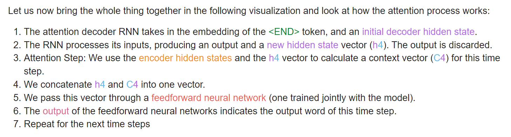
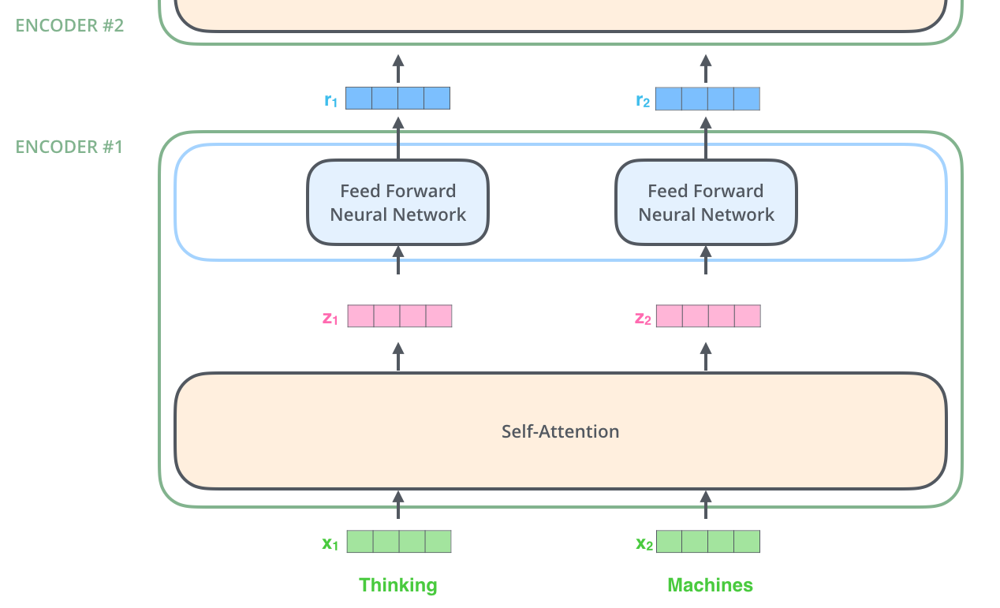

# Transformer
- [referencec: attention blog](https://jalammar.github.io/visualizing-neural-machine-translation-mechanics-of-seq2seq-models-with-attention/)
- [reference: transformer blog](http://jalammar.github.io/illustrated-transformer/)
  
## Sequence to Sequence Model

输入序列，输出另一个序列的 model。

通常结构是：
- 一个 encoder 将输入序列映射到一个 context vector
  - 输入序列中每个单词按照特定的 world embedding algorithm 变成向量表示
  - 模型通常是一个 RNN 类似物，每次 RNN Block 输入一个词向量和 hidden state，输出一个 output 并更新用于下一个单词的 hidden state。
  - 最后一个词向量处理完后得到的 hidden state 就可以作为 context，我们希望这个 context 包含了过往所有词向量的信息。
- 一个 decoder 从 context 中得到另一个序列。
  - 和  encoder 结构几乎一样，每次 RNN Block 输入 hiddden state，输出用于下一个单词的 hidden state 和当前位置预测的词向量。

然后很显然这里的一个问题是 hidden state 很难包含所有信息，更不要说前后词向量的顺序、关联性等信息。

## Attention

attention 就是为了解决这个问题，通俗说就是，让 decoder 能够区分 input sequence 中不同部分提取的信息，并且能够学到在输出特定位置是，关注来自特定输入的信息。例如英语定语后置，中文定语前置，在输出中文定语部分的时候，让模型能够学到 “这时候应该关注输入的英文的定语位置提取来的信息，而不是相同位置的信息，或者笼统的所有信息”。

attention 通常包含以下过程

- 在输出每个词向量的时候，都把所有的 encoder hidden states 输入进来
- 根据当前的输出进度，实际上就是 decoder 当前更新到的 hidden state，给每个 encoder hidden state 打分。
- 以打分为权重把 encoder hidden state 合成一个，作为当前的 context。**即 encoder context 是 coditioned on current decoder state 的**。这个打分起到的作用，就好像以 decoder hidden state 为标准，特别关注某一些 encoder hidden state，所以叫 attention。

## Transformer
Attention 是一种思路而不是具体算法实现，也不限于 seq2seq 的问题。Transformer 等可以看作是对 attention 机制的一种实现，而这种实现往往要关注以下问题：
- 怎么算 attention score
- 怎么完成模型的训练

粗略总结 Transformer 的核心：
- self-attention，直接计算输入之间的 attention
- 舍弃 hidden context state，从而让 encoder 不在依赖于前面的处理结果。但是相应的，需要 positional encoding 来表示位置。

### Self-Attention
Transformer 不仅仅把 attention 用在输出和输入之间，也用在输入和输入之间。举个例子来说：
> "The animal didn't cross the street because it was too tired"

当输入这个句子到 encoder 中的时候，当处理到 "it" 的时候，encoder 的输入只有 it 和 hidden state，如果只是翻译或许可以，但如果想要提取更多信息（比如问答），就希望此时把 it 和 animal 关联起来。

self-attention 即在输入的 entry 之间计算关联性，或者叫 attention score。计算这个 score 最粗暴的办法可能是把词向量两两一对输入一个打分网络。而 Transformer 的做法是：
- 对每个 input vector，计算三个向量 Query $q$, Key $k$, Value $v$，该过程由三个小网络 (metric) 完成
- 当 $x_1$ 输入 self-attention layer 的时候，使用得到的 $q_1$ 与其他 input vector 的 $k_i$ 计算点乘，这样会得到一个分数向量。该分数向量会做一定的归一化，然后过 softmax 来缩放。
- softmax score 即相当于 $x_1$ 对所有其他 $x_i$ 的打分，通过将 $v_i$ 以打分为权重加权平均，来达到保留想要关注的 $v$，而 drop 掉其他 的目的。最终结果记作 $z_1$

输出的 $z$ 还会在过几层网络(feed forward network)，这便是一个 encoder。

encoder 的输出还可以再过 encoder，再算一遍经过一次 attention 之后的 vector 之间的 self-attention。“Attention is all you need” 文章中用了 6 个 encoder。

### Multi-Head (Self) Attention
不同的关系为标准，得到的打分可能不同，例如词语之间的指代关系 、修饰关系、谓宾关系。所以可以用多个不同的 weight matrices 来计算好几种 self attention。然后用一个额外的权重矩阵把一个单词的所有 $z$ 合成一个，作为该单词的 encoding。

偷一个总结图：

### Positional Encoding
Transformer 把上述过程并行进行，舍弃了充当 context 的 hidden state。这就使得模型无法区分输入的位置顺序。

### Residuals
多层 encoders 之间也使用了保留残差的输入方式。这在 encoder 之间、encoder 和 feed forward network 之间，都会进行

### Decoder
Decoder 的总体结构和  Encoder 是一致的，区别在于：
- 除了 self-atttenntion，还有一个 encoder-decoder attention layer，这里的 K,V 是由 encoder 最后的输出经过一个 metric 得来的，这些 KV 向量会作为每一个 encoder-decoder attention layer 的 Key 和 Value 使用
- Decoder 额外输入其上一步输出的词向量。这样有一个很有趣的作用，就是在训练的时候，不需要以序列的方式调用 decoder，大可以直接用 gt 来作为 decoder 的输入，并行化训练。
- 计算 self-attention 的时候，只会和之前位置的输入计算 self-attention。这是因为 inference 的时候，是看不到后面的 decoder input 的。