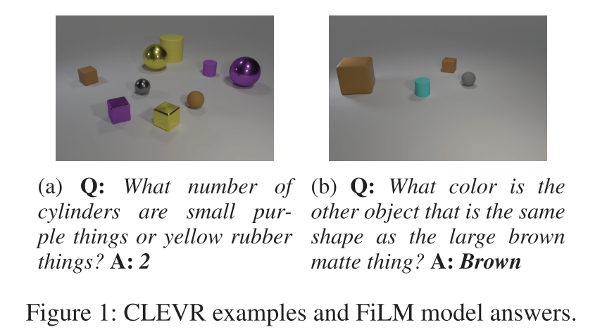
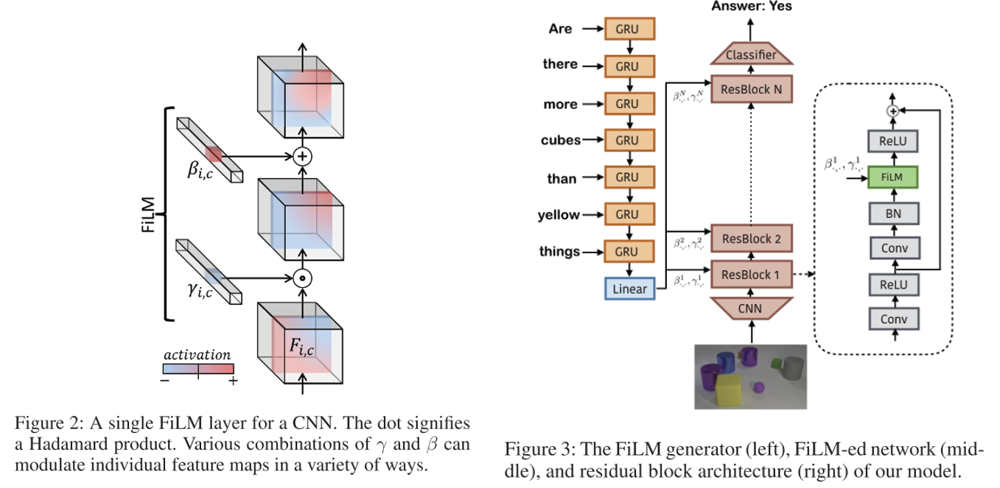

# Film: Visual reasoning with a general conditioning layer
Feature-wise Linear Modulation.

提出了一种通用的 conditioning method. 我的理解是一种通用的提取到一种信号 conditioned on 另一种信号的特征。比如图片和文字，当最终的 task 需要提取图片中，与文字相关的特定特征的时候，就可以用本文的方法，这也是本文演示 FiLM 效果时采用的 task。

具体 Task: Visual reasoning. 
- 输入：一张图片和一句 language question
- 输出：回答，这里的回答是预定义的（例如二分类表示正确与否），而不是自然语言。最终输出的是一个 softmax distribution over final answers

## Method
基本思路是，在模型正常处理信号 $y$ 的时候，将模型的 activation function 前面加上另一个激活函数层（实际相当于一个 attention 层），该层的参数是由另一个信号 $x$ 决定的。在本文中 $y$ 是图片，$x$ 是文本。

具体来说，对于 $y$ 提取到的每个 feature (channel) $c$，学习两个函数 $f_c,h_c$，这两个函数输入另一种信号 $x$，输出仿射变换的两个矩阵

$$\gamma_{c} = f_c(x), \beta_{c} = h_c(x)$$

然后对 $y$ 的 feature map $\mathbf{F}_c$ 进行 feature-wise affine transformation

$$FiLM(\mathbf{F}_c | \gamma_c, \beta_c) = \gamma_c\mathbf{F}_c+\beta_c$$

$f_c, h_c$ 实际上由 neural network 实现，被称为 FiLM Generator. 而受影响的处理信号 $y$ 的网络称为 FiLM-ed Network (Feature-wise Linearly Modulated Network).

对于每个 feature map 的每个 channel，需要有独立的 FiLM Generator Parameter，但即便如此，由于 FiLM Generator 的输入完全和图片无关，所以其效率仍然很高，并且具有一定的泛化性。

