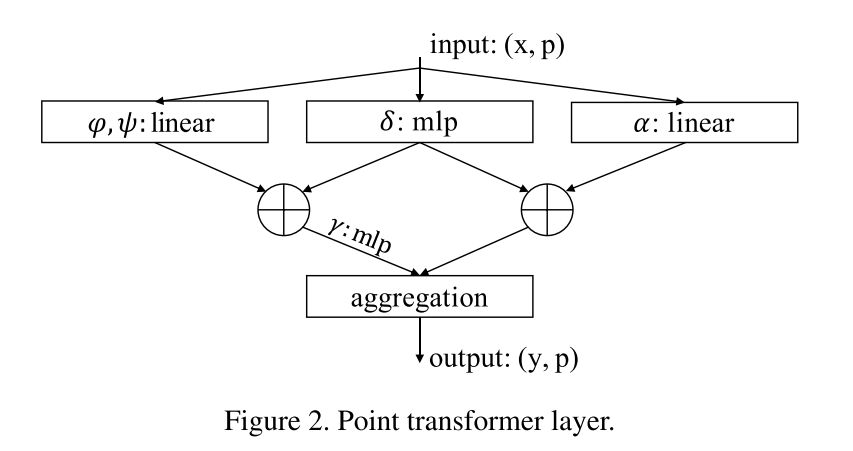

# Point Transformer
Cite 1619

把 self attention 直接应用在 point cloud 中，做得任务仍然是 segmentation，detection，classification 等视觉任务。

> Self-attention is a natural fit for point clouds because point clouds are essentially sets embedded irregularly in a metric space.

从数据形式来看，比起图片和文本数据，attention mechanism 其实更适配 point cloud 这样的数据。在应用到图片和文本的时候，由于 attention 是一个 set operation，所以需要额外的 positional encoding。

但是在实现中，本文依然需要取 neighbor points 来计算 attention。其他工作的一些对 point transformer 的改进则去掉了对 nearest neighbor query 的依赖来加快速度。

## Method
先回顾最基本的 dot product attention
$$
y_i = \sum_{x_j\in\mathcal{X}}\rho(\varphi(x_i)^T\psi(x_j)+\delta)\alpha(x_j)
$$
- $\varphi, \psi$ 分别代表Q，K矩阵，$\delta$ 为 positional encoding
- $\alpha$ 是 V 矩阵
- $\varphi, \psi$ 计算得到 attention weight scalar，经过 softmat normalization $\rho$，作用在 transformed feature $\alpha$ 上。
- 感觉上式有误，正常 $\delta$ 应该在里面，而不是加在 weight 上

本文没有使用 Transformer 最开始使用的 dot product attention，而是使用了以下 vector attention

$$
y_i= \sum_{x_j\in \mathcal{X}(i)}\rho(\gamma(\varphi(x_i)-\psi(x_j)+\delta))\odot(\alpha(x_j)+\delta)
$$
- $\mathcal{X}(i)$: $x_i$ 的 neighbors
- $\varphi, \psi$: feature transformation，可以是 Q、K矩阵，也可以是小的 MLP
- $\delta$: position encoding. 本文使用的是 $\delta=\theta(x_i-x_j)$，$\theta$ 是一个两层 MLP，并且同时把 position encoding 加在了 attention generation branch (前半) 和 feature transformation branch (后半)  
- $\gamma$: 一个两层 MLP，用来输出最终的 weight vector

单个 self attention layer 如下所示

