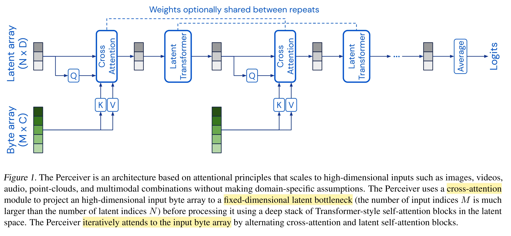

# Perceiver: General perception with iterative attention
Basic Model for PerACT and 3D-LLM.

> A model designed to handle arbitrary configurations of different modalities using a single Transformer-based architecture.

Perceiver 是一个基于 Transformer 的模型，其最大的特点是支持非常大尺寸的输入，并在处理过程中将大尺寸输入收束到一个很小的 tight latent bottleneck。这种能力对于 Transformer 来说非常重要，Transformer 作为一个从 NLP 发展来的模型，其最初设计的输入是 tokens（word embedding）。也正因此，后续利用 Transformer 处理其他领域问题的时候，也倾向于首先进行 Tokenization，例如将 image 进行 patch 化之后经由 CNN map 到一个 token space。而 Perceiver 的目标是直接输入图片、点云等大尺寸数据，经由 attention 机制直接处理。

这种机制在文章中称为 **asymmetric attention mechanism**.

Perceiver 的另外一个作用是可以处理多模态任务。由于其处理大尺寸输入的能力，使得 Perceiver 可以用同样的结构处理不同的信号类型。

## Method Overview

Perceiver 的思路其实非常直接。在最初的基于 RNN 的 seq2seq model 中，share parameter 的 RNN block 按照顺序处理输入序列，并依次输出对应输出，同时更新 latent vector。这样的结构可以无视输入的尺寸，相应的问题是，要求 latent vector 包含的信息足够完善，否则就会发生遗忘前面的输入，难以理解关联性等问题。因此才有了 attention。

而 Perceiver 把 latent space 加回了 Transformer，可以粗略的看作是将 RNN Block 换成了 Transformer Block，把 RNN Block 使用的残差拼接换成了新的输入和 latent 之间的 cross attention。

需要特别注意的是，Perceiver 解决的并不是 Seq2Seq 的问题，它更像是给出了用 Attention 替换卷积、MLP作为基本运算逻辑的通用模型的一种解决方案。

另外，为了让模型能处理多模态数据，Perceiver 的做法是在 input embedding 上下功夫。

### Cross Attention