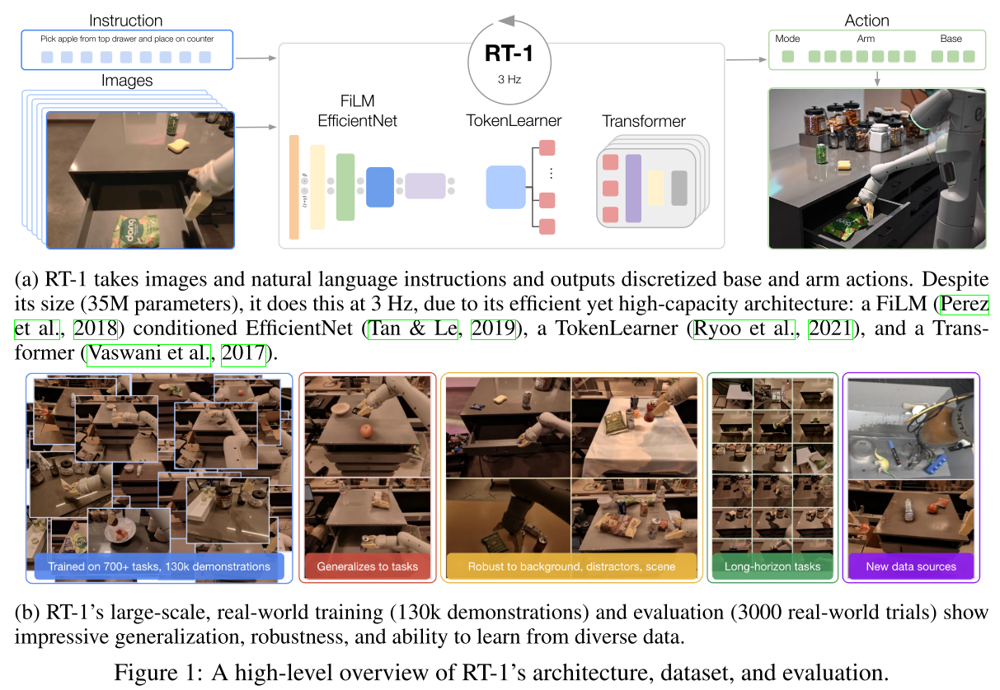
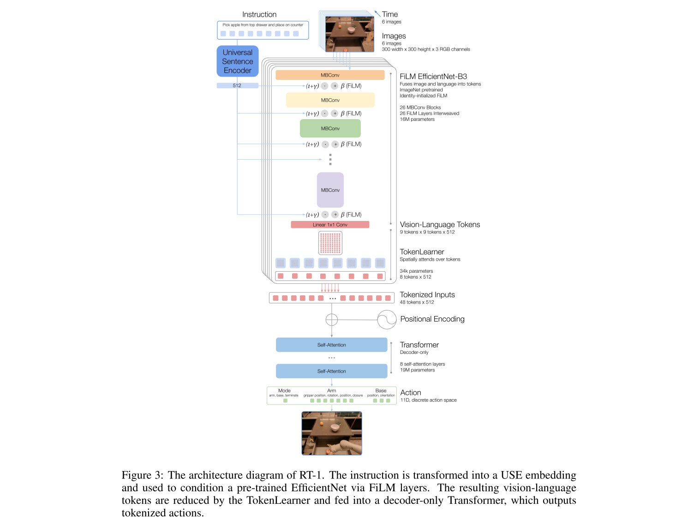

# RT-1: Robotics Transformer For Real-World Control at Scale
[mainpage](https://robotics-transformer1.github.io/), [source code](https://github.com/google-research/robotics_transformer)

Topic:

> We therefore ask: can we train a single, capable, large multi-task backbone model on data consisting of a wide variety of robotic tasks? And does such a model enjoy the benefits observed in other domains, exhibiting zero-shot generalization to new tasks, environments, and objects?

具体 task: learn robot policies to solve language-conditioned tasks from vision. 

模型输入：image sequence, one language instruction
模型输出：action at each time step.
action space：11D：*seven variables for the arm movement (x, y, z, roll, pitch, yaw, opening of the gripper), three variables for base movement (x, y, yaw) and a discrete variable to switch between three modes: controlling arm, base or terminating the episode.*

## Model Design

### Image Tokenization
使用在 ImageNet 上 pretrain 的 EfficientNet-B3 模型作为基本模型，输入6张 300x300 的图片（6, 300, 300, 3），EfficientNet 的最后一层卷积层输出 (6, 9, 9, 512)，即每张图片一个 9x9 的 feature map。然后直接将 feature map 展开，得到每张图片对应 81 个 512 维的 visual tokens (6, 81, 512).

### Instruction Tokenization
Instruction 是和 Image 混在一起 tokenization 的，做法基本参考了 FiLM *([2018 AAAI] Film: Visual reasoning with a general conditioning layer)*.

首先将 instruction 过一个 pretrain 过的 encoder，文章用的是 Universal Sentence Encoder. 该 Embedding 会通过一个 FiLM Layer 和 image feature 混合在一起，这样 visual tokens 就是 conditioned on instruction 的。

**FiLM Layer**: Feature-wise Linear Modulation,可以看作是一个 learnable activation layer，本质上是对网络的中间输出做一个仿射变换，而该仿射变换参数则是由另一类输入决定的。对于本文来说，仿射变换的参数本身是一个关于 instruction 的函数，然后将其作用在 image feature 中。具体参考FiLM论文。

直接使用 FiLM 会破坏掉 pretrained image tokenizer，文中采取的方法是首先对 FiLM generator 的 weights 进行初始化，使得其输出的 affine transformation parameter $\beta, \gamma$ 是一个 identity transformation，然后再训练过程中更新 generator 参数。

### TokenLearner
是一个筛选器，前面得到了每张图片 81 个 token，TokenLearner 从中选取 8 个。

TokenLearner 本身也是个 attention module。

### Transformer
6张图片的8个token拼接在一起，将 48 个 token 输入到 decoder only transformer。

transformer 的输出就直接是 action 了，也就是说这一部分没有再把 language instruction 输入一遍，全靠 FiLM Layer 来理解 instruction。个人感觉这个做法对 instruction 的理解能力有点差。

### Action Tokenization
一个 action 包括 11 个变量，每个变量的取值离散化成 256 bins。最终是一个 11*256 的多分类输出。

### Loss
Cross-Entropy Loss with Causal Masking. (啥是 Causal Masking?)