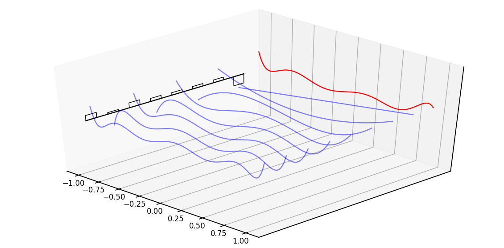
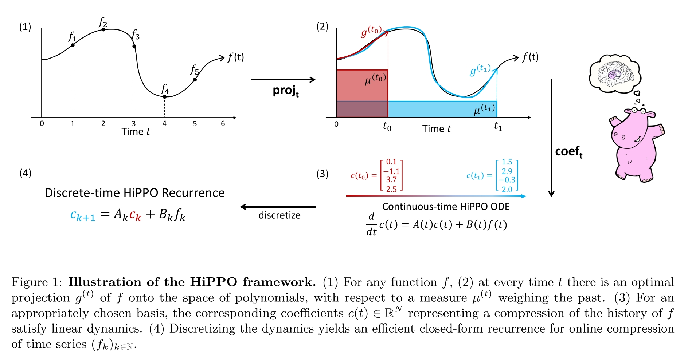

# Efficiently modeling long sequences with structured state spaces
Cite 777. Albert Gu, Karan Goel, and Christopher R´e

- [blog for this paper](https://huggingface.co/blog/lbourdois/get-on-the-ssm-train)
- [Presentation Video](https://www.youtube.com/watch?v=EvQ3ncuriCM)
  - [slides](https://rosanneliu.com/dlctfs/dlct_220114.pdf)
- [reddit discussion thread](https://www.reddit.com/r/MachineLearning/comments/s5hajb/r_the_annotated_s4_efficiently_modeling_long/)
- [blog annotated s4](https://srush.github.io/annotated-s4/)
- [slides](https://rosanneliu.com/dlctfs/dlct_220114.pdf)

Task: 针对非常长 Sequence 的建模方式与网络架构，解决 sequence model 面临的 long-range dependencies (LRDs) 问题。

核心贡献是对 state space model (SSM) 的改进，以使得 SSM 的计算和空间复杂度能够实用。文章将其称为 structured state space sequence model。

## (Linear) State Space Model
- [wikipedia SSM](https://en.wikipedia.org/wiki/State-space_representation)

State Space Model 是对物理系统的数学建模方式，这类系统可以简单抽象为：
- 系统的输出 output $y$ 由状态 state $x$ 和输入 input $u$ 决定
- input $u$ 通过影响状态 state $x$ 的 first-order differential equations or difference equations 来改变系统状态
- 输出 $y$ 由系统状态 $x$ 决定，也可以直接受到系统输入 $u$ 影响。

对于一个简单的 linear system，state variable 可以表示成一个维度之间 linearly independent 的 state vector，相应的 input, output, control signal 之间的关系可以用 matrix 建模。这样，整个系统就可以表示成

$$
\begin{align*}
\dot{x}(t) &= A(t)x(t) + B(t)u(t)\\
y(t) &= C(t)x(t) + D(t)u(t)\\
\dot{x}(t) &= \frac{d}{dt}x(t)
\end{align*}
$$

- $x(t)$ 表示 $t$ 时刻的 state vector
- $A(t)$ 表示 state matrix，他表示系统的状态自身对下一时刻的影响，或者说包含了 state dynamics 信息。
- $B(t)$ 表示 input matrix，即输入对系统状态的影响，这个影响是作用在 $\dot{x}$ 上的
- $C(t)$ 表示 output matrix，即如何从系统状态获得输出。
- $D(t)$ 表示 feedthrough matrix，表示输入对输出的直接影响。

更进一步，对一个 Linear time-invariant system，ABCD是与时间无关的

$$
\begin{align*}
\dot{x}(t) &= Ax(t) + Bu(t)\\
y(t) &= Cx(t) + Du(t)\\
\dot{x}(t) &= \frac{d}{dt}x(t)
\end{align*}
$$

### Discretization, Recursive view of an SSM
用离散的方式计算积分

$$
\begin{align*}
x_{n+1} = x_n + \frac{t_{n+1}-t_n}{2} (Ax_n + Bu_n + Ax_{n+1} + Bu_{n+1})
\end{align*}
$$

定义

$$
\begin{align*}
\Delta &= t_{n+1}-t_n\\
\bar{A} &= (I-\frac{\Delta}{2}A)^{-1}(I+\frac{\Delta}{2}A)\\
\bar{B} &= (I-\frac{\Delta}{2}A)^{-1}\Delta B\\
\bar{C} &= C
\end{align*}
$$

对于 $D=0$（输入必须通过影响 state 来影响输出）的 SSM 的最简单的一种离散表示为

$$
\begin{align*}
x_{n+1} &= \bar{A}x_{n} + \bar{B}u_{n+1}\\
y_{n+1} &= \bar{C}x_{n+1}
\end{align*}
$$

即可以通过简单的离散化，把 SSM 转变成递归形式。

从 Learning Model 的视角看，如果我们的 Learnable Parameters 就直接是 $\bar{A}, \bar{B}, \bar{C}$，SSM 就退化成了一个 RNN block。而 SSM 相比 RNN 的区别就在于 $\bar{A}, \bar{B}$ 之间是相关的。

### Convolutive view of an SSM
上面提到的递归方程可以用一个卷积核表示：

$$
y_k=\begin{bmatrix}
&\bar{C}\bar{B} &0 & 0\\
&\bar{C}\bar{A}\bar{B} &\bar{C}\bar{B} & 0\\
&\bar{C}\mathbf{\bar{A}^k}\bar{B} &\bar{C}\bar{A}\bar{B} &\bar{C}\bar{B}
\end{bmatrix}*u = \bar{K}_k * u_k
$$

$\bar{K}$ 在文中被称为 SSM convolution kernel

换句话说，如果我们的 learning parameters 直接是 $\bar{K}$，SSM 就退化成了一个 CNN block。而 SSM 相比 CNN 的区别在于其 kernel 的参数之间相互关联，且与时间 $k$ 有关。

Linear SSM、Recurrent SSM、Convolutive SSM 可以看作是 SSM 的三种视角，也可以是三种计算方式。

但是不管是 Recurrent View 还是 Convolutional View，其参数的获得 $\bar{A}, \bar{B}, \bar{C}$ 以及 $\bar{A}^k$ in $\bar{K}_k$ 都很困难，并且会面临很严重的梯度丢失，以至于无法处理长序列的数据。

## Structured State Space

是对 SSM 的另一种参数化形式，从而使得上面提到的三种 computation method 都可以很高效的计算。

这意味着，模型可以用 Convolutional Forum 来做并行化训练，并且用 Recurrent Forum 来做 inference。

### HiPPO Matrix
- [Reference blog hippo](https://hazyresearch.stanford.edu/blog/2020-12-05-hippo)

High-order Polynomial Projection Operators.

作者 (Albert Gu) 在 2020 年的工作 [HiPPO: Recurrent Memory with Optimal Polynomial Projections](https://arxiv.org/abs/2008.07669).

即不去计算 $\bar{A}^k$，而是用一个 matrix ，使得当前的 $x(t)$ 中可以包含 $u(t)$ 的历史影响。HiPPO 本质上是一个 function approximation 的方案。

> the main takeaway is that this matrix aims to compress the past history into a state that has enough information to approximately reconstruct the history. -- [blog annotated-s4](https://srush.github.io/annotated-s4/)

为了分析 HiPPO 的作用，首先把 HiPPO 的作用抽象一下。

考虑一个连续函数 $f(t)$，我们现在希望找到一个 fixed-size representation $c(t)\in \mathbb{R}^N$，其中能够包含 history of $f$ from 0 to $t$。

为了做到这一点，一个可行的办法就是将 $f(t)$ 近似为 $N$ 项多项式，然后 $c(t)$ as being the coefficient vector of the optimal polynomial approximation to the history of $f(t)$。 这便是 High-Order Polynomial Projection Operator 的基本思路。

HiPPO 的看不懂的地方就在于，它找到了一个极其容易计算，同时还保证一定精度的 basis 和 coefficient 计算方法。

而 [HiPPO Paper](https://arxiv.org/abs/2008.07669) 给出了一个很 magic 的 A matrix

这是一个 $N\times N$ matrix，只不过其中的值随 time $k$ 变化。

HiPPO 给出了一个 hidden state 的计算方式 $\frac{d}{dt}c(t)=A(t)c(t) + B(t)f(t)$，以及其离散形式 $c_{k+1} = A_kc_k + B_kf_k$，以及 A 的计算方式。

在 SSM 里，这里的 $c$ 就是一种 state variable 的定义方式，HiPPO Matrix 可以用作 A 的初始值。

### Normal Plus Low-Rank (NPLR)

