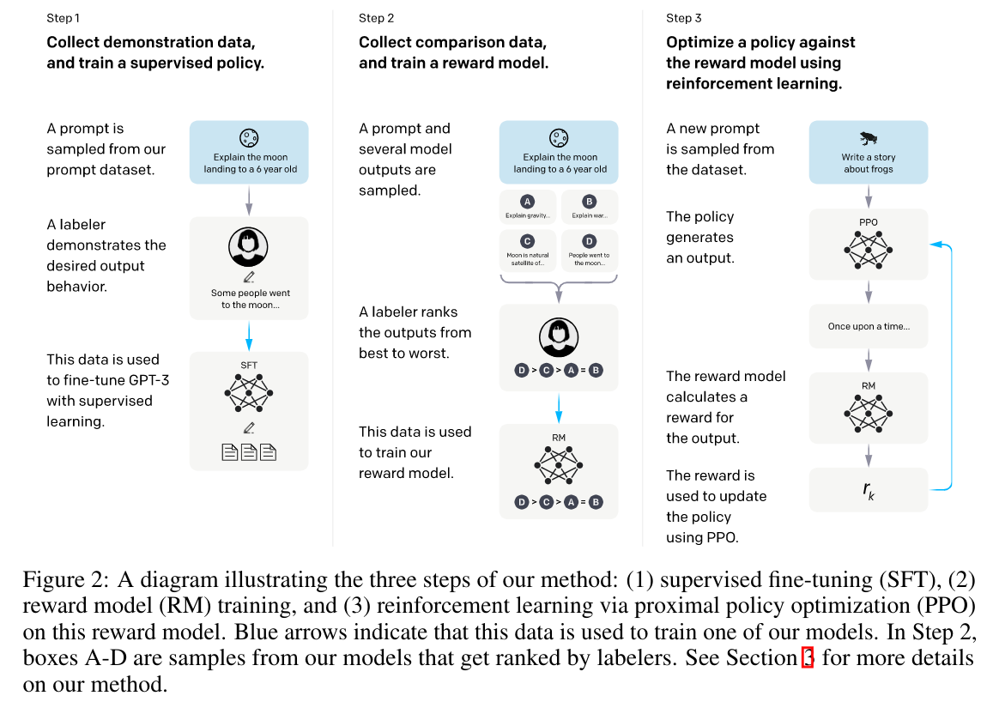

# Training language models to follow instructionswith human feedback
InstructGPT

ChatGPT 之前的文章，ChatGPT 使用了该文章里的很多方法和思想。

核心任务是用 human instruction 调整 GPT3 language model 的表现。

采用的方法是 Reinforcement Learning from Human Feedback (RLHF)

## Method
- Pre-Trained GPT-3
- Supervised Fine-Tuning (SFT)
    - 即根据问题，人为给出输出，通过 supervised learning fine-tune GPT-3
- Train Reward Model (RM)
    - 由模型对同一个问题给出多个不同的输出，人为标注其优劣。
    - 用这些标注，直接使用 supervised learning 训练一个 Reward Model.
    - Reward Model 的结构是把前面 SFT 之后的模型的 final unembedding layer 去掉，变成输出一个 scalar reward。输入则同时包含了 prompt 和 response。
    - 训练 Reward Model 的 Label 是认为标注的针对同一个 prompt 不同 response 的相对优劣
    - 使用的 loss 是
    $$\text{loss}(\theta) = -\frac{1}{C_K^2}\text{E}_{(x,y_w, y_l)}[\log(\sigma(r_\theta(x, y_w) -r_\theta(x, y_l)))]$$
        - 这里的 $y_w, y_l$ 分别代表 win, lose，即认为标注的较好的 output 和相对较差的 output，$C_K^2$ 即对 K 个不同的输出两两都进行 loss 计算，loss 将使得模型对 $y_w$ 给出比 $y_l$ 更高的 reward。
- Reinforcement Learning based on Reward Model
    - 使用 Reward Model 的输出，用 RL 算法把 GPT-3 网络作为 Policy 网络训练。实际使用的 RL 算法是 PPO
    - 依然是在前面 SFT 作为起始 policy，相当于使用 PPO 来进一步 fine-tune SFT Model。
    - Loss 由三部分组成：
      - reward model 的输出 $r_\theta(x,y)$，这里的 $x$ 是 language model 的输入，$y$ 是输出，reward model 给这个输入输出打分。
      - per-token KL penalty $-\beta\log\left(\frac{\pi_\phi^{\text{RL}}(y|x)}{\pi^{\text{SFT}}(y|x)}\right)$。注意 $\pi^{\text{SFT}}$ 是不会在 $\pi_\phi^{\text{RL}}$ 训练过程中更新的，这个 loss 项是为了控制不会过拟合 reward model。另外这里的分布是按照每个 token 计算的，按照原文的说法是叫 per-token KL penalty。猜测的计算方法就是 SFT(x) 给出一个输出，然后算这个输出是一个经过 softmax 的 one-hot 的形式，因此可以计算 y=RL(x) 中每个单词在 RL 和 SFT 中的概率，取个比值。最小化上式意味着希望 RL model 输出接近 SFT
      - pre-train gradient $\gamma E_{x\sim D_{pretrain}}[\log(\pi^{\text{RL}}(x))]$，这个理论上的作用是让训练得到的模型在公共数据集上保持好的效果。我的理解就是，按照训 GPT-12 的办法算到的 loss。
    - PPO-ptx loss (ptx may means pretrain)
    $$\text{objective}(\phi) = E_{(x,y)\sim D_{\pi_\phi^{\text{RL}}}}\left[ r_\theta(x,y) -\beta\log\left(\frac{\pi_\phi^{\text{RL}}(y|x)}{\pi^{\text{SFT}}(y|x)}\right) \right] + \gamma E_{x\sim D_{pretrain}}[\log(\pi^{\text{RL}}(x))]$$
- 对 RM 的训练和 RL 过程是可以持续进行的，即用新的模型生成新的结果，人来判断这些新的结果的优劣，然后用新的标注训 RM，然后用 RM 继续更新 Policy。

## Questions
1. How to train Language Model as a Policy Network? Why is it called a "PPO" algorithm?
2. What is the input of Reward Model? Do we need to call reward model twice to get the predicted reward for $r_\theta(x,y_w)$ and $r_\theta(x, y_l)$?
3. Does reward model share its parameters with policy network or the parameter of policy network is used to initialize reward model only once (as SFT model)? How many parameters (or layers) are added on the basis of SFT to predict scalar reward?
