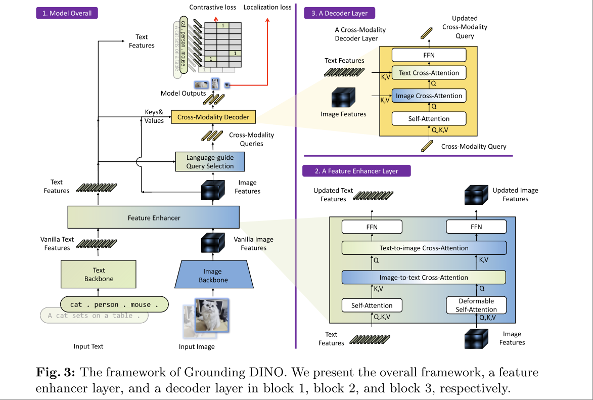

# Grounding DINO: Marrying DINO with Grounded Pre-Training for Open-Set Object Detection
Cite 796
Shilong Liu, Zhaoyang Zeng, Tianhe Ren, Feng Li, Hao Zhang, Jie Yang, Qing Jiang, Chunyuan Li, Jianwei Yang, Hang Su, Jun Zhu, Lei Zhang

Task：使用 DINO Backbone 来做 Open-Set 的 Object Detection，这里的 Open-Set 可以是类别，也可以是 `standard Referring expression comprehension`。

## Basic Idea

总体来说，要将一个 backbone，或者一个 close set detector 直接应用到 open-set (language)，通常要通过 contrastive loss 来将 region feature 和 language feature 拉到一个 space，比较典型的是 CLIP。

除此之外，处理多模态信息的模型还往往包含特定的 feature fusion 过程，本文将这些方法抽象成下图所示

上图中演示了不同的 Feature Fusion 或者 Contrastive Loss 阶段。对于 Transformer 之前的模型架构，与语言进行 Fueature Fusion 实际上很多时候都不可行。但是 ViT Based Model 和 Language Model 采用了同样的基础架构，使得 self-attention, text-to-image cross-attention, image-to-text cross-attention 成为了在 Neck 阶段进行 Feature Fusion 的非常高效与可行的方法。

本文的基本逻辑就是，用 Transformer 中的各种 cross-modality 的方法，将 DINO Backbone 和 text encoder 融合起来做 Object Detection。

## Methodology

