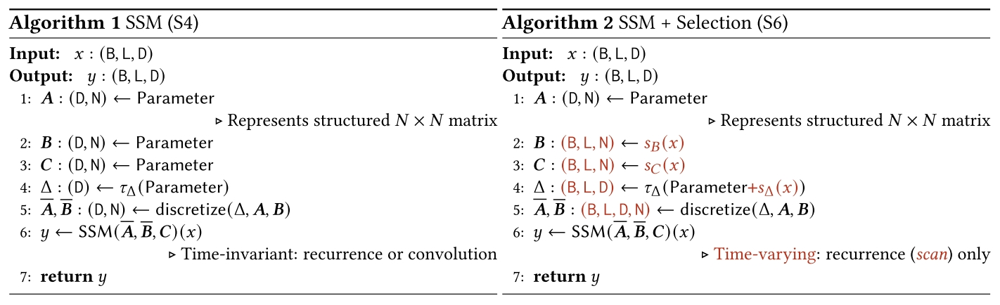

# Mamba: Linear-time sequence modeling with selective state spaces
cite 554 Albert Gu and Tri Dao

- [A So Great Blog](https://newsletter.maartengrootendorst.com/p/a-visual-guide-to-mamba-and-state)

对 Foundation Model 的改进，更具体地说，是对 Transformer 和 attention 的改进。其关注的 Transformer 的 BottleNeck 主要是
- inability to model anything outside of a finite window. 这也关系到大模型的 Long Memory 问题。
- quadratic scaling with respect to the window length. （我怎么觉得这两点是一个事呢）

本文的工作是对作者(Albert Gu) 2022 年的 [Efficiently modeling long sequences with structured state spaces](./[2022%20ICLR]%20Efficiently%20modeling%20long%20sequences%20with%20structured%20state%20spaces.md) （S4 Paper）方法的改进，该方案在作者 2021 年文章 [Combining Recurrent,
Convolutional, and Continuous-time Models with the Linear State Space Layer](https://arxiv.org/pdf/2110.13985) 有进一步说明。

S4 Paper 中的方案有一个很好的性质就是可以在 inference 和 training 期间用不同的计算方式
- convolutional mode for efficient parallelizable training
- recurrent mode for efficient autoregressive inference

## Selective State Space Models
在作者 20 年提出的 Structured State Space Model 的基础上，让模型能够主动选择输入数据中相关的数据。

Core Idea: 传统的 sequence modeling 是处理历史信息（context）的方式大致有两种
- Transformer: explicitly storing the entire context
- Recurrent Models: compress context into a smaller state.

这两类方案体现出了 sequence model 建模问题是所面对的一个 trade off
- efficiency: 将 context compress 到更小的 hidden state 从而获得更高的效率
- effectiveness: 保留更完整的 context 信息从而能够更好的根据当前 context 决定输出。

具体来说，本文实现的 selection mechanism 如下图所示

- (B,L,D) means Batch size, sequence Length, D channels.
- Alg2 所做的事情是将 SSM 中的 Parameters $\Delta,B,C$ 从 time-invariant 变成 time-varying。这会让 SSM 无法再表示成卷积形式，但是文章进一步提出了解决方案。
- $s_B(x) = \text{Linear}_N(x)$，$\text{Linear}_d$ 表示一个到维度 $d$ 的 parameterized projection
- $s_C(x) = \text{Linear}_N(x)$
- $s_\Delta(x)=\text{Broadcast}_D(\text{Linear}_1(x))$ 看不懂
- $\tau_\Delta=\text{softmax}$

## Efficient Implementation
解决如何再 Modern GPU 上运行 SSM 的问题。

- 