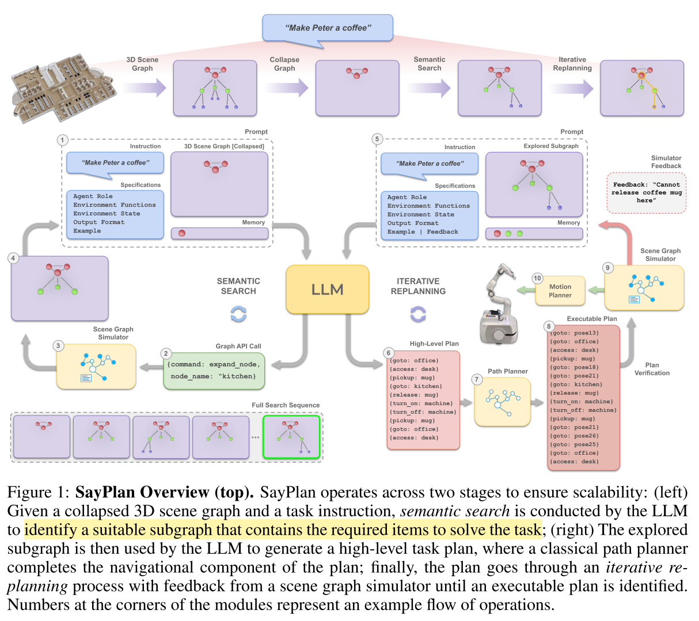

# SayPlan: Grounding Large Language Models using 3D Scene Graphs for Scalable Task Planning
结合 LLM 和 Scene Graph 来做 Task Planning。

个人感觉和其他利用 LLM 做 Planning 的方法比，最大的区别可能是利用 3D Scene Graph 处理了 grounding 问题。LLM 交互的对象只有 Scene Graph，也就不需要 grounding

核心思路是，在 3D Scene Graph 中以自然语言的形式存储信息，用 LLM 在这个 Graph 中做 semantic search。要点：
- Scene Graph 以 JSON 格式输入给 LLM
- 每次只输入 top node，然后由 LLM 决定如何调用 expand & contract API 来对 graph 进一步搜索
- LLM 不会输出具体连续值，而是交给单独的 planner 完成。

## Question
### 没有 Vision Info.

原本这个框架想要 work，需要一个非常强大的 perception module 来生成 3D Scene Graph。但是这不在本文讨论范围内。

理论上，Scene Graph 构建使用的 Model 可以直接为 VLM Model 提供 Vision Info，然后用 VLM 来做 Planning 和 Verification。

### 如何 Reasoning 失败原因？

### 如何区分同类不同物体？
