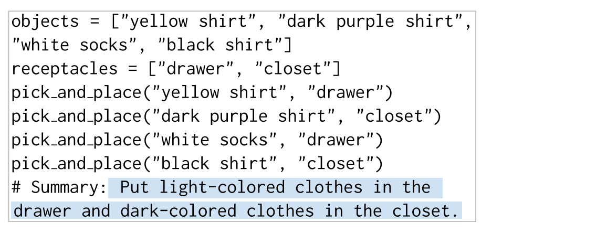
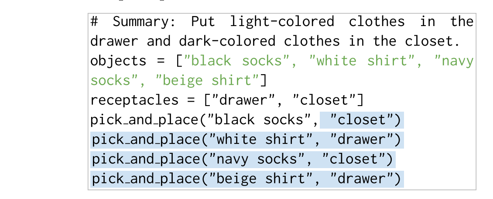
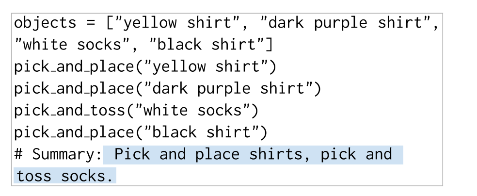
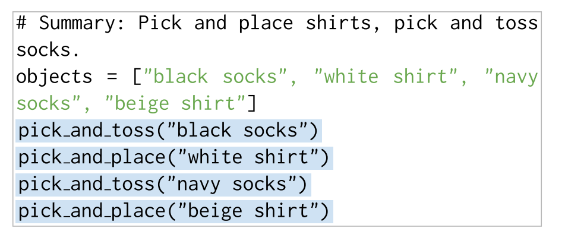

# TidyBot: Personalized Robot Assistance with Large Language Models
Task: 让机器人学会人的习惯。具体衡量表现时采取的测试任务是让机器人把一堆物体放到“proper place” (文章中称为 receptacle)。

文章的核心贡献在于，不需要使用大规模的数据来总结用户习惯，而是使用LLM对常识的理解和归纳能力来学习用户习惯。稍具体来说，相当于给LLM提供几个“XX物品放在XX”的示例指令，让LLM自己总结哪一类物品放在哪里。

对LLM的使用仅仅局限于调用（off-the-shelf）。

## Method
物品存放位置 receptacle 的选择。通过问 LLM 两个问题来利用 LLM 的常识推理能力解决，下图中高亮的是 LLM 的回答。

Manipulation primitive 的选择，和 receptacle 一样，只是问的问题不一样

## Questions
1. 为啥感觉这个工作是给LLM做了个测试，然后没了。
2. 是否会给LLM实例输出，例如第二种问题需要提前告诉LLM，你要输出“把xxx放到哪”类似的结果？——应该会有
3. 结果会不会和prompt关联性太强了。需要 prompt 指导到什么程度才能做到这样？如果做不到是不是多给出一些 prompt 就行了？