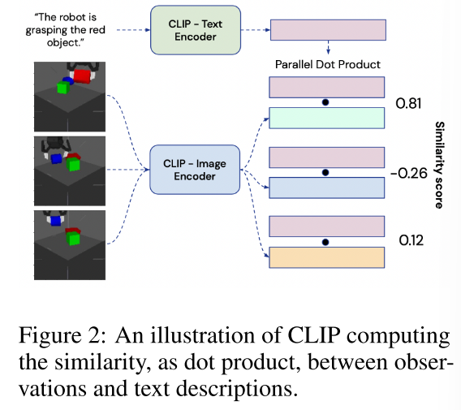
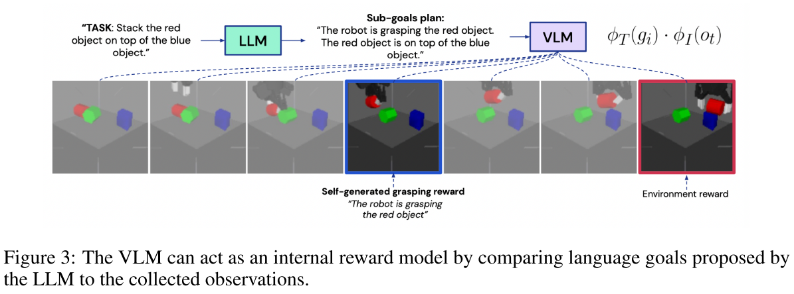

# Towards A Unified Agent with Foundation Models
Topic 是LLM，VLM大模型怎么作为基础模型构建“统一智能体”，有点大的一个 topic。

> The goal of this work is to investigate the use of Foundation Models (3), pre-trained on vast image and text datasets, to design a more general and unified RL robotic agent

测试的 Task 是 a sparse-reward simulated robotic manipulation environment, where a robot needs to stack a set of objects. 最终找出在这个简单的 task 上使用大模型作为基础模型的方法。

## 实验场景
- mujoco simulation
- state space 包含三个方块物体的位置和eef的位置
- action space 是 pick place 的 xy position
- observation space 是 128x128x3 的 RGB image
- 输入是固定格式的语言指令

## Method
总体步骤分为三步
### 将视觉输入映射到文本描述

使用了现成的 VLM 模型 CLIP。CLIP 可以理解为一对将图像和文本映射到同一个空间中的 encoder $\phi_I,\phi_T$。在这个空间中的向量之间的距离便是图像、文本之间的差异（当然也可以是图像和图像之间）。

在本文中，文本描述是非常固定的格式，只有
- The robot is grasping X
- The X is on top of Y
$X,Y\in\{\text{the red, green, blue object}\}$

本文用 CLIP 的两个 encoder 来 encode 图片和不同描述，然后通过计算输出向量之间的距离，找到最符合图片的描述。

文中用预训练的 CLIP，然后在这个实验场景里做少量的 finetune，就拿来用了。

### 理解文本指令
用一个 LLM ，由文本指令生成一系列 sub-goals.

由于 LLM 本身已经学习了足够的内容，而且本文的指令和任务都足够简单，所以只需要提供两个将 task description 拆分成 sub-goals 的例子，就可以让 LLM 学会怎么生成所有 sub-goals，并且生成的 sub-goals 的格式是非常统一的。

### 将 sub-goals 对应到 action
这一步使用的模型文章中称为 language-conditioned policy network. 这一部分是才是用的 RL，也是唯一需要 from scratch 训练的网络。

输入时 sub-goals 和 state，输出下一步的 action。

训练时使用的 reward 比较特殊，我目前的理解是包含两部分
- success or not
- VLM internal reward。即用 VLM 判断 sub-goals 是否被满足了。

而这些 reward 也不是用于 value function estimation 或者 policy gradient，而是用于衡量一次尝试的“优劣”，然后 policy network 直接从 experience buffer 里面找到那些用 reward 衡量的好的 trajectory，直接用 Behavior cloning 来训练。

从这个角度来说，VLM，LLM 等的一个核心作用是充当了 expert，policy 的学习目标就是模仿这个专家的要求。有点像是一个可以自己进行的 imitation learning.

# 问题
- 是不是可以这样认为：文中的 VLM 和 LLM 实际上充当了一个 expert 的身份，从而可以用 imitation learning 的方式来直接学习 policy。而由于我们有了自动化的、可以适应不同场景的 expert，使得 imitation learning 的代价小得多了。
  - VLM 实际上做了个 reward learning. 把 human demonstration 换成 LM.
- 本文中的所有 task 描述和 sub-goals decomposition 已经是高度结构化的了，这样的结构化需求是否是必要的，换句话说如果不是那么结构化，这个框架还 work 不 work？
  - 用一个 policy base model
  - 在 policy 里加上 reasoning
- LLM 一定要输出自然语言才可以完成 task plan 的工作吗？是什么限制了这里要输出自然语言，以至于还要有额外的 grounding 步骤才能得到 action？
- 对于一个新的场景，需要人为做的工作有哪些？
- LLM 的输出是怎么输入到 language-conditioned policy network 的？
- 有没有可能将更多的信号类型或者更复杂的 action space 嵌入到这个流程中，例如用 GATO 替代 VLM，LLM，从而能够做更精细的 control planning，而不仅仅是格式化的 action。

Discussion points
- Can we think of this framework as an imitation learning framework, where LM serves as expert?
- Task description and sub-goals decomposition is highly structual in their experiment. Is that necessary to make the whole framework work? What else should be done if they are more "natural"?
- Why use natural langurage as intermediate representation (sub-goals)? Can we remove the sub-goal descriptions from this framework?
- Is it possible to embed more complicated perception signal or action space into this framework? For example, use models like GATO to replace the VLM here.