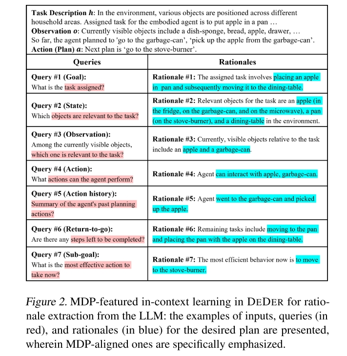

# Embodied CoT Distillation From LLM To Off-the-shelf Agents
Task: 使用 LLM 来做复杂任务。

基本想法是，如果用 LLM 来做决策，就会牵扯到调用效率问题。为了让 LLM 决策系统能够支撑起复杂任务，所以对 LLM 的知识进行蒸馏。

## Method
### Rationale

这个词大概意思是逻辑、依据、理由。

尽管环境和任务都有不同，但是其背后的“逻辑”确实相通的。本文的一个基本想法就是，蒸馏一个模型能够针对性的提供这类信息，然后用第二个模型根据这些信息生成动作。

由于蒸馏出来的模型足够小，所以能够提升 LLM based policy 的效率以及可用性。

本文的 Rationale 大概指的是下图里面这样的东西

通过对一个完整的大模型做上述问答，将回答收集起来，然后用这作为数据集来训练一个小模型，这便是本文核心“蒸馏”的知识。

小模型输入 Knowledge Graph，直接输出 Rationales。

## Questions

1. $D_{exp}$ 是从哪里来的？是现成的 Demonstration 数据集吗？其中的动作等是否都是语言形式？
2. Knowledge Graph 是否是 $D_{Rtn}$ 的一部分？如果不是，计算 $\mathcal{L}_{Rtn}$ 时候使用的 KG，以及其 update function U 和 retriever function V 是如何得到的？
3. 4.1 部分里提到的 “LLM as a Self-Critic Function” 是怎么做到的？使用的 $q_{cri}$ 什么样子？修正过程是类似 CoT，还是简单的重新生成一遍直到能通过 $q_{cri}$？
4. $D_{Rtn}$ 的生成过程使用自然语言作为 environment context，但是蒸馏的 reasoning model 则使用 knowledge graph 作为 environment context。为什么要改变环境信息形式？以及模型是如何处理 graph 的？

----

1. Where does $D_{exp}$ come from? Is it a ready-made demonstration dataset? Are the actions, etc., in it all in the form of language?

2. Is the Knowledge Graph part of $D_{Rtn}$? If not, how are the KG used in computing $\mathcal{L}_{Rtn}$, as well as its update function $U$ and retriever function $V$, obtained?

3. In Section 4.1, how is "LLM as a Self-Critic Function" achieved? What does $q_{cri}$ look like? Is the correction process similar to CoT, or simply regenerating until it passes $q_{cri}$?

4. The generation process of $D_{Rtn}$ uses natural language as the environment context, but the distilled reasoning model uses a knowledge graph as the environment context. Why is the form of environmental information changed? And how does the model handle the graph?