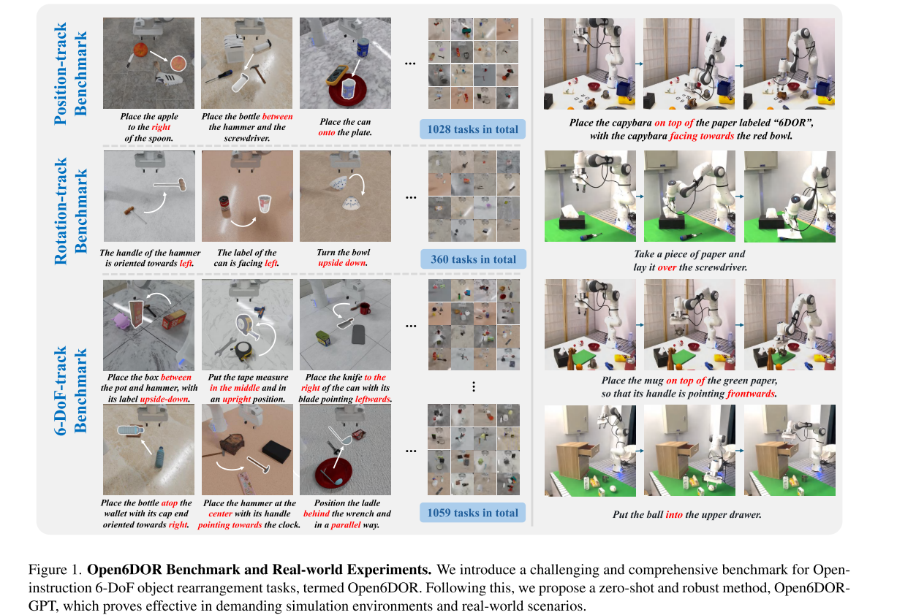
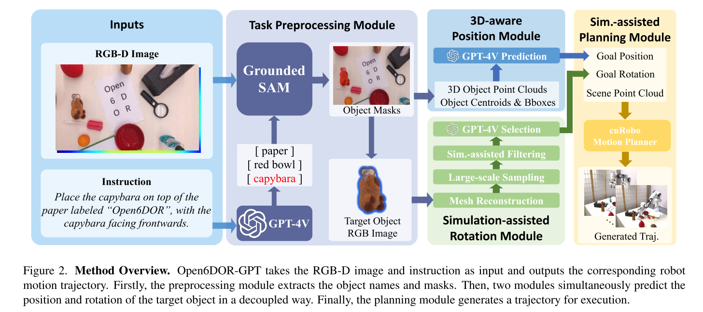
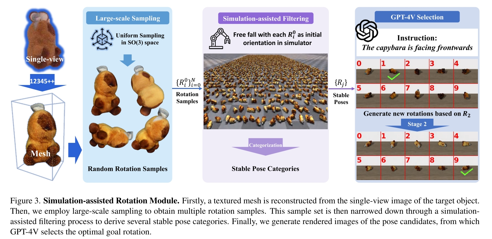

# Open6DOR: Benchmarking Open-instruction 6-DoF Object Rearrangement and A VLM-based Approach
under review. [page](https://pku-epic.github.io/Open6DOR/)

Open Instruct 6-DoF Object Rearrangement Benchmark
- Open Instruct: 指令是自然语言形式
- 6-DoF: 要求合适的物体6D姿态（指的是物体而不是robot）
- object rearrangement: 包含 pick & place 的姿态和长期规划。
- benchmarK: 很多数据，有模拟也有 real world
  - 200+ object
  - 2400+ tasks

作为 benchmark 最大的亮点本文放在了 6DoF 上，即要求满足特定物体**姿态**的 pick & place。这个姿态是直接在 instruct 中给出的，而不是推断出来的，例如 "Turn the bowl upside down."

## Problem Statement
- 给出固定在机械臂上的单个相机的一张 RGBD 图片 $I_{rgbd}$
- 给出一个语言指令 $\tilde{I}$，指令中包含目标物体及其目标姿态
- 输出目标物体的位置和旋转值 $P_{goal}, R_{goal}$

benchmark 中的任务进一步细分为三类，以衡量模型在旋转和移动物体时的表现
- 只需要旋转物体的，例如 "place the cup upside down"
- 只需要移动物体的，例如 "put the cup between A and B"
- 需要同时旋转和移动的，例如 "place the mug in front of A with its handle pointing towards the left"

## Method Open6DOR-GPT

- 首先将 $\tilde{I}$ 经过 GPT-4V 提取出要操作的 target name $\{O_i^{name}\}$
- 使用 GroundedSAM （Grounded-Segment-Anything）,输入 $I_{rgb}, O_i^{name}$，输出该物体的 2D Mask。得到 masked image $I_{mask}$
- 从 Masked Image 中算出 point cloud 以及其 centroid, bounding box。
- 将算出来的 centroid, bounding box 作为补充描述，和 instruction 一起输入 GPT-4V，输出一个目标 position $P_{goal}$
- 计算目标旋转角度
  - 首先对目标物体进行 3D 重建，得到 mesh model $M$
  - 均匀采样 3600 个不同的 Rotation
  - 把重建的模型在 simulation 里面按照这些 Rotation 从一个低位置扔下去，去掉那些姿态变化大的 rotation。
  - 把剩下的 Rotations 按照相似程度做一个聚类，每个类只取一个 rotation。最终得到较少的 rotation candidates $\{R_j\}_{i=0}^n$
  - 用 $\{R_j\}_{i=0}^n$ 来旋转重建的模型 $M$，然后把所有的结果渲染到一张图片里，并直接在图中标明每个 rotation 的序号。把这张图片和 instruction 给 GPT-4V，让 GPT-4V 从中选择一个 Rotation。

计算目标旋转角度的完整流程如下：

最后做 Planning。先用 Grasp Model 生成一系列抓取姿态，用 GPT-4V 选择合适的，最后用 cuRobo 做 motion planning。

## Question
- GPT-4V 是怎么输出目标位置$P_{goal}$以及选择抓取姿态 $\{\tilde{G}_j\}$的？
- 有没有可能推断物体的姿态而不是直接在指令中给出？例如摆餐具就是把刀叉放在盘子旁边。由指令明确给出姿态和从指令推断出姿态在任务上的区别是什么？差别有多大？能否用同样的方法在更大规模数据的情况下解决？
- 把机器人去掉，作为一个单纯的视觉任务，对于本文来说区别在哪？不管是作为一个 BenchMark 来说，还是对其提出的 Open6DOR-GPT 方法来说。

- How does GPT-4V output target position $P_{goal}$ or select grasp pose $\{\tilde{G}_j\}$? What is the output format?
- Is it possible to infer target pose instead of providing it in instruction? For example, knives and forks need to be placed next to the plate if the instruction is setting utensils. How different are these two tasks? Can we solve them using the same method with more data?
- What is the difference if we take robot away from this benchmark and make it a pure vision task? Both in terms of benchmark and method.